# 海外藏中国文物知识管理与服务平台 - 掌上博物馆子系统 设计报告


## 1. 引言

### 1.1 文档目的

本文档用于描述掌上博物馆子系统的总体架构、模块划分、接口设计、数据库设计、UI设计及非功能性设计，为系统开发、测试和后续集成提供技术依据。

### 1.2 子系统概述

掌上博物馆是“海外藏中国文物知识管理与服务平台”的移动端子系统，基于华为 HarmonyOS 开发，采用 ArkTS 语言与 ArkUI 框架。当前前端仓库已完成课程设计联调版本，围绕海外藏中国文物提供浏览、发现、语音导览、以图搜图与用户互动能力。

当前 App 的主界面采用 **首页 / 文物 / 发现 / 我的** 四个底部 Tab：

- **首页**：平台标题、文物轮播、精选馆藏与推荐入口。
- **文物**：文物列表浏览、文物页内搜索、多维筛选、排序、分页加载和文物详情跳转。
- **发现**：语音搜索入口与以图搜图入口。
- **我的**：登录注册、个人主页、收藏夹、浏览记录、我的评论、上传照片、隐私设置。

主要功能包括：

- **文物浏览**：首页精选馆藏展示、文物页卡片/列表展示、搜索、筛选、排序、分页加载、文物详情页、同年代文物与相关推荐。
- **以图搜图**：发现页相册选择图片、拍照搜索入口、相似度结果展示。
- **语音导览**：发现页语音搜索、详情页文物语音讲解、播放控制、基础语音问答。
- **用户交互**：点赞、收藏及分组管理、评论与回复、评论点赞、浏览记录、用户上传照片。
- **用户个人信息管理**：注册登录、个人主页、隐私设置和退出登录。

本阶段实现已完成主要前端页面与核心模块联调。文物与博物馆基础数据由后台管理子系统维护，移动端通过接口读取展示；以图搜图由独立 FastAPI 图像检索服务完成特征提取与相似度检索；用户系统、隐私设置和用户交互相关能力通过统一服务层与后端接口联动，并保留必要的本地状态用于页面同步与异常兜底。

### 1.3 目标读者

- 前端开发人员（本组全体成员）
- 后端开发人员（知识服务子系统、知识问答子系统、后台管理子系统成员）
- 测试工程师
- 项目管理人员
- 助教及评审教师

### 1.4 术语与缩略语

| 术语    | 全称                                    | 描述                                         |
| ------- | --------------------------------------- | -------------------------------------------- |
| ArkTS   | Ark TypeScript                          | HarmonyOS 官方开发语言，基于 TypeScript 扩展 |
| ArkUI   | Ark User Interface                      | HarmonyOS 声明式 UI 框架                     |
| MVVM    | Model-View-ViewModel                    | 前端架构模式，分离 UI、业务逻辑与数据        |
| JWT     | JSON Web Token                          | 用户认证令牌，无状态身份验证                 |
| RESTful | Representational State Transfer         | API 设计风格                                 |
| SSE     | Server-Sent Events                      | 服务器推送事件，用于流式响应                 |
| CLIP    | Contrastive Language-Image Pre-training | 图像特征提取模型                             |
| FAISS   | Facebook AI Similarity Search           | 向量相似度检索引擎                           |

### 1.5 参考文献

1. 课程设计题目 - 海外藏中国文物知识管理与服务平台.docx
2. 华为 HarmonyOS 开发者文档：https://developer.harmonyos.com/


## 2. 系统架构设计

### 2.1 架构风格

本子系统采用 **MVVM（Model-View-ViewModel）** 分层架构，主要分为以下三层：

- **View 层（UI 层）**：使用 ArkUI 声明式组件构建页面，负责界面渲染与用户交互。
- **ViewModel 层（业务逻辑层）**：管理页面状态，处理业务逻辑，调用 Model 层接口。
- **Model 层（数据层）**：定义数据结构，封装网络请求与本地存储操作。

此外，本子系统**不直接操作知识图谱**，所有业务数据通过后端 API 获取；以图搜图的特征提取与相似度检索由后端（CLIP + FAISS）完成，移动端仅负责图片采集与结果展示。

### 2.2 总体分层架构图

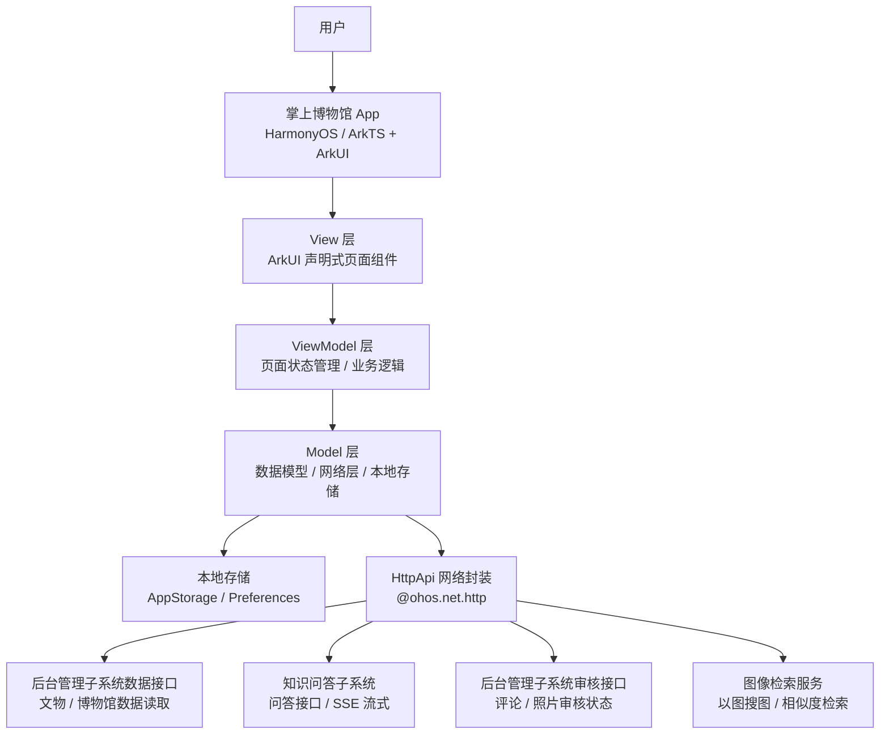

说明：文物与博物馆基础数据由后台管理子系统维护，移动端仅通过接口读取并展示，不在 App 端提供文物数据增删改查能力。

### 2.3 技术栈

| 类别      | 技术选型                                 | 说明                                                         |
| --------- | ---------------------------------------- | ------------------------------------------------------------ |
| 开发平台  | HarmonyOS                                | 面向手机和平板设备                                           |
| 开发语言  | ArkTS                                    | HarmonyOS 推荐开发语言                                       |
| UI 框架   | ArkUI                                    | 声明式 UI 组件开发                                           |
| 开发工具  | DevEco Studio 6.1.0 (Release)            | 统一开发环境                                                 |
| 路由管理  | `@ohos.router`                           | 页面跳转与参数传递                                           |
| 网络请求  | `@ohos.net.http`                         | 已封装为 `HttpApi`，基础路径为 `/api/v1`                     |
| 本地状态  | `AppStorage`                             | 保存登录状态、用户名、统计数据等轻量状态                     |
| 本地存储  | `Preferences`                            | 用于部分页面状态缓存、交互数据兜底与异常场景连续使用           |
| 文物数据  | `后端文物接口 / 本地兜底数据`                           | 通过后端接口读取文物数据，必要时使用本地兜底数据保障页面展示           |
| 语音能力  | `@kit.CoreSpeechKit`                     | 使用 `textToSpeech` 和 `speechRecognizer` 实现语音播报与语音识别 |
| 图片选择  | `@kit.CoreFileKit` / `@ohos.file.picker` | 用于相册图片选择与上传照片                                   |
| 相机/权限 | `@ohos.abilityAccessCtrl`、相机权限      | 用于以图搜图拍照入口                                         |
| 图像展示  | `Image` 组件                             | 文物图片、上传图片和识图结果展示                             |
| 版本控制  | Git + GitHub                             | 团队协作开发                                                 |

### 2.4 模块划分

| 模块编号 | 模块名称           | 负责人 | 功能描述                                                     |
| -------- | ------------------ | ------ | ------------------------------------------------------------ |
| M1       | 框架统筹与用户系统 | 潘晨晨 | `Index` 四栏底部导航：首页、文物、发现、我的；登录注册、个人主页、设置与隐私管理 |
| M2       | 文物浏览           | 郝婧   | 首页 `ShowPage` 精选展示、文物页 `HomePage` 列表/搜索/筛选/排序、文物详情页 `ArtifactDetailPage` |
| M3       | 以图搜图           | 王珍   | 发现页拍照搜图、相册选择图片、`ImageSearchResultPage` 相似度结果展示 |
| M4       | 语音导览           | 范力烨 | 发现页语音搜索、文物详情页语音讲解播放、播放控制、基础语音问答 |
| M5       | 用户交互（社交）   | 刘清   | 点赞、收藏及分组管理、评论与回复、浏览记录、用户上传照片及审核状态展示 |

## 3. 总体设计与公共部分

### 3.1 页面路由设计

#### 3.1.1 路由表

当前 `main_pages.json` 中注册了 `Index`、`HomePage`、`ProfilePage`、`LoginPage`、`RegisterPage`、`DiscoverPage`、`ArtifactDetailPage`、`ImageSearchResultPage` 以及个人中心相关页面。`ShowPage` 作为首页展示组件嵌入 `Index` 的第一个 Tab 中，不单独作为路由跳转页面。

| 页面名称       | 路由路径 / 组件               | 所属模块    | 说明                                                   |
| -------------- | ----------------------------- | ----------- | ------------------------------------------------------ |
| 主入口页       | `pages/Index`                 | M1 框架     | 四栏 Tab 容器，包含首页、文物、发现、我的              |
| 首页           | `ShowPage`（嵌入 `Index`）    | M2 文物浏览 | 平台标题、轮播展示、精选馆藏入口                       |
| 文物页         | `pages/HomePage`              | M2 文物浏览 | 文物列表、搜索、筛选、排序、分页加载                   |
| 发现页         | `pages/DiscoverPage`          | M3/M4       | 语音搜索与以图搜图入口                                 |
| 文物详情页     | `pages/ArtifactDetailPage`    | M2/M4/M5    | 文物详情、语音讲解、语音问答、点赞收藏、评论、上传照片 |
| 以图搜图结果页 | `pages/ImageSearchResultPage` | M3 以图搜图 | 展示相似文物结果及相似度                               |
| 我的页面       | `pages/ProfilePage`           | M1 用户系统 | 登录状态展示、个人功能入口                             |
| 登录页         | `pages/LoginPage`             | M1 用户系统 | 用户登录入口                                           |
| 注册页         | `pages/RegisterPage`          | M1 用户系统 | 新用户注册入口                                         |
| 我的收藏页     | `pages/MyFavoritesPage`       | M5 用户交互 | 收藏夹、分组管理、移出收藏                             |
| 浏览记录页     | `pages/MyHistoryPage`         | M5 用户交互 | 查看历史浏览文物                                       |
| 我的点赞页     | `pages/MyLikesPage`           | M5 用户交互 | 查看已点赞文物                                         |
| 我的评论页     | `pages/MyCommentsPage`        | M5 用户交互 | 查看本人评论与审核状态                                 |
| 上传照片页     | `pages/MyUploadsPage`         | M5 用户交互 | 上传参观照片并查看审核状态                             |
| 设置页         | `pages/SettingsPage`          | M1 用户系统 | 账号与系统设置入口                                     |
| 隐私设置页     | `pages/PrivacySettingPage`    | M1/M5       | 管理收藏、点赞、评论、上传照片可见性                   |


#### 3.1.2 页面跳转流程图

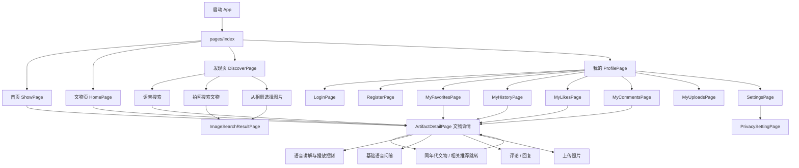

### 3.2 网络层封装设计

本子系统通过 `common/network/HttpApi.ets` 封装 `@ohos.net.http` 能力，统一处理基础路径、Token、请求超时和异常状态。当前前端实现中，部分页面仍使用本地测试数据运行；后续联调时，可逐步将文物数据、用户数据、审核状态、图像检索和问答请求切换到 `HttpApi`。

```typescript
// HttpApi.ets - 统一网络请求封装
import http from '@ohos.net.http';

const BASE_URL = 'http://60.205.14.101:8080/api/v1';

export class HttpApi {
  static getToken(): string {
    return (AppStorage.Get('token') as string) || '';
  }

  static async get<T>(url: string, params?: Record<string, string>): Promise<T> {
    // 拼接 BASE_URL，添加 Authorization: Bearer <token>
    // 统一设置 connectTimeout/readTimeout 为 10000ms
    // 401 时清除登录状态并提示重新登录
    return {} as T;
  }

  static async post<T>(url: string, body: object): Promise<T> {
    // 统一 JSON 请求体、Token 请求头和异常处理
    return {} as T;
  }

  static async put<T>(url: string, body: object): Promise<T> {
    // 用于更新类接口，如用户设置、隐私设置等
    return {} as T;
  }
}
```

接口返回格式应与后端保持一致，推荐统一为：

```json
{
  "code": 200,
  "message": "success",
  "data": {}
}
```

### 3.3 公共数据模型定义

当前前端原型的核心数据模型与本地存储模型如下。正式联调时，应在网络层或数据适配层中完成后端字段到前端字段的映射。

#### 3.3.1 文物数据模型

```typescript
// common/models/Artifact.ets
export interface Artifact {
  id: string;              // 前端内部使用的文物唯一 ID；后端对应 objectId
  title: string;           // 文物名称
  imageUrl: string;        // 主图地址
  imageUrls?: string[];    // 多图地址数组
  period: string;          // 年代
  type: string;            // 类型
  material: string;        // 材质
  description: string;     // 文物介绍
  museum: string;          // 收藏博物馆
  popularity?: number;     // 热度值，用于热门排序
}
```

> 说明：后台管理子系统的文物数据接口通常使用 `objectId` 作为资源唯一标识，当前前端本地测试数据使用 `id`。移动端只读取和展示文物数据，不提供文物数据维护入口。

#### 3.3.2 用户交互相关模型

用户交互模块围绕以下本地模型进行存储和展示：

| 模型                 | 说明                                                         |
| -------------------- | ------------------------------------------------------------ |
| `FavoriteItem`       | 收藏文物快照，包含文物 ID、标题、图片、年代、博物馆、分组、收藏时间 |
| `CommentItem`        | 评论与回复，包含评论内容、所属文物、用户、审核状态、点赞数   |
| `UploadedPhotoItem`  | 上传照片记录，包含图片 URI、地点、说明、审核状态             |
| `HistoryItem`        | 浏览记录，记录用户浏览过的文物和时间                         |
| `PrivacySettings`    | 隐私设置，控制收藏、点赞、评论、上传照片可见性               |
| `InteractionSummary` | 点赞、收藏等互动状态和数量统计                               |

#### 3.3.3 本地状态与持久化

| 存储方式      | 当前用途                                                     |
| ------------- | ------------------------------------------------------------ |
| `AppStorage`  | 登录状态、用户名、用户 ID、Token、个人统计数据、交互刷新标记 |
| `Preferences` | 点赞、收藏、评论、照片、历史记录、隐私设置等原型数据         |
| 本地测试数据  | 文物浏览、详情、搜索、推荐、语音搜索的前端原型数据源         |

## 4. 接口设计

本子系统不直接操作数据库。文物与博物馆基础数据由后台管理子系统维护，移动端通过数据接口读取并展示；用户交互、审核、图像检索和复杂问答分别与对应后端服务对接。当前前端原型仍可使用本地测试数据运行，正式联调时按以下接口方向替换。

### 4.1 当前前端内部调用方式

| 调用对象         | 当前实现                                                     | 调用模块                 |
| ---------------- | ------------------------------------------------------------ | ------------------------ |
| 文物数据         | 本地测试数据                                                 | M2 文物浏览、M4 语音搜索 |
| 文物详情         | 通过 `id` 在本地测试数据中查找                               | M2 文物详情              |
| 相关推荐         | 按 `period` 或 `type` 在本地文物中匹配                       | M2 文物浏览              |
| 语音讲解         | `MuseumVoiceService.buildArtifactGuide` + `speak`            | M4 语音导览              |
| 语音搜索         | `MuseumVoiceService.searchArtifactByText` + `handleVoiceSearch` | M4 语音导览              |
| 基础问答         | `MuseumVoiceService.answerQuestion`                          | M4 语音导览              |
| 点赞收藏评论上传 | 交互存储服务 + `Preferences`                                 | M5 用户交互              |
| 登录状态         | `AppStorage`                                                 | M1 用户系统              |
| 图片选择         | `PhotoViewPicker` / 相机权限                                 | M3/M5                    |

### 4.2 对接后台管理子系统数据接口

后台管理子系统负责维护文物、博物馆等基础数据。移动端仅调用读取类接口，不调用创建、更新、删除、批量导入和图片上传等管理接口。

| 接口名称       | 请求方式 | 建议路径                         | 说明                                                         | 调用模块                 |
| -------------- | -------- | -------------------------------- | ------------------------------------------------------------ | ------------------------ |
| 获取文物列表   | GET      | `/data/relics`                   | 分页获取文物数据，支持 `page`、`pageSize`、`keyword`、`museumId` 等参数 | M2 文物浏览              |
| 获取文物详情   | GET      | `/data/relics/{objectId}`        | 获取单件文物完整信息                                         | M2 文物浏览、M4 语音讲解 |
| 搜索文物       | GET      | `/data/relics?keyword={keyword}` | 根据关键词检索文物                                           | M2 文物浏览、M4 语音搜索 |
| 获取博物馆列表 | GET      | `/data/museums`                  | 获取博物馆基本信息，用于筛选和详情展示                       | M2 文物浏览              |
| 获取博物馆详情 | GET      | `/data/museums/{objectId}`       | 获取指定博物馆信息                                           | M2 文物浏览              |

### 4.3 对接图像检索服务接口

| 接口名称     | 请求方式 | 建议路径        | 说明                                             | 调用模块    |
| ------------ | -------- | --------------- | ------------------------------------------------ | ----------- |
| 图像特征检索 | POST     | `/search/image` | 上传图片，返回相似文物列表、相似度和文物基本信息 | M3 以图搜图 |

### 4.4 对接知识问答子系统接口

| 接口名称     | 请求方式 | 建议路径             | 说明                                                         | 调用模块    |
| ------------ | -------- | -------------------- | ------------------------------------------------------------ | ----------- |
| 问答对话     | POST     | `/qa/chat`           | 发送问题、文物 ID、历史会话 ID，返回回答；复杂问答支持 SSE 流式响应 | M4 语音导览 |
| 获取历史列表 | GET      | `/qa/getHistoryList` | 获取用户历史问答记录                                         | M4 语音导览 |

### 4.5 对接后台管理 / 用户交互接口

| 接口名称      | 请求方式 | 建议路径                    | 说明                                     | 调用模块    |
| ------------- | -------- | --------------------------- | ---------------------------------------- | ----------- |
| 提交评论      | POST     | `/comments`                 | 提交评论并进入审核流程                   | M5 用户交互 |
| 获取评论列表  | GET      | `/comments`                 | 获取指定文物已审核评论                   | M5 用户交互 |
| 上传照片      | POST     | `/photos/upload`            | 上传用户照片并进入审核流程               | M5 用户交互 |
| 获取审核状态  | GET      | `/audit/status/{contentId}` | 查询评论或照片审核状态                   | M5 用户交互 |
| 点赞/收藏操作 | POST     | `/user/action`              | 提交点赞、收藏、取消点赞、取消收藏等行为 | M5 用户交互 |
| 保存隐私设置  | PUT      | `/user/privacy`             | 保存用户隐私开关配置                     | M1/M5       |


## 5. 模块详细设计

> **说明**：本节按既定分工编写，并根据当前前端实现统一调整为“首页 / 文物 / 发现 / 我的”四栏底部导航。旧设计中独立的搜索页、语音导览页、语音问答页和以图搜图入口页，在当前实现中分别合并到 `HomePage`、`DiscoverPage` 和 `ArtifactDetailPage`。

### 5.1 文物浏览模块

#### 5.1.1 模块概述

文物浏览模块对应 `ShowPage`、`HomePage` 与 `ArtifactDetailPage`，是 App 的核心内容展示模块。
- `ShowPage` 作为底部 Tab 的“首页”，展示品牌氛围区、文物自动轮播和精选馆藏。
- `HomePage` 作为“文物”页，提供文物列表、实时搜索、多维筛选（年代/类型/材质）、排序（热门/名称/年代）、网格/列表双视图和手动分页加载。
- `ArtifactDetailPage` 展示单件文物详情，包括多图轮播（支持双指缩放/拖拽）、基本信息、同年代标签云、横向相关推荐，并集成点赞、收藏、评论、上传照片及语音导览入口。

文物基础数据全部通过后端接口（`MuseumArtifactApi`）动态获取，移动端不负责文物数据的增删改查。筛选选项、排序规则、分页等均与后端实时同步。

#### 5.1.2 页面与组件设计

**ShowPage 首页组件结构**

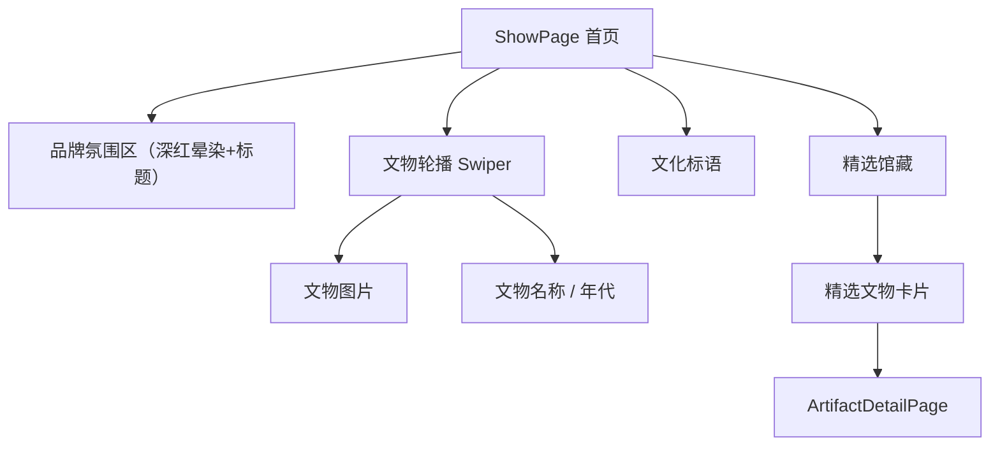

**HomePage 文物页组件结构**

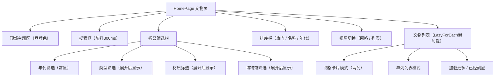

**ArtifactDetailPage 组件结构**

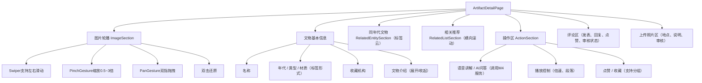

#### 5.1.3 组件交互流程

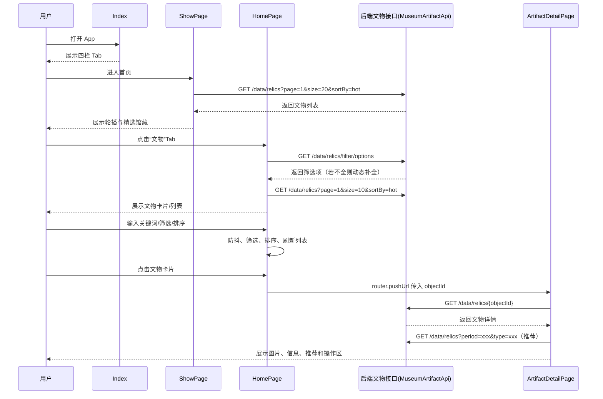

#### 5.1.4 数据结构设计

| 字段 | 类型 | 说明 |
|------|------|------|
| `id` / `objectId` | `string` | 文物唯一标识，前端使用 `id`，接口使用 `objectId` |
| `title` | `string` | 文物名称 |
| `imageUrl` | `string` | 文物主图 |
| `imageUrls` | `string[]` | 文物多图（可选） |
| `period` | `string` | 年代（用于筛选和朝代排序） |
| `type` | `string` | 类型 |
| `material` | `string` | 材质 |
| `description` | `string` | 文物介绍 |
| `museum` | `string` | 收藏博物馆 |
| `popularity` | `number` | 热度值（用于热门排序） |

#### 5.1.5 接口与扩展说明

| 功能 | 当前实现方式 | 接口路径 / 说明 |
|------|--------------|----------------|
| 首页精选数据 | 调用 `MuseumArtifactApi.searchArtifacts` 取热度前20，轮播取前5，精选取前4 | `GET /artifacts/search?page=1&size=20&sortBy=hot` |
| 文物列表 | 分页请求，支持搜索关键词、筛选条件、排序 | `GET /artifacts/search` 携带 `keyword`, `period`, `type`, `material`, `museum`, `sortBy`, `page`, `size` |
| 文物详情 | 根据 `objectId` 获取单件文物完整信息 | `GET /artifacts/{objectId}` |
| 筛选选项 | 优先请求 `/filter/options`；若返回不全则自动分页拉取全部文物动态提取 | `GET /artifacts/filter-options` |
| 同年代/相关推荐 | 基于当前文物的 `period` 和 `type` 请求列表，过滤自身 | `GET /artifacts/search?period=xxx&type=xxx` |

---

### 5.2 以图搜图模块
#### 5.2.1 模块概述
##### 5.2.1.1 模块简介
本模块分为**HarmonyOS ArkTS前端客户端**与**Python FastAPI后端检索服务**两大组成部分，依托ResNet50图像特征提取算法+FAISS向量相似度检索引擎，实现用户拍照/本地相册选取文物图片、上传后端完成图像特征比对、返回高相似度馆藏文物列表的核心业务能力。
系统配套SQLite本地文物数据库存储全量文物基础信息，支持相似度阈值过滤、检索结果单列/双列视图切换、文物详情跳转；配套初始化脚本实现远程文物数据源拉取、图片批量下载、特征向量生成、FAISS向量索引持久化构建，支撑离线向量检索。

##### 5.2.1.2 模块目标
1. **用户侧**：用户通过相机拍摄或手机相册选取文物图片，快速检索馆藏中外观相似文物，直观展示匹配度、文物年代、品类、材质等信息；
2. **服务侧**：实现文物数据自动化拉取入库、图像特征批量提取、向量索引持久化存储，保障检索毫秒级响应；
3. **扩展侧**：预留相似度阈值、TopK检索数量配置项，支持参数动态调整，适配不同检索精准度需求。

##### 5.2.1.3 模块组成划分
|分层|技术栈|核心文件|职责|
| ---- | ---- | ---- | ---- |
|移动端前端|HarmonyOS ArkTS|DiscoverPage.ets、ImageSearchResultPage.ets、SearchService.ets、Constants.ets、SearchModels.ets|权限申请、图片选择、文件封装上传、结果渲染、视图切换|
|后端接口服务|Python+FastAPI|main.py、models.py、config.py|接收图片、参数解析、调用特征提取与向量检索、封装标准返回报文|
|特征提取层|PyTorch+ResNet50|feature_extractor.py|图片预处理、2048维图像特征向量提取、L2归一化|
|向量检索层|FAISS|faiss_index.py|余弦相似度向量库构建、向量存储、K近邻相似度检索|
|数据持久层|SQLite|database.py|文物结构化数据本地入库、单条/全量文物数据查询|
|数据初始化工具|Python Requests|init_index.py|远程API拉取文物元数据、批量下载文物图、批量生成特征、构建索引|

#### 5.2.2 技术方案
##### 5.2.2.1 整体架构
采用**客户端-服务端分层架构**，客户端负责交互与图片采集，后端采用**图像特征工程+向量数据库检索**架构，整体三层：
1. **接入层（FastAPI）**：提供HTTP图片上传接口，接收HarmonyOS客户端multipart/form-data表单格式图片与检索参数(top_k、threshold)；
2. **算法层**：ResNet50预训练模型提取图片特征→FAISS IndexFlatIP余弦向量库完成相似度检索→按配置阈值过滤低相似度结果；
3. **数据层**：SQLite存储全量文物结构化信息、本地文件持久化FAISS索引文件+JSON元数据映射文件。

##### 5.2.2.2 关键技术选型说明
1. **前端：HarmonyOS ArkTS**
    - 基于HarmonyOS原生API实现相机唤起、相册文件选择、麦克风权限管理；
    - 原生http组件手动封装multipart/form-data二进制请求体，实现图片文件二进制上传；
    - 组件化@Builder封装搜索卡片、结果列表单列/网格双布局，状态变量驱动UI渲染。
2. **后端框架：FastAPI**
    - 高性能异步接口，自动参数校验，统一异常捕获，提供健康检查接口`/health`用于服务可用性探测；
    - Pydantic实体约束接口出入参格式，标准化接口返回JSON结构。
3. **图像特征提取：ResNet50（PyTorch）**
    - 采用ImageNet预训练权重，移除最后全连接分类层，取全局平均池化输出**2048维浮点特征向量**；
    - 统一图片尺寸缩放至`224×224`，标准化归一化处理，特征输出后执行L2归一化，适配余弦相似度计算。
4. **向量检索引擎：FAISS IndexFlatIP**
    - 使用**内积IndexFlatIP索引**，向量提前L2归一化后，内积结果等价余弦相似度，值域`[0,1]`；
    - 索引文件（relic_index.faiss）+元数据JSON（relic_metadata.json）双文件落地持久化，服务启动自动加载索引，无需重复计算特征。
5. **关系存储：SQLite**
    - 轻量嵌入式数据库，单文件存储所有文物基础字段(objectId、名称、年代、图片地址、描述等)；
    - 建立title、period索引优化文本查询效率，支持批量插入、单ID精准查询。
6. **数据初始化：Requests**
    - 对接外部文物数据源REST接口，分页拉取全量文物数据，自动下载文物原图、批量生成特征构建向量库。

##### 5.2.2.3 关键配置参数（config.py+Constants.ets前后端统一配置）
|参数|默认值|说明|
| ---- | ---- | ---- |
|DEFAULT_TOP_K|20|单次最大检索返回候选文物数量|
|DEFAULT_THRESHOLD|0.4|余弦相似度最低阈值，低于该值过滤结果|
|FEATURE_DIM|2048|ResNet50输出特征维度|
|IMAGE_MAX_SIZE|(224,224)|模型输入图片统一尺寸|
|DEVICE|cpu|特征提取硬件设备，可选cuda|

##### 5.2.2.4 环境依赖
1. **后端Python依赖**：fastapi、uvicorn、torch、torchvision、faiss-cpu、numpy、pillow、requests、pydantic、sqlite3；
2. **前端依赖**：HarmonyOS API9+，CameraKit、文件管理、网络http原生组件。

#### 5.2.3 业务流程
整体分为**前置索引初始化流程**（项目部署阶段一次性执行）、**用户实时以图搜图业务流程**（用户使用阶段）两大流程。

##### 5.2.3.1 前置初始化流程（执行init_index.py）
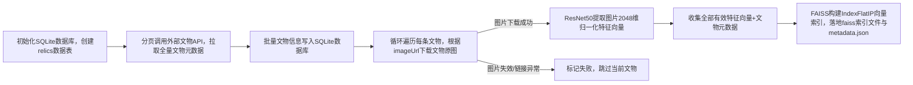
**流程说明**：
1. 脚本自动创建sqlite文物数据表，设置主键objectId与常用字段索引；
2. 携带鉴权TOKEN分页请求远端文物接口，限制单次最多拉取100条数据避免过载；
3. 循环下载文物图片，3次重试机制处理下载超时，异常图片跳过不参与建库；
4. 有效图片生成归一化特征，批量存入FAISS索引并本地持久化，后端服务启动自动加载索引。

##### 5.2.3.2 用户端实时以图搜图业务流程
```mermaid
flowchart LR
A[用户进入发现页DiscoverPage] --> B{选择拍照/相册选图}
B -->|拍照| C[申请CAMERA+READ_MEDIA权限，唤起系统后置相机]
B -->|相册| D[申请READ_MEDIA权限，打开系统相册选择单张图片]
C & D --> E[获取图片本地URI，标记搜索加载状态isSearching=true]
E --> F[SearchService读取本地图片二进制Buffer，手动组装multipart/form-data请求体]
F --> G[携带top_k=20、threshold=0.4 POST请求后端/search/image接口]
G --> H[FastAPI接收图片二进制数据与入参]
H --> I[ResNet50提取用户上传图片归一化特征向量]
I --> J[FAISS检索Top20候选向量，得到相似度+对应文物元数据]
J --> K[后端过滤相似度＜0.4的数据，组装SearchResponse返回前端]
K --> L[前端接收返回数据，按相似度降序排序]
L --> M[跳转ImageSearchResultPage结果页，传入原图URI与搜索结果JSON]
M --> N{用户切换视图模式}
N -->|单列模式| O[水平卡片列表渲染文物信息]
N -->|双列网格| P[双列Grid垂直卡片渲染]
O & P --> Q[点击文物卡片，携带objectId跳转文物详情页]
```
**流程细节补充**：
1. 权限校验失败则弹出Toast提示，终止图片选择；
2. 前后端双重阈值过滤：后端接口阈值过滤+前端二次过滤，杜绝低相似度数据展示；
3. 无匹配数据时展示空页面，提供返回重新搜索按钮。

#### 5.2.4 接口调用设计
接口分为**后端内部初始化数据源接口（外部第三方）**、**客户端-后端检索业务接口**两类。

##### 5.2.4.1 第三方文物数据源接口（init_index.py调用）
- 地址：`http://60.205.14.101:8080/api/v1/data/relics`
- 请求方式：GET
- 请求参数：page(页码)、pageSize(分页条数)
- 请求头：Authorization: Bearer {ACCESS_TOKEN}（固定鉴权令牌）
- 用途：项目初始化拉取全量文物基础元数据、图片链接，用于建库与向量构建。

##### 5.2.4.2 以图搜图核心业务接口（客户端→FastAPI）
##### 接口信息
- 接口地址：`/api/v1/search/image`
- 请求方式：POST
- Content-Type：multipart/form-data
- 前端常量配置：`BASE_URL=http://192.168.137.1:8000`，完整地址由Constants拼接生成
- 接口查询参数（URL拼接）
  |参数名|类型|默认值|释义|
  | ---- | ---- | ---- | ---- |
  |top_k|int|20|最大返回候选数量|
  |threshold|float|0.4|相似度过滤阈值|
- 请求表单字段
  |字段名|类型|说明|
  | ---- | ---- | ---- |
  |file|二进制文件|用户上传的文物图片（jpg/png等图片格式）|

##### 返回报文结构（JSON）
```json
{
  "code":200,
  "message":"success",
  "data":{
    "results":[
      {
        "objectId":"唯一文物ID",
        "title":"文物名称",
        "period":"年代",
        "type":"文物品类",
        "material":"材质",
        "imageUrl":"文物图片远程地址",
        "similarity":0.82 
      }
    ]
  }
}
```

##### 异常返回
- 400：非图片文件、空文件；
- 503：后端FAISS索引未加载（未执行初始化脚本）；
- 500：图片解析失败、特征提取异常。

##### 5.2.4.3 后端健康检查接口
- 地址：`/health`，GET请求，返回`{"status":"ok"}`，用于服务状态监测。

##### 5.2.4.4 前端接口封装（SearchService.ets）
SearchService.searchByImage静态方法：
1. 读取HarmonyOS本地图片URI为ArrayBuffer二进制；
2. 随机生成boundary，手动拼接multipart/form-data报文头+文件二进制+报文尾；
3. 携带ContentType请求头发起POST，接收返回JSON并反序列化为SearchResponse实体。

##### 5.2.4.5 数据模型定义
1. **后端models.py**：Pydantic模型约束入参出参，SearchResultItem定义单条返回文物字段；
2. **前端SearchModels.ets**：TS接口同步后端返回结构，SearchResponse→SearchResultItem；
3. **页面DTO**：SearchResultDTO用于页面间路由传参，字段与检索结果一一映射。

#### 5.2.5 页面UI设计
前端页面分为**DiscoverPage发现搜索页、ImageSearchResultPage搜索结果页**两大页面。
1. 发现页 DiscoverPage：顶部标题区、以图搜图卡片，按钮搜索中禁用；
2. 结果页 ImageSearchResultPage：返回 + 原图预览 + 结果数量 + 布局切换，支持单列 / 双列视图；结果数据列表按相似度降序排列,可点击跳转详情页;无数据展示空页面。

### 5.3 语音导览模块

语音导览模块是掌上博物馆 App 的智能化交互功能之一，主要面向文物浏览过程中的听觉讲解、语音搜索和语音问答场景。用户可以在文物详情页收听文物讲解，也可以通过语音输入关键词搜索文物，还可以围绕文物内容进行语音提问，获得文字与语音形式的回答。

本模块主要包含以下功能：

- **语音讲解播放**：在文物详情页播放文物介绍。
- **语音搜索文物**：通过语音输入关键词快速查找文物。
- **语音问答**：通过语音提出问题，获取知识问答系统返回的答案。

#### 5.3.1 语音讲解播放

语音讲解功能位于文物详情页，用于帮助用户以听觉方式了解文物信息。用户进入任意文物详情页后，可以点击页面中的 **“语音讲解”** 按钮，系统会根据当前文物信息生成讲解内容，并调用系统 TTS 能力进行语音播报。

讲解内容通常基于以下信息生成：

- 文物名称
- 所属年代
- 文物类型
- 材质
- 收藏博物馆
- 文物简介

##### 5.3.1.1 开始播放讲解

1. 打开 App，进入任意一件文物的详情页。
2. 在详情页中找到 **“语音讲解”** 按钮。
3. 点击按钮后，系统会自动播放该文物的语音介绍。
4. 播放过程中，用户可以根据需要进行暂停、停止、重播或切换段落。

> 💡 **小技巧**：如果文物介绍内容较长，可以配合“上一段 / 下一段”功能快速定位感兴趣的讲解部分。

##### 5.3.1.2 播放控制

语音讲解支持多种播放控制操作：

- **播放**：开始播放当前文物讲解。
- **停止**：停止当前语音播报。
- **重播**：从头重新播放讲解内容。
- **上一段 / 下一段**：切换当前讲解段落。
- **倍速调节**：根据个人习惯调整播放速度。

常见倍速包括：

- **0.75x**：适合慢速收听。
- **1x**：正常语速。
- **1.25x**：略快语速。
- **1.5x**：快速浏览讲解内容。

##### 5.3.1.3 段落进度提示

当讲解内容被拆分为多个段落时，页面会显示当前播放进度，例如：

```text
第 2 段 / 共 5 段
```

用户可以通过段落控制按钮快速切换讲解内容，避免从头重复收听。

------

#### 5.3.2 语音搜索文物

语音搜索功能用于帮助用户通过说话的方式查找文物，减少移动端手动输入的操作成本。

##### 5.3.2.1 使用语音搜索

1. 进入 App 的 **发现页** 或支持语音搜索的页面。
2. 点击 **麦克风图标** 或 **语音搜索按钮**。
3. 根据提示说出想要搜索的关键词。
4. 系统将用户语音转换为文字关键词。
5. App 根据识别结果搜索相关文物。
6. 搜索结果以列表形式展示，点击任意文物即可进入详情页。

##### 5.3.2.2 支持的搜索内容

用户可以说出文物名称、年代、材质、类型或博物馆相关关键词，例如：

```text
青花瓷
唐代文物
清代瓷器
青铜器
大英博物馆的文物
```

系统会将识别出的文字作为搜索关键词，并匹配相关文物信息。

##### 5.3.2.3 语音搜索流程

语音搜索的基本流程如下：

```text
点击语音搜索 → 说出关键词 → 语音识别 → 转换为文本 → 查询文物 → 展示结果
```

如果识别失败或未搜索到相关文物，页面会提示用户重新输入或更换关键词。

> 📌 示例：用户说出“青花瓷”，系统会自动识别为文字关键词，并展示与“青花瓷”相关的文物列表。

##### 5.3.2.4 使用注意事项

- 使用语音搜索前，请确保已授予 App 麦克风权限。
- 请尽量在安静环境中使用语音搜索，以提高识别准确率。
- 如果识别结果不准确，可以重新点击麦克风按钮再次输入。
- 如果搜索结果为空，可以尝试使用更简短或更明确的关键词。

------

#### 5.3.3 语音问答

语音问答功能用于支持用户以自然语言方式向系统提问，获取文物相关知识回答。

##### 5.3.3.1 使用语音问答

1. 进入文物详情页或语音问答页面。
2. 点击 **“语音问答”** 或麦克风按钮。
3. 说出想要了解的问题。
4. 系统将语音转换为文本问题。
5. App 将问题发送至知识问答子系统。
6. 问答系统返回答案后，页面展示文字回答。
7. 用户可以点击播放按钮，将答案通过语音播报出来。

##### 5.3.3.2 示例问题

用户可以提出与文物相关的问题，例如：

```text
这件文物属于哪个朝代？
这件瓷器有什么特点？
这件文物收藏在哪个博物馆？
青花瓷为什么有历史价值？
唐代陶俑有什么代表性特征？
```

系统会根据问题内容返回对应的知识性回答。

##### 5.3.3.3 流式问答说明

部分问答场景支持流式回答。流式回答是指系统不会等完整答案生成后一次性返回，而是边生成边返回内容，用户可以逐步看到答案。

其展示效果类似：

```text
清代瓷器在工艺上……
其装饰纹样更加丰富……
同时也体现了当时中外文化交流的特点……
```

这种方式可以减少等待时间，让问答过程更接近真实对话体验。

##### 5.3.3.4 语音答案播放

问答结果返回后，用户可以选择：

- 直接阅读文字答案。
- 点击播放按钮收听语音答案。
- 停止当前语音播放。
- 重新播放答案。

当用户不方便阅读屏幕时，语音答案可以提供更自然、更便捷的使用体验。

------

#### 5.3.4 权限与异常提示

语音导览模块主要依赖设备麦克风和系统语音能力。首次使用语音搜索或语音问答时，系统可能会申请麦克风权限。

##### 5.3.4.1 麦克风权限

如果系统弹出权限申请，请点击 **“允许”**。

如果误点了拒绝，可以通过系统设置重新开启：

```text
系统设置 → 应用管理 → 掌上博物馆 → 权限 → 麦克风 → 允许
```

##### 5.3.4.2 常见异常

| 问题             | 可能原因                 | 解决方式                     |
| ---------------- | ------------------------ | ---------------------------- |
| 语音搜索无反应   | 未授予麦克风权限         | 到系统设置中开启麦克风权限   |
| 识别结果不准确   | 环境噪声较大或说话不清晰 | 在安静环境中重新输入         |
| 语音讲解没有声音 | 设备静音或音量过低       | 检查系统音量和静音模式       |
| 问答返回较慢     | 网络不稳定或后端响应较慢 | 检查网络后重试               |
| TTS 播放失败     | 系统语音服务异常         | 退出页面后重新进入或重启 App |

------

#### 5.3.5 使用建议

为了获得更好的语音导览体验，建议：

1. 在相对安静的环境下使用语音搜索和语音问答。
2. 提问时尽量使用简洁明确的表达。
3. 如果搜索结果不准确，可尝试更换关键词。
4. 长文物介绍可配合段落切换和倍速调节使用。
5. 网络较差时，语音问答可能存在延迟，建议切换至稳定网络后重试。

------

#### 5.3.6 功能总结

语音导览模块围绕“听讲解、说需求、问问题”三个使用场景展开：

```text
文物语音讲解：让用户通过听觉了解文物。
语音搜索文物：让用户通过说话快速查找文物。
语音智能问答：让用户通过自然语言获得文物知识回答。
```

整体流程可以概括为：

```text
语音输入 → 语音识别 → 文本处理 → 调用搜索或问答功能 → 展示结果 → TTS 语音播放
```

通过该模块，掌上博物馆不仅能够展示文物信息，还能以更自然、更智能的方式与用户进行交互，从而提升文物浏览的沉浸感和便捷性。

### 5.4 用户交互模块

#### 5.4.1 模块概述

用户交互模块覆盖点赞、收藏、收藏夹分组、评论、回复、评论点赞、照片上传、浏览记录和隐私可见性。当前实现已完成前后端联动，页面通过统一的 `InteractionService` 与后端接口进行交互，同时保留原有本地交互存储能力用于数据缓存与异常场景下的连续使用。

模块涉及页面与服务如下：

- `ArtifactDetailPage`：点赞、收藏、评论、回复、评论点赞、上传照片、浏览记录写入
- `MyFavoritesPage`：收藏夹列表、分组筛选、分组管理
- `MyLikesPage`：我的点赞列表与取消点赞
- `MyCommentsPage`：我的评论、审核状态查看
- `MyUploadsPage`：上传照片、上传记录查看
- `MyHistoryPage`：浏览记录查看
- `PrivacySettingPage`：隐私可见性配置
- `OtherProfilePage`：他人主页可见内容展示
- `InteractionService`：统一封装用户交互模块的接口访问、数据映射与联动逻辑
- `PrivacyService`：统一处理隐私设置的读取与保存

#### 5.4.2 点赞收藏流程设计

点赞与收藏功能主要位于文物详情页，并与个人中心中的“我的点赞”和“我的收藏”保持联动。

点赞流程如下：

1. 用户在 `ArtifactDetailPage` 点击点赞按钮。
2. 页面校验登录状态，未登录则提示并跳转登录页。
3. 已登录时调用 `InteractionService.toggleLike`。
4. 服务层优先请求后端点赞接口，并根据接口返回更新点赞状态与数量。
5. 点赞结果同步反映在详情页按钮状态和“我的点赞”页面中。

收藏流程如下：

1. 用户在 `ArtifactDetailPage` 点击收藏按钮。
2. 页面根据当前选中的收藏分组调用 `InteractionService.toggleFavorite`。
3. 服务层优先请求后端收藏接口，并同步更新当前收藏状态。
4. 收藏结果可在 `MyFavoritesPage` 中查看。

收藏夹支持默认分组和自定义分组，用户可在 `MyFavoritesPage` 中：

- 新建收藏夹
- 按分组筛选收藏项
- 将收藏项移动到其他分组
- 删除自定义收藏夹

其中，收藏动作与收藏列表已接入后端联动；分组管理继续由页面与交互存储共同维护，保证收藏管理流程完整可用。

#### 5.4.3 评论功能设计

评论区位于文物详情页，支持发表评论、回复评论和评论点赞。

评论流程如下：

1. 用户在 `ArtifactDetailPage` 输入评论内容。
2. 页面在提交前执行非空、长度和敏感词校验。
3. 校验通过后调用 `InteractionService.addComment`。
4. 服务层优先提交后端评论接口。
5. 评论提交成功后，页面提示“评论已提交”。
6. 评论区显示公开评论，同时保留当前用户评论状态展示。
7. 用户可在 `MyCommentsPage` 查看本人评论、审核状态和所属文物。

回复流程与评论提交共用同一套提交逻辑，区别在于额外带上父评论和回复对象信息。

评论点赞流程如下：

1. 用户点击评论下方点赞按钮。
2. 页面调用 `InteractionService.toggleCommentLike`。
3. 服务层请求评论点赞接口并返回最新点赞状态和数量。
4. 页面立即刷新当前评论项显示。

当前公开评论支持回复和点赞，待审核评论仅当前用户可见。

相关页面：

- `ArtifactDetailPage`：评论区、发表、回复、评论点赞
- `MyCommentsPage`：查看本人评论、审核状态、跳转文物

#### 5.4.4 照片上传功能设计

照片上传入口位于文物详情页和 `MyUploadsPage`。

上传流程如下：

1. 用户点击上传入口。
2. 系统打开图片选择器。
3. 用户选择图片后填写地点与说明。
4. 页面调用 `InteractionService.addUpload`。
5. 服务层优先调用后端上传接口提交图片。
6. 上传成功后页面提示“照片已上传，等待审核”。
7. 用户可在 `MyUploadsPage` 查看上传记录与审核状态。

上传记录展示内容包括：

- 图片缩略图
- 关联文物
- 拍摄地点
- 文字说明
- 上传时间
- 审核状态

`MyUploadsPage` 在存在待审核内容时会自动刷新，以便及时更新审核结果。

#### 5.4.5 浏览记录与隐私设置

浏览记录：

- 用户进入 `ArtifactDetailPage` 时调用 `recordHistory`。
- 系统自动记录当前浏览文物信息和时间。
- 用户可在 `MyHistoryPage` 查看最近浏览过的文物列表，并点击重新进入详情页。

隐私设置：

- `PrivacySettingPage` 控制收藏、点赞、评论、上传照片的可见性。
- 页面通过 `PrivacyService` 读取和保存隐私配置。
- `OtherProfilePage` 根据隐私设置决定是否展示对应内容。

因此，隐私设置不仅影响设置页本身，也直接影响他人主页中的公开展示结果。

#### 5.4.6 接口调用设计

当前用户交互模块的核心接口调用由 `InteractionService` 与 `PrivacyService` 提供。

| 方法 | 功能 |
| --- | --- |
| `getLikeSummary` / `toggleLike` / `removeLike` | 点赞状态查询、点赞、取消点赞 |
| `getFavoriteSummary` / `toggleFavorite` / `removeFavorite` | 收藏状态查询、收藏、取消收藏 |
| `getFavorites` / `getFavoriteGroups` / `getFavoriteGroupSummaries` | 收藏列表与分组信息查询 |
| `addFavoriteGroup` / `deleteFavoriteGroup` | 收藏夹分组管理 |
| `moveFavoriteToGroup` / `getFavoriteGroupForArtifact` | 收藏项分组调整 |
| `addComment` / `getCommentsForArtifact` / `getUserComments` | 评论提交、文物评论查询、我的评论查询 |
| `toggleCommentLike` | 评论点赞 |
| `addUpload` / `getUploads` | 照片上传与上传记录查询 |
| `recordHistory` / `getHistory` | 浏览记录写入与查询 |
| `getMyPrivacy` / `updateMyPrivacy` / `getUserPrivacy` | 隐私设置读取与保存 |

对应的后端接口主要包括：

| 接口 | 说明 |
| --- | --- |
| `POST /api/v1/artifacts/{artifactId}/likes` | 文物点赞 |
| `GET /api/v1/users/{username}/likes` | 我的点赞列表 |
| `POST /api/v1/users/{username}/favorites` | 收藏文物 |
| `GET /api/v1/users/{username}/favorites` | 收藏列表 |
| `POST /api/v1/artifacts/{artifactId}/comments` | 发表评论 |
| `GET /api/v1/artifacts/{artifactId}/comments` | 文物评论列表 |
| `GET /api/v1/users/{username}/comments` | 我的评论列表 |
| `POST /api/v1/comments/{commentId}/likes` | 评论点赞 |
| `POST /api/v1/artifacts/{artifactId}/uploads` | 上传照片 |
| `GET /api/v1/users/{username}/uploads` | 我的上传列表 |
| `POST /api/v1/users/{username}/history` | 写入浏览记录 |
| `GET /api/v1/users/{username}/history` | 获取浏览记录 |
| `GET /api/v1/users/{username}/privacy` | 获取隐私设置 |
| `PUT /api/v1/users/{username}/privacy` | 保存隐私设置 |

当前设计上，页面层不直接处理接口细节，而是通过服务层统一完成：

- 登录态校验
- 参数封装
- 接口调用
- 返回结果映射
- 页面所需数据结构转换

这样可以降低页面层复杂度，提升模块可维护性，并方便后续继续扩展用户交互相关能力。

### 5.5 框架统筹与用户系统模块

#### 5.5.1 模块概述

框架统筹与用户系统模块负责掌上博物馆 App 的整体入口组织、底部 Tab 导航、用户注册登录、个人主页、个人资料维护、修改密码、隐私设置、他人主页查看与退出登录等功能。该模块是 App 中用户身份识别、用户信息展示和用户内容可见性控制的基础模块。

当前实现中，主入口页面为 `Index`，通过底部四栏 Tab 组织 **首页 / 文物 / 发现 / 我的** 四个一级功能区。用户系统相关页面主要集中在“我的”模块中，并通过 `UserService`、`PrivacyService`、`PublicHomepageService`、`HttpApi` 等服务层封装与后端接口进行交互。登录态、Token 与用户基础信息通过 `AppStorage` 作为前端全局状态在多页面间共享，用户资料和隐私配置以后端接口返回数据为准。

该模块当前已经完成以下核心能力：

- 用户注册、登录与退出登录。
- 登录成功后保存 Token 与用户基础信息。
- 个人主页根据登录状态动态展示。
- 编辑个人资料，包括昵称、简介、手机号、邮箱。
- 修改密码，要求输入旧密码和两次新密码。
- 头像上传与头像显示降级兜底。
- 隐私设置，包括收藏、点赞、评论、上传照片四类可见性控制。
- 输入用户名查看他人主页，并根据对方隐私设置动态展示或隐藏内容。
- 与个人中心相关的收藏夹、浏览记录、点赞、评论、上传照片、设置等入口跳转。

---

#### 5.5.2 页面与组件设计

用户系统模块涉及的主要页面如下：

| 页面名称 | 路由 / 组件 | 功能说明 |
| --- | --- | --- |
| 主入口页 | `pages/Index` | App 四栏底部导航容器，管理首页、文物、发现、我的四个 Tab |
| 我的页面 / 个人中心 | `pages/ProfilePage` | 根据登录状态展示登录入口或用户信息与功能菜单 |
| 登录页 | `pages/LoginPage` | 用户输入账号和密码完成登录 |
| 注册页 | `pages/RegisterPage` | 新用户注册，支持输入用户名、手机号或邮箱、密码等信息 |
| 编辑资料页 | `pages/EditProfilePage` | 修改昵称、简介、手机号、邮箱，并支持点击头像上传新头像 |
| 修改密码页 | `pages/ChangePasswordPage` | 输入旧密码、两次新密码完成密码修改 |
| 设置页 | `pages/SettingsPage` | 账号设置与隐私设置入口 |
| 隐私设置页 | `pages/PrivacySettingPage` | 控制收藏、点赞、评论、上传照片四类内容是否对他人可见 |
| 他人主页 | `pages/OtherProfilePage` | 查看指定用户名的公开主页，根据隐私配置展示内容 |
| 我的收藏页 | `pages/MyFavoritesPage` | 查看收藏夹与收藏文物 |
| 浏览记录页 | `pages/MyHistoryPage` | 查看历史浏览文物 |
| 我的点赞页 | `pages/MyLikesPage` | 查看已点赞文物 |
| 我的评论页 | `pages/MyCommentsPage` | 查看本人评论与审核状态 |
| 上传照片页 | `pages/MyUploadsPage` | 查看本人上传照片与审核状态 |

##### 个人中心页面结构

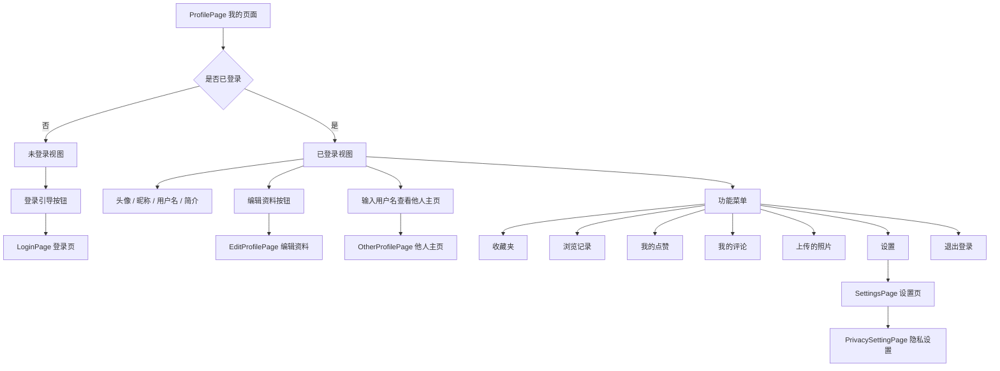

##### 编辑资料页面结构

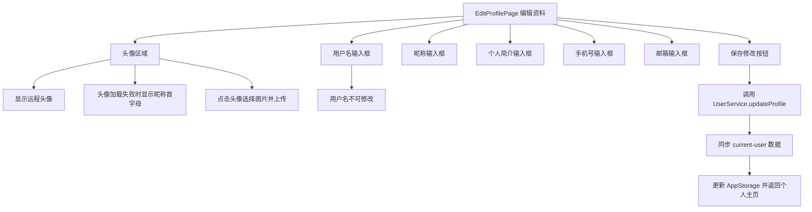

##### 隐私设置与他人主页联动结构

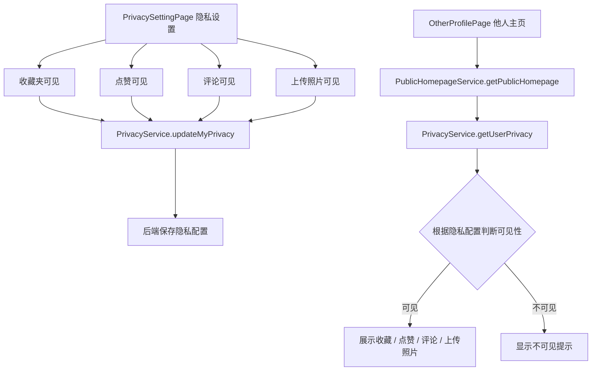

---

#### 5.5.3 用户注册与登录设计

用户注册和登录流程已接入后端真实接口，不再仅依赖前端模拟状态。登录成功后，前端保存后端返回的 `accessToken`、`refreshToken` 和用户基础信息，并使用 `AppStorage` 在多个页面间共享当前用户状态。

##### 注册流程

注册页主要完成新账号创建。页面会进行必要的前端输入校验，例如用户名不能为空、密码长度符合要求、两次密码一致、手机号或邮箱格式合理等。校验通过后调用后端注册接口。

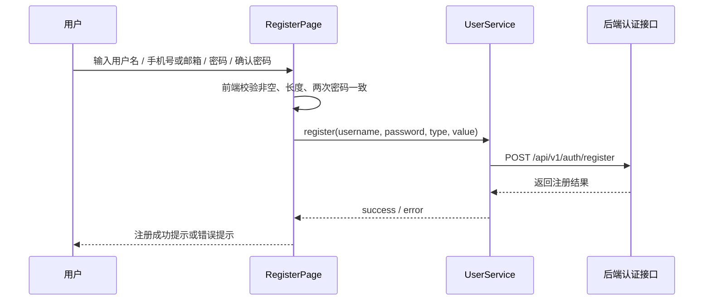

##### 登录流程

登录页支持输入账号和密码完成登录。后端登录成功后返回 Token 和用户信息，前端将登录态和用户基础信息写入 `AppStorage`，用于个人主页、编辑资料页、他人主页等页面状态共享。

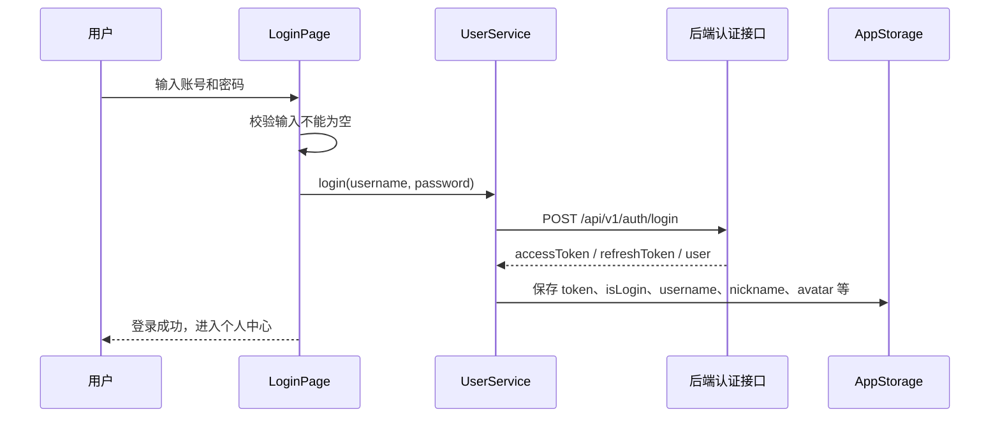

##### 退出登录流程

退出登录时，系统会清空前端保存的登录态和用户基础信息，并跳转回登录页或未登录视图。

清空内容包括：

- `isLogin`
- `token`
- `refreshToken`
- `username`
- `userId`
- `nickname`
- `avatar`
- `bio`
- `phone`
- `email`

---

#### 5.5.4 个人资料管理设计

个人资料管理主要由 `ProfilePage` 和 `EditProfilePage` 配合完成。

`ProfilePage` 用于展示当前用户头像、昵称、用户名、简介和功能入口。页面通过 `@StorageLink` 监听 `AppStorage` 中的用户状态，并在页面显示时重新请求 `current-user`，确保展示数据与后端保持一致。

`EditProfilePage` 用于修改昵称、简介、手机号和邮箱。页面加载时调用当前用户接口填充原有信息，用户可在已有内容基础上修改。点击“保存修改”后，前端调用资料更新接口，并将后端返回的最新用户信息重新写入 `AppStorage`，保证个人主页和编辑资料页数据一致。

##### 资料同步流程

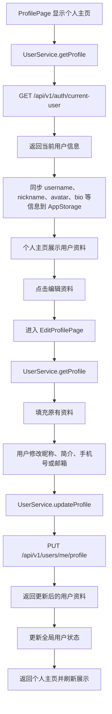

##### 资料字段

| 字段 | 说明 |
| --- | --- |
| `username` | 用户名，不允许在编辑资料页修改 |
| `nickname` | 昵称，可编辑 |
| `bio` | 个人简介，可编辑 |
| `phone` | 手机号，可编辑 |
| `email` | 邮箱，可编辑 |
| `avatar` | 头像 URL，由头像上传接口更新 |

---

#### 5.5.5 头像上传与显示兜底设计

头像上传在真机联调中存在系统文件 URI 限制问题，因此最终采用 **Base64 JSON 上传方案**。用户在编辑资料页点击头像后，从相册选择图片，前端先将图片复制到 App 缓存目录，再读取图片内容并转换为 Base64，最后通过 JSON 请求提交给后端。

##### 头像上传流程

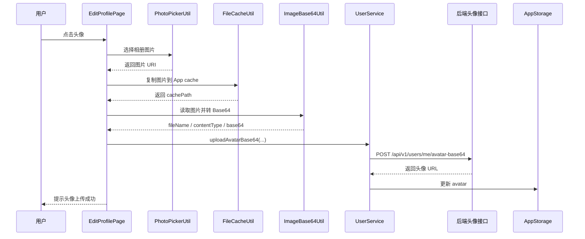

##### 显示兜底策略

头像显示采用“优先显示远程头像，失败时显示昵称首字母”的降级方案：

1. 如果 `avatar` 字段存在且图片可以正常加载，则显示真实头像。
2. 如果头像 URL 为空，则显示昵称或用户名的首字母。
3. 如果头像 URL 存在但远程图片加载失败，则自动切换为昵称或用户名首字母。
4. 编辑资料页保留点击头像重新上传能力，但不额外显示“点击更换头像”文字，保证页面简洁。

该策略保证了即使远程头像资源暂时不可解析，页面仍能稳定展示，不会出现空白或异常图片。

---

#### 5.5.6 修改密码设计

修改密码功能位于设置相关页面中。用户需要输入旧密码、新密码和确认新密码。前端会进行以下校验：

- 旧密码不能为空。
- 新密码不能为空。
- 新密码长度符合要求。
- 两次新密码必须一致。
- 新密码不应与非法格式匹配。

校验通过后，调用后端修改密码接口。修改成功后，用户可以使用新密码重新登录。该设计可以减少无效请求，并避免用户误操作。

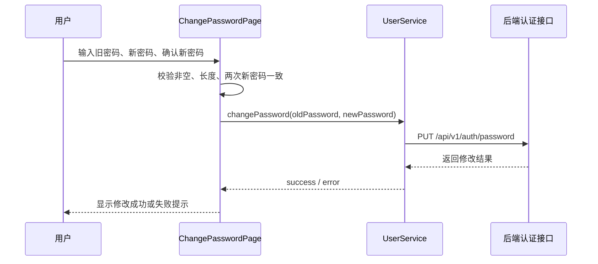

---

#### 5.5.7 隐私设置设计

隐私设置用于控制用户个人主页中互动内容是否对其他用户公开。当前支持四类可见性开关：

| 开关 | 说明 |
| --- | --- |
| 收藏夹可见 | 控制他人是否可以查看用户收藏内容 |
| 点赞可见 | 控制他人是否可以查看用户点赞记录 |
| 评论可见 | 控制他人是否可以查看用户公开评论 |
| 上传照片可见 | 控制他人是否可以查看用户上传照片 |

隐私设置页加载时调用后端读取接口获取当前配置。用户切换开关后，前端会将新的配置保存到后端。为避免页面初始化时 Toggle 自动触发保存逻辑，页面会判断新值是否与当前状态一致；如果一致，则不发起保存请求，也不弹出“设置已更新”提示。

##### 隐私设置保存流程

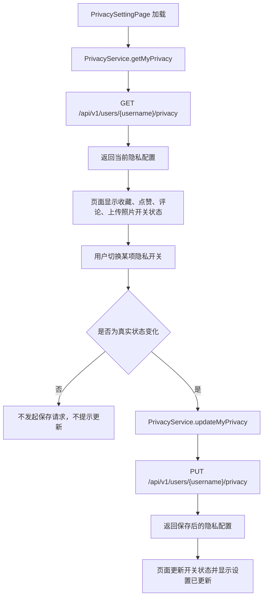

---

#### 5.5.8 他人主页设计

他人主页用于展示其他用户公开的个人信息和互动内容。用户可以在个人中心输入目标用户名并跳转至 `OtherProfilePage`。他人主页展示内容会受到对方隐私配置影响。

##### 他人主页展示规则

| 内容类型 | 可见时 | 不可见时 |
| --- | --- | --- |
| 收藏夹 | 展示收藏文物列表 | 显示“对方设置了收藏夹不可见” |
| 点赞 | 展示点赞记录 | 显示“对方设置了点赞记录不可见” |
| 评论 | 展示公开评论 | 显示“对方设置了评论不可见” |
| 上传照片 | 展示上传照片 | 显示“对方设置了照片不可见” |

他人主页头像显示逻辑与个人主页保持一致：有头像且能加载时显示头像，头像为空或加载失败时显示昵称或用户名首字母。

##### 他人主页数据加载流程

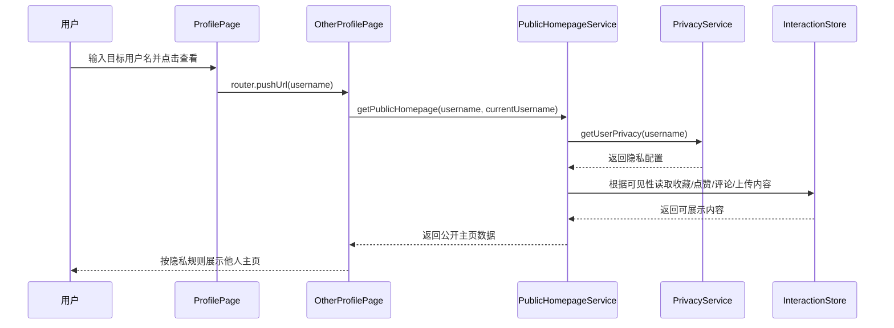

---

#### 5.5.9 服务层与状态管理设计

用户系统模块采用页面层与服务层分离的方式组织代码。页面层主要负责 UI 渲染和用户交互，服务层负责网络请求和业务封装。

##### 主要服务类

| 服务类 | 作用 |
| --- | --- |
| `HttpApi` | 统一封装网络请求，自动拼接基础路径，携带 JWT Token，处理请求结果 |
| `UserService` | 封装登录、注册、获取当前用户、编辑资料、修改密码、头像上传等用户接口 |
| `PrivacyService` | 封装个人隐私设置读取、保存和他人隐私配置读取 |
| `PublicHomepageService` | 聚合他人主页数据，根据隐私配置决定展示内容 |
| `PhotoPickerUtil` | 封装相册图片选择 |
| `FileCacheUtil` | 将相册 URI 对应图片复制到 App 缓存目录 |
| `ImageBase64Util` | 读取图片文件并转换为 Base64，同时识别图片类型 |

##### AppStorage 使用说明

`AppStorage` 用于保存应用运行期间的前端全局状态，支撑多个页面共享用户信息。它不是后端数据库意义上的长期数据源，用户资料和隐私设置最终以后端接口数据为准。

当前主要保存字段如下：

| 字段 | 说明 |
| --- | --- |
| `isLogin` | 当前是否已登录 |
| `token` | 访问令牌 |
| `refreshToken` | 刷新令牌 |
| `userId` | 当前用户 ID |
| `username` | 当前用户名 |
| `nickname` | 当前昵称 |
| `avatar` | 当前头像 URL |
| `bio` | 当前个人简介 |
| `phone` | 当前手机号 |
| `email` | 当前邮箱 |

---

#### 5.5.10 接口设计

当前用户系统模块涉及的后端接口如下：

| 功能 | 请求方式 | 接口路径 | 说明 |
| --- | --- | --- | --- |
| 用户登录 | POST | `/api/v1/auth/login` | 用户输入账号和密码完成登录 |
| 用户注册 | POST | `/api/v1/auth/register` | 新用户注册 |
| 获取当前用户 | GET | `/api/v1/auth/current-user` | 获取当前登录用户资料 |
| 编辑个人资料 | PUT | `/api/v1/users/me/profile` | 修改昵称、简介、手机号、邮箱 |
| 修改密码 | PUT | `/api/v1/auth/password` | 使用旧密码修改为新密码 |
| 读取隐私设置 | GET | `/api/v1/users/{username}/privacy` | 获取指定用户隐私配置 |
| 保存隐私设置 | PUT | `/api/v1/users/{username}/privacy` | 保存当前用户隐私配置 |
| 上传头像 | POST | `/api/v1/users/me/avatar-base64` | 通过 Base64 JSON 上传头像 |

接口返回统一遵循后端通用格式：

```json
{
  "code": 200,
  "message": "success",
  "data": {}
}
```

---

#### 5.5.11 安全性与异常处理设计

##### 前端输入校验

| 场景 | 校验内容 |
| --- | --- |
| 注册 | 用户名不能为空；密码长度符合要求；两次密码一致；手机号或邮箱格式合理 |
| 登录 | 账号不能为空；密码不能为空 |
| 编辑资料 | 昵称不能为空；手机号和邮箱可按格式校验 |
| 修改密码 | 旧密码不能为空；新密码不能为空；两次新密码一致；新密码长度符合要求 |
| 查看他人主页 | 目标用户名不能为空；不能重复跳转到自己的他人主页 |

##### Token 与请求安全

登录成功后，前端将后端返回的 Token 写入 `AppStorage`。后续需要身份认证的请求由 `HttpApi` 统一添加：

```text
Authorization: Bearer <token>
```

当请求返回未认证或 Token 失效时，前端可清除登录状态并引导用户重新登录。

##### 异常与兜底策略

| 异常场景 | 处理策略 |
| --- | --- |
| 登录失败 | Toast 提示失败原因 |
| 注册失败 | Toast 提示后端返回错误或注册失败 |
| 获取用户信息失败 | 使用已有前端状态兜底，并提示加载失败 |
| 保存资料失败 | 保留原页面输入内容，提示保存失败 |
| 修改密码失败 | 提示失败原因，不清空输入 |
| 隐私设置读取失败 | 为保护隐私，默认使用较保守的不可见策略 |
| 隐私设置保存失败 | 回滚到旧设置并提示保存失败 |
| 头像上传失败 | 保持原头像或首字母头像，提示上传失败 |
| 头像加载失败 | 自动降级显示昵称或用户名首字母 |
| 未登录访问 | 显示登录引导或跳转登录页 |

---

#### 5.5.12 模块特点与扩展方向

##### 当前模块特点

1. **用户流程闭环完整**  
   已覆盖注册、登录、资料编辑、修改密码、隐私设置、他人主页查看和退出登录等完整用户流程。

2. **状态同步清晰**  
   通过 `AppStorage` 与页面生命周期函数实现个人主页、编辑资料页、他人主页之间的数据同步。

3. **隐私联动真实生效**  
   隐私开关不仅能保存设置，还能影响他人主页展示内容，实现“设置—保存—展示限制”的闭环。

4. **头像处理具有容错能力**  
   支持头像上传，同时为远程头像加载失败提供昵称首字母兜底。

5. **服务层封装降低耦合**  
   用户相关接口集中在 `UserService` 和 `PrivacyService` 中，页面层无需直接处理底层网络请求。

##### 后续扩展方向

- 支持更完整的手机号和邮箱格式校验。
- 支持邮箱或短信验证码注册与找回密码。
- 支持真实第三方账号登录，例如华为账号一键登录。
- 支持用户主动删除头像或恢复默认头像。
- 他人主页后续可进一步接入后端真实收藏、点赞、评论、上传照片接口。
- 隐私设置可扩展为更细粒度的内容可见范围，例如仅自己、好友可见、全部可见。

## 6. 非功能性设计

### 6.1 性能设计

#### 6.1.1 图片加载优化

- **策略**：列表页使用缩略图（?size=thumb 参数），详情页加载原图
- **缓存**：使用 Image 组件内置缓存机制，避免重复下载
- **占位图**：加载中显示骨架屏或默认占位图

#### 6.1.2 语音与本地交互响应优化

- **语音识别超时**：设置为 10 秒，超时后提示用户重试
- **语音合成预加载**：进入文物详情页时预加载语音讲解
- **SSE 流式展示**：语音问答采用流式响应，逐字显示答案，减少等待感

#### 6.1.3 列表性能优化

- 文物页文物列表使用 LazyForEach 实现懒加载
- 分页加载，每页 20 条

### 6.2 安全设计

#### 6.2.1 认证与授权

- 采用 JWT 无状态认证机制
- Token 设置过期时间（建议 2 小时）
- 请求在 HttpApi 中统一携带 `Authorization: Bearer {token}`

#### 6.2.2 数据安全

- 用户密码使用 bcrypt 加密存储（后端）
- 密码等敏感信息不在本地明文存储
- 所有 API 通信采用 HTTPS 加密

#### 6.2.3 权限管理

- 调用系统敏感能力（相机、麦克风）前动态申请权限
- 用户可在设置中随时撤销权限
- 未授权时给出明确提示并引导用户授权

#### 6.2.4 输入校验

- 所有用户输入进行前端校验（长度、格式等）
- 防止 XSS 攻击，对用户生成内容进行转义处理

### 6.3 容错与异常处理

#### 6.3.1 网络异常处理

| 场景              | 处理策略                                |
| ----------------- | --------------------------------------- |
| 无网络连接        | 显示“网络不可用”提示，展示本地缓存数据  |
| 请求超时          | 自动重试 1 次，仍失败则提示用户稍后再试 |
| 服务器错误（5xx） | 提示“服务器繁忙，请稍后再试”            |
| Token 过期        | 自动跳转登录页，提示重新登录            |

#### 6.3.2 功能降级

- **语音识别失败**：降级为手动输入搜索关键词
- **图片搜索超时**：提示用户“检索超时，请尝试重新上传”
- **音视频加载失败**：显示“加载失败，点击重试”按钮

### 6.4 可扩展性设计

- 模块间通过接口解耦，新增功能模块不影响已有代码
- 网络层封装支持后续更换后端地址或添加拦截器
- 数据模型独立定义，便于与后端协商调整字段


## 7. 附录

### 7.1 与其它子系统的集成约定

| 子系统 / 服务       | 集成内容                       | 约定说明                                                     |
| ------------------- | ------------------------------ | ------------------------------------------------------------ |
| 后台管理子系统      | 文物数据、博物馆数据、审核状态 | 后台管理负责文物与博物馆基础数据维护；掌上博物馆移动端通过只读接口读取展示，不负责文物数据增删改查 |
| 图像检索服务        | 以图搜图                       | 发现页上传或拍摄图片后调用图像检索接口，返回相似文物及相似度 |
| 知识问答子系统      | 复杂语音问答                   | 文物详情页或语音问答功能可调用问答接口，复杂回答支持 SSE 流式输出 |
| 用户认证 / 用户系统 | 登录注册、Token 校验           | 登录成功后本地保存 Token，网络请求通过 `Authorization: Bearer <token>` 传递身份信息 |
| 后台审核服务        | 评论、照片审核                 | 用户评论和上传照片需进入审核流程，移动端展示审核状态         |

### 7.2 Git 协作规范

1. **禁止直接推送到 `main` 分支**
2. 每位组员基于 `main` 创建自己的功能分支，命名格式：`feature/<模块名>`（如 `feature/browse-module`）
3. 每天工作结束前将分支推送至远端备份
4. 合并时发起 Pull Request，由组长审核后合并
5. 合并冲突由开发者本地解决后重新推送

### 7.3 GitHub 仓库信息

- 仓库地址：`https://github.com/BUCT-CS2301/PalmMuseum.git`
- 主分支：`main`
