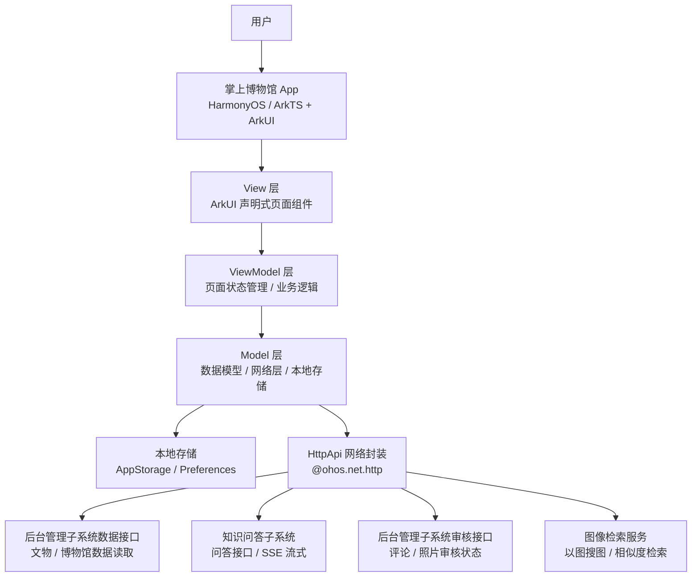
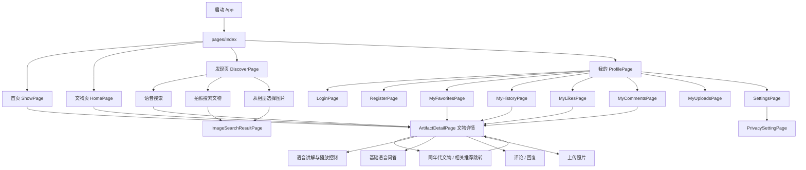
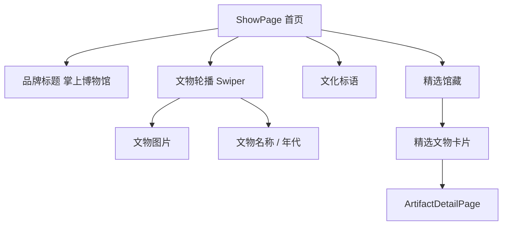
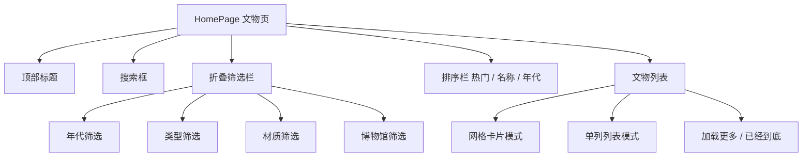
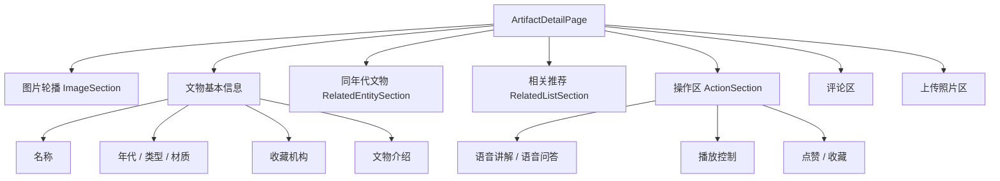
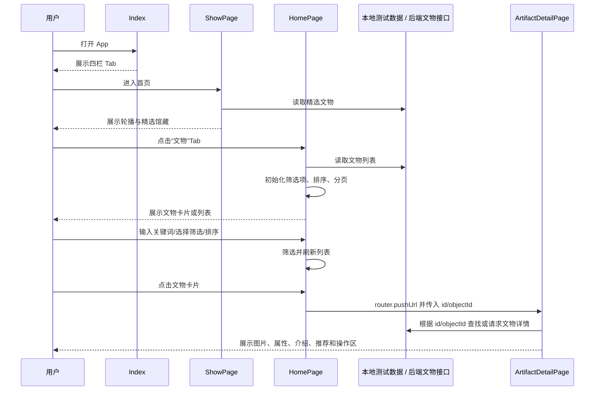
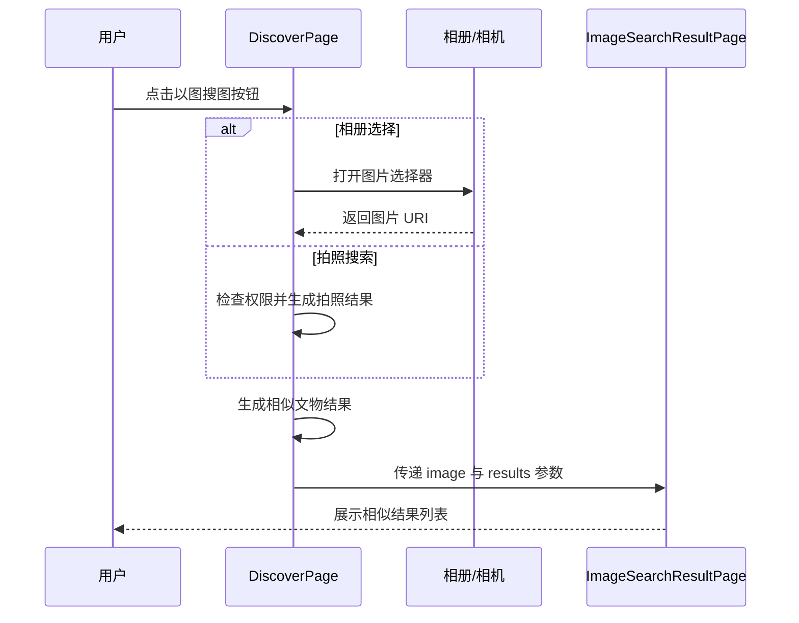
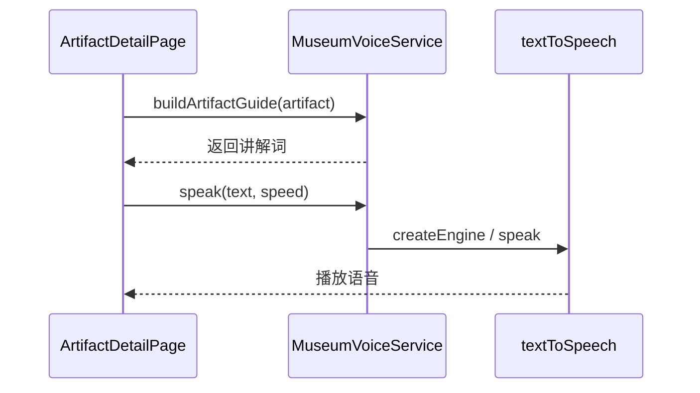
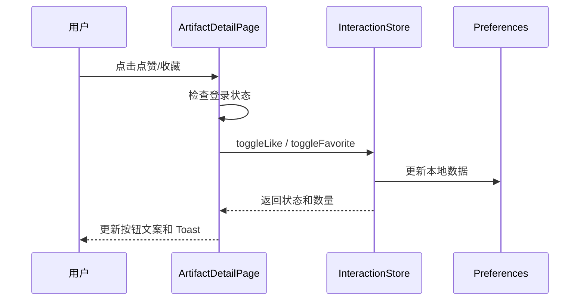

# 海外藏中国文物知识管理与服务平台 - 掌上博物馆子系统 设计报告


## 1. 引言

### 1.1 文档目的

本文档用于描述掌上博物馆子系统的总体架构、模块划分、接口设计、数据库设计、UI设计及非功能性设计，为系统开发、测试和后续集成提供技术依据。

### 1.2 子系统概述

掌上博物馆是“海外藏中国文物知识管理与服务平台”的移动端子系统，基于华为 HarmonyOS 开发，采用 ArkTS 语言与 ArkUI 框架。当前前端仓库以课程原型实现为主，围绕海外藏中国文物提供浏览、发现、语音导览、以图搜图与用户互动能力。

当前 App 的主界面采用 **首页 / 文物 / 发现 / 我的** 四个底部 Tab：

- **首页**：平台标题、文物轮播、精选馆藏与推荐入口。
- **文物**：文物列表浏览、文物页内搜索、多维筛选、排序、分页加载和文物详情跳转。
- **发现**：语音搜索入口与以图搜图入口。
- **我的**：登录注册、个人主页、收藏夹、浏览记录、我的评论、上传照片、隐私设置。

主要功能包括：

- **文物浏览**：首页精选馆藏展示、文物页卡片/列表展示、搜索、筛选、排序、分页加载、文物详情页、同年代文物与相关推荐。
- **以图搜图**：发现页相册选择图片、拍照搜索入口、相似度结果展示。
- **语音导览**：发现页语音搜索、详情页文物语音讲解、播放控制、基础语音问答。
- **用户交互**：点赞、收藏及分组管理、评论与回复、评论点赞、浏览记录、用户上传照片。
- **用户个人信息管理**：注册登录、个人主页、隐私设置和退出登录。

本阶段实现以本地测试数据与本地存储为主，已预留网络请求封装。正式联调时，文物与博物馆基础数据由后台管理子系统维护，移动端通过接口读取展示；语音问答、图像检索和用户内容审核等能力按对应子系统接口接入。

### 1.3 目标读者

- 前端开发人员（本组全体成员）
- 后端开发人员（知识服务子系统、知识问答子系统、后台管理子系统成员）
- 测试工程师
- 项目管理人员
- 助教及评审教师

### 1.4 术语与缩略语

| 术语    | 全称                                    | 描述                                         |
| ------- | --------------------------------------- | -------------------------------------------- |
| ArkTS   | Ark TypeScript                          | HarmonyOS 官方开发语言，基于 TypeScript 扩展 |
| ArkUI   | Ark User Interface                      | HarmonyOS 声明式 UI 框架                     |
| MVVM    | Model-View-ViewModel                    | 前端架构模式，分离 UI、业务逻辑与数据        |
| JWT     | JSON Web Token                          | 用户认证令牌，无状态身份验证                 |
| RESTful | Representational State Transfer         | API 设计风格                                 |
| SSE     | Server-Sent Events                      | 服务器推送事件，用于流式响应                 |
| CLIP    | Contrastive Language-Image Pre-training | 图像特征提取模型                             |
| FAISS   | Facebook AI Similarity Search           | 向量相似度检索引擎                           |

### 1.5 参考文献

1. 课程设计题目 - 海外藏中国文物知识管理与服务平台.docx  
2. 华为 HarmonyOS 开发者文档：https://developer.harmonyos.com/


## 2. 系统架构设计

### 2.1 架构风格

本子系统采用 **MVVM（Model-View-ViewModel）** 分层架构，主要分为以下三层：

- **View 层（UI 层）**：使用 ArkUI 声明式组件构建页面，负责界面渲染与用户交互。
- **ViewModel 层（业务逻辑层）**：管理页面状态，处理业务逻辑，调用 Model 层接口。
- **Model 层（数据层）**：定义数据结构，封装网络请求与本地存储操作。

此外，本子系统**不直接操作知识图谱**，所有业务数据通过后端 API 获取；以图搜图的特征提取与相似度检索由后端（CLIP + FAISS）完成，移动端仅负责图片采集与结果展示。

### 2.2 总体分层架构图



说明：文物与博物馆基础数据由后台管理子系统维护，移动端仅通过接口读取并展示，不在 App 端提供文物数据增删改查能力。

### 2.3 技术栈

| 类别      | 技术选型                                 | 说明                                                         |
| --------- | ---------------------------------------- | ------------------------------------------------------------ |
| 开发平台  | HarmonyOS                                | 面向手机和平板设备                                           |
| 开发语言  | ArkTS                                    | HarmonyOS 推荐开发语言                                       |
| UI 框架   | ArkUI                                    | 声明式 UI 组件开发                                           |
| 开发工具  | DevEco Studio 6.1.0 (Release)            | 统一开发环境                                                 |
| 路由管理  | `@ohos.router`                           | 页面跳转与参数传递                                           |
| 网络请求  | `@ohos.net.http`                         | 已封装为 `HttpApi`，基础路径为 `/api/v1`                     |
| 本地状态  | `AppStorage`                             | 保存登录状态、用户名、统计数据等轻量状态                     |
| 本地存储  | `Preferences`                            | 保存点赞、收藏、评论、上传记录、隐私配置等原型数据           |
| 文物数据  | `本地测试数据`                           | 当前原型使用本地模拟文物数据，后续可替换为接口数据           |
| 语音能力  | `@kit.CoreSpeechKit`                     | 使用 `textToSpeech` 和 `speechRecognizer` 实现语音播报与语音识别 |
| 图片选择  | `@kit.CoreFileKit` / `@ohos.file.picker` | 用于相册图片选择与上传照片                                   |
| 相机/权限 | `@ohos.abilityAccessCtrl`、相机权限      | 用于以图搜图拍照入口                                         |
| 图像展示  | `Image` 组件                             | 文物图片、上传图片和识图结果展示                             |
| 版本控制  | Git + GitHub                             | 团队协作开发                                                 |

### 2.4 模块划分

| 模块编号 | 模块名称           | 负责人 | 功能描述                                                     |
| -------- | ------------------ | ------ | ------------------------------------------------------------ |
| M1       | 框架统筹与用户系统 | 潘晨晨 | `Index` 四栏底部导航：首页、文物、发现、我的；登录注册、个人主页、设置与隐私管理 |
| M2       | 文物浏览           | 郝婧   | 首页 `ShowPage` 精选展示、文物页 `HomePage` 列表/搜索/筛选/排序、文物详情页 `ArtifactDetailPage` |
| M3       | 以图搜图           | 王珍   | 发现页拍照搜图、相册选择图片、`ImageSearchResultPage` 相似度结果展示 |
| M4       | 语音导览           | 范力烨 | 发现页语音搜索、文物详情页语音讲解播放、播放控制、基础语音问答 |
| M5       | 用户交互（社交）   | 刘清   | 点赞、收藏及分组管理、评论与回复、浏览记录、用户上传照片及审核状态展示 |

## 3. 总体设计与公共部分

### 3.1 页面路由设计

#### 3.1.1 路由表

当前 `main_pages.json` 中注册了 `Index`、`HomePage`、`ProfilePage`、`LoginPage`、`RegisterPage`、`DiscoverPage`、`ArtifactDetailPage`、`ImageSearchResultPage` 以及个人中心相关页面。`ShowPage` 作为首页展示组件嵌入 `Index` 的第一个 Tab 中，不单独作为路由跳转页面。

| 页面名称       | 路由路径 / 组件               | 所属模块    | 说明                                                   |
| -------------- | ----------------------------- | ----------- | ------------------------------------------------------ |
| 主入口页       | `pages/Index`                 | M1 框架     | 四栏 Tab 容器，包含首页、文物、发现、我的              |
| 首页           | `ShowPage`（嵌入 `Index`）    | M2 文物浏览 | 平台标题、轮播展示、精选馆藏入口                       |
| 文物页         | `pages/HomePage`              | M2 文物浏览 | 文物列表、搜索、筛选、排序、分页加载                   |
| 发现页         | `pages/DiscoverPage`          | M3/M4       | 语音搜索与以图搜图入口                                 |
| 文物详情页     | `pages/ArtifactDetailPage`    | M2/M4/M5    | 文物详情、语音讲解、语音问答、点赞收藏、评论、上传照片 |
| 以图搜图结果页 | `pages/ImageSearchResultPage` | M3 以图搜图 | 展示相似文物结果及相似度                               |
| 我的页面       | `pages/ProfilePage`           | M1 用户系统 | 登录状态展示、个人功能入口                             |
| 登录页         | `pages/LoginPage`             | M1 用户系统 | 用户登录入口                                           |
| 注册页         | `pages/RegisterPage`          | M1 用户系统 | 新用户注册入口                                         |
| 我的收藏页     | `pages/MyFavoritesPage`       | M5 用户交互 | 收藏夹、分组管理、移出收藏                             |
| 浏览记录页     | `pages/MyHistoryPage`         | M5 用户交互 | 查看历史浏览文物                                       |
| 我的点赞页     | `pages/MyLikesPage`           | M5 用户交互 | 查看已点赞文物                                         |
| 我的评论页     | `pages/MyCommentsPage`        | M5 用户交互 | 查看本人评论与审核状态                                 |
| 上传照片页     | `pages/MyUploadsPage`         | M5 用户交互 | 上传参观照片并查看审核状态                             |
| 设置页         | `pages/SettingsPage`          | M1 用户系统 | 账号与系统设置入口                                     |
| 隐私设置页     | `pages/PrivacySettingPage`    | M1/M5       | 管理收藏、点赞、评论、上传照片可见性                   |

> 说明：旧文档中单独规划的 `SearchPage`、`ImageSearchPage`、`VoiceGuidePage`、`VoiceQAPage` 在当前实现中已合并到文物页、发现页和文物详情页中，不再作为独立页面描述。

#### 3.1.2 页面跳转流程图



### 3.2 网络层封装设计

本子系统通过 `common/network/HttpApi.ets` 封装 `@ohos.net.http` 能力，统一处理基础路径、Token、请求超时和异常状态。当前前端实现中，部分页面仍使用本地测试数据运行；后续联调时，可逐步将文物数据、用户数据、审核状态、图像检索和问答请求切换到 `HttpApi`。

```typescript
// HttpApi.ets - 统一网络请求封装
import http from '@ohos.net.http';

const BASE_URL = 'http://60.205.14.101:8080/api/v1';

export class HttpApi {
  static getToken(): string {
    return (AppStorage.Get('token') as string) || '';
  }

  static async get<T>(url: string, params?: Record<string, string>): Promise<T> {
    // 拼接 BASE_URL，添加 Authorization: Bearer <token>
    // 统一设置 connectTimeout/readTimeout 为 10000ms
    // 401 时清除登录状态并提示重新登录
    return {} as T;
  }

  static async post<T>(url: string, body: object): Promise<T> {
    // 统一 JSON 请求体、Token 请求头和异常处理
    return {} as T;
  }

  static async put<T>(url: string, body: object): Promise<T> {
    // 用于更新类接口，如用户设置、隐私设置等
    return {} as T;
  }
}
```

接口返回格式应与后端保持一致，推荐统一为：

```json
{
  "code": 200,
  "message": "success",
  "data": {}
}
```

### 3.3 公共数据模型定义

当前前端原型的核心数据模型与本地存储模型如下。正式联调时，应在网络层或数据适配层中完成后端字段到前端字段的映射。

#### 3.3.1 文物数据模型

```typescript
// common/models/Artifact.ets
export interface Artifact {
  id: string;              // 前端内部使用的文物唯一 ID；后端对应 objectId
  title: string;           // 文物名称
  imageUrl: string;        // 主图地址
  imageUrls?: string[];    // 多图地址数组
  period: string;          // 年代
  type: string;            // 类型
  material: string;        // 材质
  description: string;     // 文物介绍
  museum: string;          // 收藏博物馆
  popularity?: number;     // 热度值，用于热门排序
}
```

> 说明：后台管理子系统的文物数据接口通常使用 `objectId` 作为资源唯一标识，当前前端本地测试数据使用 `id`。移动端只读取和展示文物数据，不提供文物数据维护入口。

#### 3.3.2 用户交互相关模型

用户交互模块围绕以下本地模型进行存储和展示：

| 模型                 | 说明                                                         |
| -------------------- | ------------------------------------------------------------ |
| `FavoriteItem`       | 收藏文物快照，包含文物 ID、标题、图片、年代、博物馆、分组、收藏时间 |
| `CommentItem`        | 评论与回复，包含评论内容、所属文物、用户、审核状态、点赞数   |
| `UploadedPhotoItem`  | 上传照片记录，包含图片 URI、地点、说明、审核状态             |
| `HistoryItem`        | 浏览记录，记录用户浏览过的文物和时间                         |
| `PrivacySettings`    | 隐私设置，控制收藏、点赞、评论、上传照片可见性               |
| `InteractionSummary` | 点赞、收藏等互动状态和数量统计                               |

#### 3.3.3 本地状态与持久化

| 存储方式      | 当前用途                                                     |
| ------------- | ------------------------------------------------------------ |
| `AppStorage`  | 登录状态、用户名、用户 ID、Token、个人统计数据、交互刷新标记 |
| `Preferences` | 点赞、收藏、评论、照片、历史记录、隐私设置等原型数据         |
| 本地测试数据  | 文物浏览、详情、搜索、推荐、语音搜索的前端原型数据源         |

## 4. 接口设计

本子系统不直接操作数据库。文物与博物馆基础数据由后台管理子系统维护，移动端通过数据接口读取并展示；用户交互、审核、图像检索和复杂问答分别与对应后端服务对接。当前前端原型仍可使用本地测试数据运行，正式联调时按以下接口方向替换。

### 4.1 当前前端内部调用方式

| 调用对象         | 当前实现                                                     | 调用模块                 |
| ---------------- | ------------------------------------------------------------ | ------------------------ |
| 文物数据         | 本地测试数据                                                 | M2 文物浏览、M4 语音搜索 |
| 文物详情         | 通过 `id` 在本地测试数据中查找                               | M2 文物详情              |
| 相关推荐         | 按 `period` 或 `type` 在本地文物中匹配                       | M2 文物浏览              |
| 语音讲解         | `MuseumVoiceService.buildArtifactGuide` + `speak`            | M4 语音导览              |
| 语音搜索         | `MuseumVoiceService.searchArtifactByText` + `handleVoiceSearch` | M4 语音导览              |
| 基础问答         | `MuseumVoiceService.answerQuestion`                          | M4 语音导览              |
| 点赞收藏评论上传 | 交互存储服务 + `Preferences`                                 | M5 用户交互              |
| 登录状态         | `AppStorage`                                                 | M1 用户系统              |
| 图片选择         | `PhotoViewPicker` / 相机权限                                 | M3/M5                    |

### 4.2 对接后台管理子系统数据接口

后台管理子系统负责维护文物、博物馆等基础数据。移动端仅调用读取类接口，不调用创建、更新、删除、批量导入和图片上传等管理接口。

| 接口名称       | 请求方式 | 建议路径                         | 说明                                                         | 调用模块                 |
| -------------- | -------- | -------------------------------- | ------------------------------------------------------------ | ------------------------ |
| 获取文物列表   | GET      | `/data/relics`                   | 分页获取文物数据，支持 `page`、`pageSize`、`keyword`、`museumId` 等参数 | M2 文物浏览              |
| 获取文物详情   | GET      | `/data/relics/{objectId}`        | 获取单件文物完整信息                                         | M2 文物浏览、M4 语音讲解 |
| 搜索文物       | GET      | `/data/relics?keyword={keyword}` | 根据关键词检索文物                                           | M2 文物浏览、M4 语音搜索 |
| 获取博物馆列表 | GET      | `/data/museums`                  | 获取博物馆基本信息，用于筛选和详情展示                       | M2 文物浏览              |
| 获取博物馆详情 | GET      | `/data/museums/{objectId}`       | 获取指定博物馆信息                                           | M2 文物浏览              |

### 4.3 对接图像检索服务接口

| 接口名称     | 请求方式 | 建议路径        | 说明                                             | 调用模块    |
| ------------ | -------- | --------------- | ------------------------------------------------ | ----------- |
| 图像特征检索 | POST     | `/search/image` | 上传图片，返回相似文物列表、相似度和文物基本信息 | M3 以图搜图 |

### 4.4 对接知识问答子系统接口

| 接口名称     | 请求方式 | 建议路径             | 说明                                                         | 调用模块    |
| ------------ | -------- | -------------------- | ------------------------------------------------------------ | ----------- |
| 问答对话     | POST     | `/qa/chat`           | 发送问题、文物 ID、历史会话 ID，返回回答；复杂问答支持 SSE 流式响应 | M4 语音导览 |
| 获取历史列表 | GET      | `/qa/getHistoryList` | 获取用户历史问答记录                                         | M4 语音导览 |

### 4.5 对接后台管理 / 用户交互接口

| 接口名称      | 请求方式 | 建议路径                    | 说明                                     | 调用模块    |
| ------------- | -------- | --------------------------- | ---------------------------------------- | ----------- |
| 提交评论      | POST     | `/comments`                 | 提交评论并进入审核流程                   | M5 用户交互 |
| 获取评论列表  | GET      | `/comments`                 | 获取指定文物已审核评论                   | M5 用户交互 |
| 上传照片      | POST     | `/photos/upload`            | 上传用户照片并进入审核流程               | M5 用户交互 |
| 获取审核状态  | GET      | `/audit/status/{contentId}` | 查询评论或照片审核状态                   | M5 用户交互 |
| 点赞/收藏操作 | POST     | `/user/action`              | 提交点赞、收藏、取消点赞、取消收藏等行为 | M5 用户交互 |
| 保存隐私设置  | PUT      | `/user/privacy`             | 保存用户隐私开关配置                     | M1/M5       |

> 接口命名需在后续联调时与各后端子系统最终文档统一。本文档强调职责边界：后台管理维护文物数据，掌上博物馆移动端读取展示文物数据。

## 5. 数据库设计

### 5.1 本地存储设计

当前前端实现中的本地存储主要用于支撑课程原型运行。正式接入后端后，本地存储应作为离线缓存或临时状态缓存，不作为文物基础数据的权威数据源。

| 存储方式      | 用途               | 关键数据                                                     |
| ------------- | ------------------ | ------------------------------------------------------------ |
| `AppStorage`  | 页面级全局状态     | `isLogin`、`username`、`userId`、`token`、个人统计、交互版本标记 |
| `Preferences` | 本地持久化原型数据 | 点赞、收藏、收藏夹分组、评论、评论点赞、上传照片、浏览历史、隐私设置 |
| 本地测试数据  | 前端原型展示       | 文物 ID、名称、图片、年代、类型、材质、描述、博物馆、热度    |

说明：文物、博物馆等基础数据的维护应由后台管理子系统完成；移动端只保留必要缓存，避免出现多端数据不一致。

### 5.2 用户数据库表设计（与后端共用，需协商一致）

以下为建议设计，最终需与知识服务子系统、后台管理子系统协商统一。

```sql
-- 用户表
CREATE TABLE user (
  user_id      INT PRIMARY KEY AUTO_INCREMENT,
  username     VARCHAR(50) NOT NULL UNIQUE,
  password     VARCHAR(255) NOT NULL,        -- bcrypt 加密存储
  email        VARCHAR(100),
  phone        VARCHAR(20),
  avatar       VARCHAR(255),                 -- 头像URL
  status       TINYINT DEFAULT 1,            -- 1:正常 0:禁用
  privacy_setting JSON,                      -- 隐私设置（JSON格式）
  created_at   DATETIME DEFAULT CURRENT_TIMESTAMP,
  updated_at   DATETIME ON UPDATE CURRENT_TIMESTAMP
);

-- 收藏表
CREATE TABLE favorite (
  favorite_id  INT PRIMARY KEY AUTO_INCREMENT,
  user_id      INT NOT NULL,
  object_id    VARCHAR(50) NOT NULL,
  group_name   VARCHAR(50) DEFAULT '默认收藏夹',
  created_at   DATETIME DEFAULT CURRENT_TIMESTAMP,
  FOREIGN KEY (user_id) REFERENCES user(user_id)
);

-- 评论表
CREATE TABLE comment (
  comment_id   INT PRIMARY KEY AUTO_INCREMENT,
  user_id      INT NOT NULL,
  object_id    VARCHAR(50) NOT NULL,
  content      TEXT NOT NULL,
  parent_id    INT DEFAULT NULL,             -- 父评论ID，用于回复
  audit_status TINYINT DEFAULT 0,            -- 0:待审 1:通过 2:拒绝
  created_at   DATETIME DEFAULT CURRENT_TIMESTAMP,
  FOREIGN KEY (user_id) REFERENCES user(user_id),
  FOREIGN KEY (parent_id) REFERENCES comment(comment_id)
);

-- 用户上传照片表
CREATE TABLE user_photo (
  photo_id     INT PRIMARY KEY AUTO_INCREMENT,
  user_id      INT NOT NULL,
  object_id    VARCHAR(50),                  -- 关联的文物ID（可选）
  photo_url    VARCHAR(255) NOT NULL,
  description  VARCHAR(500),
  location     VARCHAR(200),                 -- 拍摄地点
  audit_status TINYINT DEFAULT 0,            -- 0:待审 1:通过 2:拒绝
  created_at   DATETIME DEFAULT CURRENT_TIMESTAMP,
  FOREIGN KEY (user_id) REFERENCES user(user_id)
);

-- 点赞表
CREATE TABLE user_like (
  like_id      INT PRIMARY KEY AUTO_INCREMENT,
  user_id      INT NOT NULL,
  object_id    VARCHAR(50) NOT NULL,
  created_at   DATETIME DEFAULT CURRENT_TIMESTAMP,
  UNIQUE KEY (user_id, object_id),
  FOREIGN KEY (user_id) REFERENCES user(user_id)
);
```


## 6. 模块详细设计

> **说明**：本节按既定分工编写，并根据当前前端实现统一调整为“首页 / 文物 / 发现 / 我的”四栏底部导航。旧设计中独立的搜索页、语音导览页、语音问答页和以图搜图入口页，在当前实现中分别合并到 `HomePage`、`DiscoverPage` 和 `ArtifactDetailPage`。

### 6.1 文物浏览模块（郝婧 编写）

#### 6.1.1 模块概述

文物浏览模块对应 `ShowPage`、`HomePage` 与 `ArtifactDetailPage`，是 App 的核心内容展示模块。`ShowPage` 作为底部 Tab 的“首页”，用于展示平台标题、轮播文物和精选馆藏；`HomePage` 作为“文物”页，用于展示文物列表、搜索、筛选、排序和分页加载；`ArtifactDetailPage` 用于展示单件文物详情、同年代文物和相关推荐。

文物基础数据由后台管理子系统维护，移动端当前使用本地测试数据完成原型展示，正式联调时应通过文物数据接口读取。

#### 6.1.2 页面与组件设计

**ShowPage 首页组件结构**



**HomePage 文物页组件结构**



**ArtifactDetailPage 组件结构**



#### 6.1.3 组件交互流程



#### 6.1.4 数据结构设计

| 字段              | 类型     | 说明                                                 |
| ----------------- | -------- | ---------------------------------------------------- |
| `id` / `objectId` | string   | 文物唯一标识，前端当前使用 `id`，后端使用 `objectId` |
| `title`           | string   | 文物名称                                             |
| `imageUrl`        | string   | 文物主图                                             |
| `imageUrls`       | string[] | 文物多图，可选                                       |
| `period`          | string   | 年代                                                 |
| `type`            | string   | 类型                                                 |
| `material`        | string   | 材质                                                 |
| `description`     | string   | 文物介绍                                             |
| `museum`          | string   | 收藏博物馆                                           |
| `popularity`      | number   | 热度排序值，可选                                     |

#### 6.1.5 接口与扩展说明

| 当前逻辑                      | 后续接口建议                   |
| ----------------------------- | ------------------------------ |
| 首页 / 文物页读取本地测试数据 | GET `/data/relics`             |
| 文物页搜索筛选本地数组        | GET `/data/relics?keyword=...` |
| 详情页按 `id` 查找            | GET `/data/relics/{objectId}`  |
| 博物馆筛选项                  | GET `/data/museums`            |
| 同年代 / 相关推荐本地匹配     | 后续可由知识服务或推荐接口提供 |

---

### 6.2 以图搜图模块（王珍 编写）

#### 6.2.1 模块概述

以图搜图模块当前集成在 `DiscoverPage` 中，结果展示页面为 `ImageSearchResultPage`。用户可通过“拍照搜索文物”或“从相册选择图片”触发识图流程。当前原型通过模拟结果生成相似文物列表，后续可替换为图像检索服务。

#### 6.2.2 技术方案

| 功能     | 当前实现                                                 |
| -------- | -------------------------------------------------------- |
| 入口页面 | `DiscoverPage` 中的“以图搜图”卡片                        |
| 相册选择 | `PhotoViewPicker`，单图选择                              |
| 拍照入口 | 请求相机/媒体读取权限，当前使用模拟图片进入结果流程      |
| 结果生成 | 从本地模拟文物中生成相似度结果                           |
| 结果展示 | `ImageSearchResultPage` 列表展示图片、名称、年代、相似度 |

#### 6.2.3 业务流程



#### 6.2.4 接口调用设计

当前阶段：

| 方法                   | 说明                             |
| ---------------------- | -------------------------------- |
| `requestPermissions()` | 申请相机和媒体读取权限           |
| `openCamera()`         | 进入拍照搜索流程                 |
| `openAlbum()`          | 调用相册选择图片                 |
| `startImageSearch()`   | 生成模拟相似文物结果并跳转结果页 |

后续联调接口：

| 接口            | 方式 | 说明                                   |
| --------------- | ---- | -------------------------------------- |
| `/search/image` | POST | 上传图片文件，返回相似文物列表和相似度 |

#### 6.2.5 UI 设计

- `DiscoverPage` 中展示“以图搜图”卡片。
- 卡片内包含“拍照搜索文物”和“从相册选择图片”两个按钮。
- `ImageSearchResultPage` 展示“以图搜图结果”标题。
- 结果卡片展示图片、文物名称、年代、相似度。

---

### 6.3 语音导览模块（范力烨 编写）

#### 6.3.1 模块概述

语音导览模块由 `MuseumVoiceService` 统一封装，页面入口分布在 `DiscoverPage` 和 `ArtifactDetailPage` 中。当前实现包括语音播报、播放控制、语音搜索、本地规则问答；后续可扩展为接入知识问答子系统的 SSE 流式问答。

#### 6.3.2 语音播讲设计

语音播讲用于在文物详情页播放当前文物介绍。



核心方法：

| 方法                           | 作用                                               |
| ------------------------------ | -------------------------------------------------- |
| `buildArtifactGuide(artifact)` | 根据名称、年代、类型、材质、博物馆、简介生成讲解词 |
| `speak(text, speed)`           | 播放指定文本                                       |
| `stop()`                       | 停止播放                                           |
| `replay()`                     | 重播当前讲解                                       |
| `setSpeed(speed)`              | 设置倍速                                           |
| `previousParagraph()`          | 播放上一段                                         |
| `nextParagraph()`              | 播放下一段                                         |
| `getProgressText()`            | 返回段落进度                                       |

#### 6.3.3 语音搜索设计

语音搜索入口位于 `DiscoverPage`。当前页面同时支持文本输入和语音搜索按钮，调用 `MuseumVoiceService.handleVoiceSearch(text)` 完成搜索处理。

流程如下：

1. 用户在发现页输入或说出文物关键词。
2. 系统清洗“帮我找、搜索、查找、我想看”等语气词。
3. 系统在 `本地测试数据` 的名称、年代、类型、材质、博物馆和简介字段中匹配。
4. 若找到文物，则语音提示并跳转 `ArtifactDetailPage`。
5. 若未找到，则播报“没有找到相关文物”。

关键方法：

| 方法                         | 作用                           |
| ---------------------------- | ------------------------------ |
| `startVoiceSearch(onText)`   | 调用语音识别引擎，获取识别文本 |
| `finishVoiceSearch()`        | 结束语音识别                   |
| `searchArtifactByText(text)` | 根据文本匹配文物               |
| `handleVoiceSearch(text)`    | 完成搜索和页面跳转             |
| `normalizeSearchText(text)`  | 清洗搜索文本                   |

#### 6.3.4 语音问答设计

当前语音问答为本地规则问答，入口在文物详情页。系统根据问题关键词返回对应字段：

| 问题类型 | 匹配关键词               | 回答字段             |
| -------- | ------------------------ | -------------------- |
| 收藏地点 | 哪里、在哪、博物馆、收藏 | `museum`             |
| 年代     | 年代、什么时候、朝代     | `period`             |
| 材质     | 材质、什么做             | `material`           |
| 类型     | 类型、种类               | `type`               |
| 简介     | 介绍、讲讲、是什么       | `buildArtifactGuide` |

后续接入知识问答子系统时，可扩展为：前端发送 `question`、`artifactId`、`historyId`、`rag=true` 到 `/qa/chat`，后端通过 SSE 返回回答片段，前端逐字展示并可调用 TTS 播放。

#### 6.3.5 接口调用设计

当前本地方法接口：

| 接口                   | 参数                 | 功能             |
| ---------------------- | -------------------- | ---------------- |
| `buildArtifactGuide`   | `artifact`           | 生成讲解词       |
| `speak`                | `text, speed`        | 播放语音         |
| `stop`                 | 无                   | 停止播放         |
| `replay`               | 无                   | 重播             |
| `setSpeed`             | `speed`              | 设置倍速         |
| `previousParagraph`    | 无                   | 上一段           |
| `nextParagraph`        | 无                   | 下一段           |
| `getProgressText`      | 无                   | 获取段落进度     |
| `startVoiceSearch`     | `onText`             | 开始语音识别     |
| `finishVoiceSearch`    | 无                   | 结束语音识别     |
| `searchArtifactByText` | `text`               | 搜索文物         |
| `handleVoiceSearch`    | `text`               | 搜索并跳转       |
| `answerQuestion`       | `artifact, question` | 生成基础问答结果 |

后续预留接口：

| 接口                 | 方法 | 说明                            |
| -------------------- | ---- | ------------------------------- |
| `/qa/chat`           | POST | 复杂知识问答，支持 SSE 流式响应 |
| `/qa/getHistoryList` | GET  | 获取历史问答记录                |

---

### 6.4 用户交互模块（刘清 编写）

#### 6.4.1 模块概述

用户交互模块覆盖点赞、收藏、收藏夹分组、评论、回复、评论点赞、照片上传、浏览记录和隐私可见性。当前实现以前端本地存储模拟为主，由 `InteractionStore` 统一管理。

#### 6.4.2 点赞收藏流程设计



收藏夹支持默认分组和自定义分组，用户可在 `MyFavoritesPage` 中新建收藏夹、按分组筛选、移动收藏项、删除自定义收藏夹。

#### 6.4.3 评论功能设计

评论区位于详情页，用户可发表评论和回复。评论保存后默认为待审核状态，当前原型通过本地延时自动模拟审核通过。公开评论支持点赞和回复，待审核评论仅自己可见。

相关页面：

- `ArtifactDetailPage`：评论区、发表、回复、评论点赞。
- `MyCommentsPage`：查看本人评论、审核状态、跳转文物。

#### 6.4.4 照片上传功能设计

照片上传入口位于详情页和 `MyUploadsPage`。用户选择图片后，可填写地点与说明，系统保存图片 URI 和审核状态。当前使用本地存储模拟审核，后续可接入后台审核接口。

#### 6.4.5 浏览记录与隐私设置

- 浏览记录：进入详情页时调用 `recordHistory`，用户可在 `MyHistoryPage` 查看。
- 隐私设置：`PrivacySettingPage` 控制收藏、点赞、评论、上传照片可见性。

#### 6.4.6 接口调用设计

当前内部方法主要由 `interactionStore` 提供：

| 方法                                                        | 功能           |
| ----------------------------------------------------------- | -------------- |
| `toggleLike` / `removeLike`                                 | 点赞、取消点赞 |
| `toggleFavorite` / `removeFavorite`                         | 收藏、取消收藏 |
| `addFavoriteGroup` / `deleteFavoriteGroup`                  | 收藏夹分组管理 |
| `moveFavoriteToGroup`                                       | 移动收藏项分组 |
| `addComment` / `getCommentsForArtifact` / `getUserComments` | 评论提交与查询 |
| `toggleCommentLike`                                         | 评论点赞       |
| `addUpload` / `getUploads`                                  | 照片上传记录   |
| `recordHistory` / `getHistory`                              | 浏览记录       |
| `savePrivacy` / `getPrivacy`                                | 隐私设置       |

后续后端接口可替换本地存储：评论接口、照片上传接口、审核状态接口、点赞收藏接口、隐私配置接口。

---

### 6.5 框架统筹与用户系统模块（潘晨晨 编写）

#### 6.5.1 模块概述

框架统筹与用户系统模块负责 App 主入口、底部 Tab、登录注册、个人主页、个人数据入口、隐私设置和退出登录。当前主入口为 `Index`，其中包含首页、文物、发现、我的四个 Tab。

#### 6.5.2 启动与主导航设计

`Index` 使用 `Tabs` 组件组织四个主页面：

| Tab  | 页面                       | 说明                                   |
| ---- | -------------------------- | -------------------------------------- |
| 首页 | `ShowPage`（嵌入 `Index`） | 平台标题、文物轮播、精选馆藏与推荐入口 |
| 文物 | `HomePage`                 | 文物列表、搜索、筛选、排序和详情入口   |
| 发现 | `DiscoverPage`             | 语音搜索、以图搜图                     |
| 我的 | `ProfilePage`              | 登录注册、个人中心入口                 |

#### 6.5.3 用户注册与登录设计

当前登录注册为前端模拟实现：

- `LoginPage`：输入用户名/手机号和密码，校验非空后保存 `isLogin=true` 与 `username`。
- `RegisterPage`：输入用户名、密码、确认密码，校验完整性和两次密码一致后自动登录。
- `ProfilePage`：根据 `isLogin` 显示未登录入口或已登录菜单。
- 退出登录：清空 `isLogin` 与 `username`。

后续接入后端时，应替换为真实注册登录接口，并保存 `token` 到 `AppStorage`。

#### 6.5.4 个人主页设计

已登录状态下，个人主页展示用户名和功能入口。当前规划入口包括：

- 收藏夹：进入 `MyFavoritesPage`。
- 浏览记录：进入 `MyHistoryPage`。
- 我的评论：进入 `MyCommentsPage`。
- 上传的照片：进入 `MyUploadsPage`。
- 隐私设置：进入 `PrivacySettingPage`。
- 退出登录：清除登录状态。

> 当前 `ProfilePage` 中部分菜单仍显示“功能开发中”，但对应页面和存储逻辑已经存在，后续应补齐页面跳转。

#### 6.5.5 隐私设置设计

隐私设置页面提供四类开关：

| 开关         | 说明                       |
| ------------ | -------------------------- |
| 收藏夹可见   | 控制他人是否能看到收藏夹   |
| 点赞可见     | 控制他人是否能看到点赞记录 |
| 评论可见     | 控制他人是否能看到公开评论 |
| 上传照片可见 | 控制他人是否能看到上传照片 |

设置实时保存到本地，后续可映射到用户配置接口。

## 7. 非功能性设计

### 7.1 性能设计

#### 7.1.1 图片加载优化

- **策略**：列表页使用缩略图（?size=thumb 参数），详情页加载原图
- **缓存**：使用 Image 组件内置缓存机制，避免重复下载
- **占位图**：加载中显示骨架屏或默认占位图

#### 7.1.2 语音与本地交互响应优化

- **语音识别超时**：设置为 10 秒，超时后提示用户重试
- **语音合成预加载**：进入文物详情页时预加载语音讲解
- **SSE 流式展示**：语音问答采用流式响应，逐字显示答案，减少等待感

#### 7.1.3 列表性能优化

- 文物页文物列表使用 LazyForEach 实现懒加载
- 分页加载，每页 20 条

### 7.2 安全设计

#### 7.2.1 认证与授权

- 采用 JWT 无状态认证机制
- Token 设置过期时间（建议 2 小时）
- 请求在 HttpApi 中统一携带 `Authorization: Bearer {token}`

#### 7.2.2 数据安全

- 用户密码使用 bcrypt 加密存储（后端）
- 密码等敏感信息不在本地明文存储
- 所有 API 通信采用 HTTPS 加密

#### 7.2.3 权限管理

- 调用系统敏感能力（相机、麦克风）前动态申请权限
- 用户可在设置中随时撤销权限
- 未授权时给出明确提示并引导用户授权

#### 7.2.4 输入校验

- 所有用户输入进行前端校验（长度、格式等）
- 防止 XSS 攻击，对用户生成内容进行转义处理

### 7.3 容错与异常处理

#### 7.3.1 网络异常处理

| 场景              | 处理策略                                |
| ----------------- | --------------------------------------- |
| 无网络连接        | 显示“网络不可用”提示，展示本地缓存数据  |
| 请求超时          | 自动重试 1 次，仍失败则提示用户稍后再试 |
| 服务器错误（5xx） | 提示“服务器繁忙，请稍后再试”            |
| Token 过期        | 自动跳转登录页，提示重新登录            |

#### 7.3.2 功能降级

- **语音识别失败**：降级为手动输入搜索关键词
- **图片搜索超时**：提示用户“检索超时，请尝试重新上传”
- **音视频加载失败**：显示“加载失败，点击重试”按钮

### 7.4 可扩展性设计

- 模块间通过接口解耦，新增功能模块不影响已有代码
- 网络层封装支持后续更换后端地址或添加拦截器
- 数据模型独立定义，便于与后端协商调整字段


## 8. 附录

### 8.1 与其它子系统的集成约定

| 子系统 / 服务       | 集成内容                       | 约定说明                                                     |
| ------------------- | ------------------------------ | ------------------------------------------------------------ |
| 后台管理子系统      | 文物数据、博物馆数据、审核状态 | 后台管理负责文物与博物馆基础数据维护；掌上博物馆移动端通过只读接口读取展示，不负责文物数据增删改查 |
| 图像检索服务        | 以图搜图                       | 发现页上传或拍摄图片后调用图像检索接口，返回相似文物及相似度 |
| 知识问答子系统      | 复杂语音问答                   | 文物详情页或语音问答功能可调用问答接口，复杂回答支持 SSE 流式输出 |
| 用户认证 / 用户系统 | 登录注册、Token 校验           | 登录成功后本地保存 Token，网络请求通过 `Authorization: Bearer <token>` 传递身份信息 |
| 后台审核服务        | 评论、照片审核                 | 用户评论和上传照片需进入审核流程，移动端展示审核状态         |

### 8.2 Git 协作规范

1. **禁止直接推送到 `main` 分支**
2. 每位组员基于 `main` 创建自己的功能分支，命名格式：`feature/<模块名>`（如 `feature/browse-module`）
3. 每天工作结束前将分支推送至远端备份
4. 合并时发起 Pull Request，由组长审核后合并
5. 合并冲突由开发者本地解决后重新推送

### 8.3 GitHub 仓库信息

- 仓库地址：`https://github.com/BUCT-CS2301/PalmMuseum.git`
- 主分支：`main`

### 8.4 设计变更记录

| 日期 | 变更内容 | 变更原因 | 影响范围 | 记录人 |
|---|---|---|---|---|
|  |  |  |  |  |

### 8.5 用户交互模块设计补充（2026-05-31）

为与当前代码实现保持一致，用户交互模块设计补充如下。

#### 8.5.1 当前实现状态

当前前端并非仅实现“点赞、收藏、评论、上传照片”四项基础能力，还已经扩展到：

- 评论回复树
- 评论点赞
- 收藏夹自定义新增、删除
- 收藏内容移动分组
- 浏览记录自动记录
- 个人主页统计联动
- 隐私设置读写

实现核心仍基于本地 `Preferences` 与 `AppStorage`，由 `InteractionStore` 统一封装，页面层不直接操作底层存储。

#### 8.5.2 审核流设计修正

原型阶段审核流采用“前端本地模拟”方案：

1. 评论或照片提交后先写入本地存储，状态为 `pending`
2. 页面通过定时刷新或重新读取数据触发状态同步
3. 本地逻辑在约 `1.5s` 后自动将记录转为 `approved`

该设计用于模拟真实审核过程，后续接入后台管理子系统时，仅需将本地同步逻辑替换为服务端审核状态查询逻辑。

#### 8.5.3 数据模型补充

建议用户交互模块联调时，以以下字段作为最小公共模型：

- `CommentItem`
  - `id`
  - `artifactId`
  - `artifactTitle`
  - `username`
  - `content`
  - `createdAt`
  - `status`
  - `parentId`
  - `replyTo`
  - `likeCount`
  - `likedByCurrentUser`
- `FavoriteItem`
  - `artifactId`
  - `title`
  - `imageUrl`
  - `period`
  - `museum`
  - `groupName`
  - `createdAt`
- `UploadedPhotoItem`
  - `id`
  - `artifactId`
  - `artifactTitle`
  - `username`
  - `imageUri`
  - `location`
  - `description`
  - `createdAt`
  - `status`
- `UserInteractionStats`
  - `likes`
  - `favorites`
  - `comments`
  - `photos`
  - `history`

#### 8.5.4 接口设计修正建议

原设计中将点赞/收藏笼统合并为 `/user/action`，对于当前实现已不够细。建议后续按资源拆分：

- 文物点赞
  - `GET /artifacts/{objectId}/interaction-summary`
  - `POST /artifacts/{objectId}/likes`
  - `DELETE /artifacts/{objectId}/likes`
- 收藏与收藏夹
  - `GET /users/{userId}/favorite-groups`
  - `POST /users/{userId}/favorite-groups`
  - `DELETE /users/{userId}/favorite-groups/{groupName}`
  - `GET /users/{userId}/favorites`
  - `POST /users/{userId}/favorites`
  - `DELETE /users/{userId}/favorites/{objectId}`
  - `PATCH /users/{userId}/favorites/{objectId}`
- 评论
  - `GET /artifacts/{objectId}/comments`
  - `POST /artifacts/{objectId}/comments`
  - `POST /comments/{commentId}/likes`
  - `GET /users/{userId}/comments`
- 照片
  - `POST /artifacts/{objectId}/photos`
  - `GET /users/{userId}/photos`
  - `GET /audit/status/{contentId}`
- 统计与隐私
  - `POST /users/{userId}/history`
  - `GET /users/{userId}/history`
  - `GET /users/{userId}/interaction-stats`
  - `GET /users/{userId}/privacy`
  - `PUT /users/{userId}/privacy`

#### 8.5.5 文档与代码对齐说明

后续如继续维护本模块文档，建议统一以以下文档为接口主参照：

- [Doc/用户交互文档检查与接口整理.md](F:\PalmMuseum\Doc\用户交互文档检查与接口整理.md)

该文档已经整理了：

- 当前文档缺口
- 当前代码对应的数据模型
- 接口字段建议
- 最小联调接口集合
