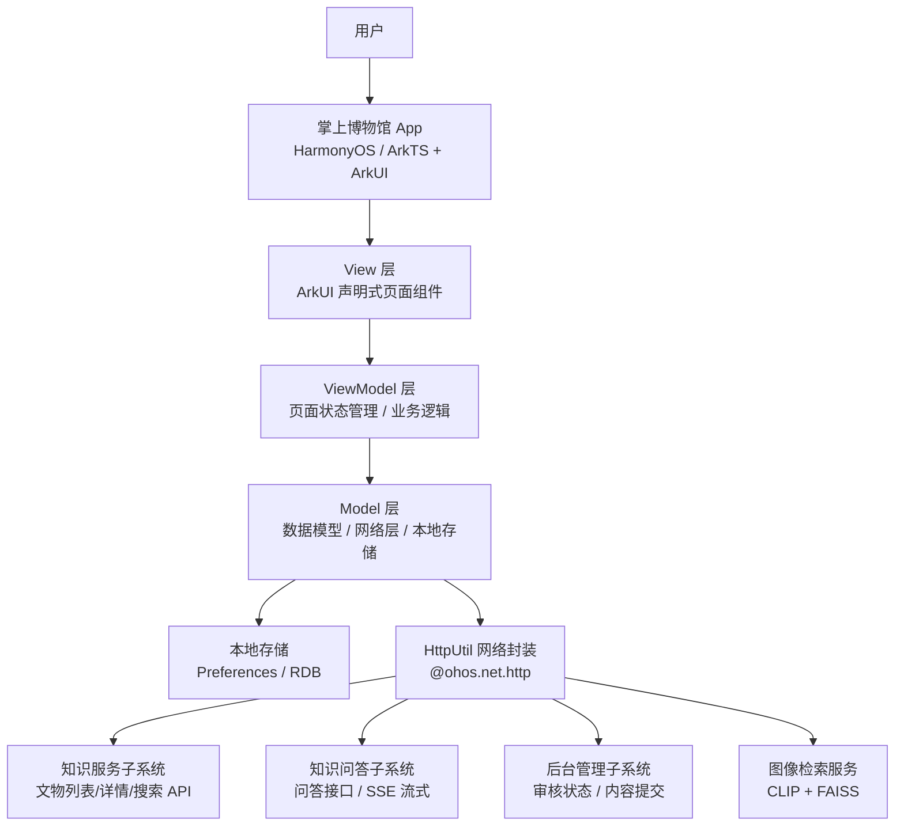
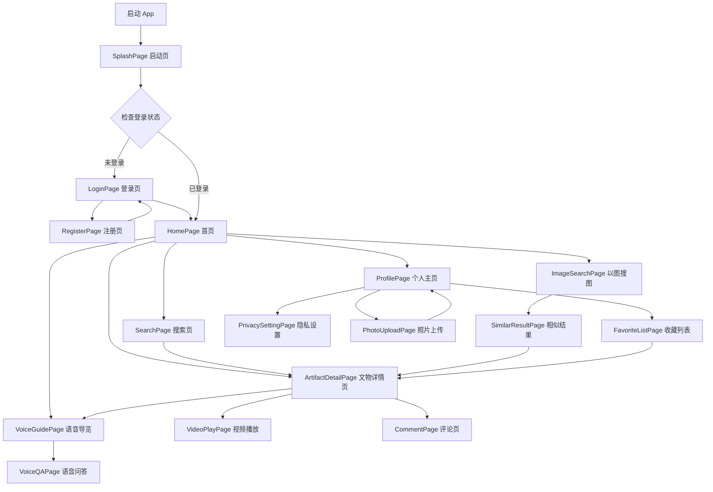
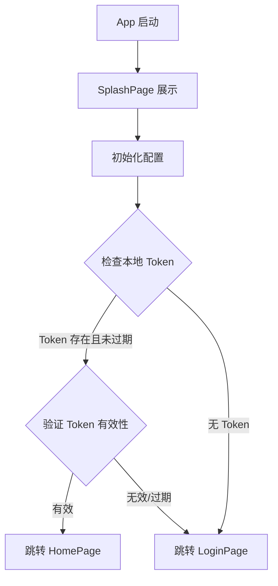
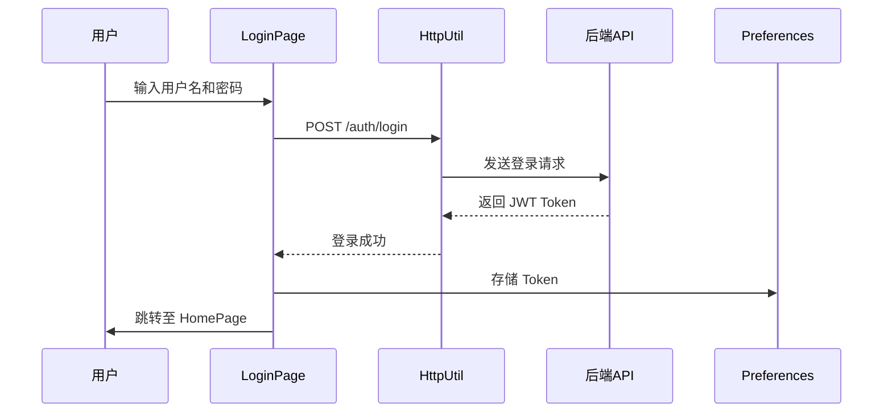
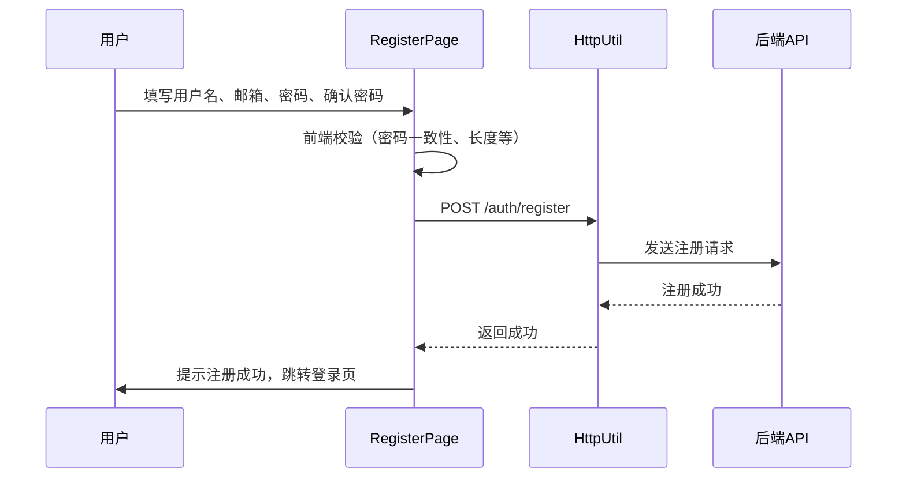

# 海外藏中国文物知识管理与服务平台 - 掌上博物馆子系统 设计报告


## 1. 引言

### 1.1 文档目的

本文档用于描述掌上博物馆子系统的总体架构、模块划分、接口设计、数据库设计、UI设计及非功能性设计，为系统开发、测试和后续集成提供技术依据。

### 1.2 子系统概述

掌上博物馆是“海外藏中国文物知识管理与服务平台”的移动端子系统，基于华为 HarmonyOS 开发，采用 ArkTS 语言与 ArkUI 框架。本子系统从知识图谱数据中选取**瓷器**作为展示主题（暂定，待最终确认），为用户提供沉浸式的文物浏览与互动体验。

主要功能包括：
- **文物浏览**：首页展示（卡片/瀑布流）、文物详情页、简单搜索、音视频播放
- **以图搜图**：相册上传图片搜索、拍照搜索、相似度结果展示
- **语音导览**：文物语音讲解播放、语音输入搜索、语音问答交互
- **用户交互**：点赞、收藏及分组管理、评论与回复、用户上传照片
- **用户个人信息管理**：注册登录、个人主页、隐私设置

### 1.3 目标读者

- 前端开发人员（本组全体成员）
- 后端开发人员（知识服务子系统、知识问答子系统、后台管理子系统成员）
- 测试工程师
- 项目管理人员
- 助教及评审教师

### 1.4 术语与缩略语

| 术语 | 全称 | 描述 |
|---|---|---|
| ArkTS | Ark TypeScript | HarmonyOS 官方开发语言，基于 TypeScript 扩展 |
| ArkUI | Ark User Interface | HarmonyOS 声明式 UI 框架 |
| MVVM | Model-View-ViewModel | 前端架构模式，分离 UI、业务逻辑与数据 |
| JWT | JSON Web Token | 用户认证令牌，无状态身份验证 |
| RESTful | Representational State Transfer | API 设计风格 |
| SSE | Server-Sent Events | 服务器推送事件，用于流式响应 |
| CLIP | Contrastive Language-Image Pre-training | 图像特征提取模型 |
| FAISS | Facebook AI Similarity Search | 向量相似度检索引擎 |

### 1.5 参考文献

1. 课程设计题目 - 海外藏中国文物知识管理与服务平台.docx  
2. 华为 HarmonyOS 开发者文档：https://developer.harmonyos.com/


## 2. 系统架构设计

### 2.1 架构风格

本子系统采用 **MVVM（Model-View-ViewModel）** 分层架构，主要分为以下三层：

- **View 层（UI 层）**：使用 ArkUI 声明式组件构建页面，负责界面渲染与用户交互。
- **ViewModel 层（业务逻辑层）**：管理页面状态，处理业务逻辑，调用 Model 层接口。
- **Model 层（数据层）**：定义数据结构，封装网络请求与本地存储操作。

此外，本子系统**不直接操作知识图谱**，所有业务数据通过后端 API 获取；以图搜图的特征提取与相似度检索由后端（CLIP + FAISS）完成，移动端仅负责图片采集与结果展示。

### 2.2 总体分层架构图



### 2.3 技术栈

| 类别 | 技术选型 | 说明 |
|---|---|---|
| 开发平台 | HarmonyOS | 鸿蒙操作系统，课程指定 |
| 开发语言 | ArkTS | 鸿蒙推荐编程语言，基于 TypeScript 扩展 |
| UI 框架 | ArkUI | 声明式 UI 开发框架 |
| 开发工具 | DevEco Studio 6.1.0 (Release) | 统一开发环境 |
| 路由管理 | @ohos.router | 系统级路由能力 |
| 网络请求 | @ohos.net.http | HTTP 数据请求，封装为 HttpUtil |
| 图片加载 | Image 组件 + 图片缓存 | 网络图片加载与本地缓存 |
| 语音识别 | @ohos.speechRecognizer | 语音输入转文字 |
| 语音合成 | @ohos.textToSpeech | 文字转语音播报 |
| 相机调用 | @ohos.multimedia.camera | 拍照搜图功能 |
| 音视频播放 | AVPlayer / Video 组件 | 文物讲解音视频播放 |
| 本地存储 | Preferences / 关系型数据库 | 用户偏好、历史记录、收藏数据缓存 |
| 版本控制 | Git + GitHub | 协作开发 |
| 后端接口 | RESTful API | 与 Web 服务子系统、问答子系统通信 |

### 2.4 模块划分

| 模块编号 | 模块名称 | 负责人 | 功能描述 |
|---|---|---|---|
| M1 | 框架统筹与用户系统 | 潘晨晨 | App 初始化、路由配置、网络层封装；用户注册/登录、个人主页、隐私设置 |
| M2 | 文物浏览 | 郝婧 | 首页卡片/瀑布流展示、文物详情页、简单搜索、音视频播放 |
| M3 | 以图搜图 | 王珍 | 相册选择图片搜索、拍照搜索、相似度结果展示 |
| M4 | 语音导览 | 范力烨 | 文物语音讲解播放、语音输入搜索、语音问答交互 |
| M5 | 用户交互（社交） | 刘清 | 点赞、收藏及分组管理、评论与回复、用户上传照片 |


## 3. 总体设计与公共部分

### 3.1 页面路由设计

#### 3.1.1 路由表

| 页面名称 | 路由路径 | 所属模块 | 说明 |
|---|---|---|---|
| 启动页 | pages/SplashPage | M1 框架 | App 启动加载页，检查登录状态 |
| 登录页 | pages/LoginPage | M1 用户系统 | 用户登录入口 |
| 注册页 | pages/RegisterPage | M1 用户系统 | 新用户注册 |
| 首页 | pages/HomePage | M2 文物浏览 | 文物列表展示（默认进入页） |
| 文物详情页 | pages/ArtifactDetailPage | M2 文物浏览 | 文物详细信息与关联展示 |
| 搜索页 | pages/SearchPage | M2 文物浏览 | 关键字全文搜索 |
| 视频播放页 | pages/VideoPlayPage | M2 文物浏览 | 全屏视频播放 |
| 以图搜图页 | pages/ImageSearchPage | M3 以图搜图 | 图片上传与拍照入口 |
| 相似结果页 | pages/SimilarResultPage | M3 以图搜图 | 相似文物结果列表 |
| 语音导览页 | pages/VoiceGuidePage | M4 语音导览 | 语音讲解播放控制 |
| 语音问答页 | pages/VoiceQAPage | M4 语音导览 | 语音问答对话界面 |
| 个人主页 | pages/ProfilePage | M1 用户系统 | 用户信息、收藏、动态入口 |
| 隐私设置页 | pages/PrivacySettingPage | M1 用户系统 | 隐私选项设置 |
| 收藏列表页 | pages/FavoriteListPage | M5 用户交互 | 收藏夹分组管理 |
| 评论页 | pages/CommentPage | M5 用户交互 | 评论查看、发表与回复 |
| 照片上传页 | pages/PhotoUploadPage | M5 用户交互 | 用户照片上传与说明填写 |

#### 3.1.2 页面跳转流程图



### 3.2 网络层封装设计

本子系统创建统一的 HTTP 工具类 `HttpUtil`，封装 `@ohos.net.http` 能力，全组统一调用。

```typescript
// HttpUtil.ets - 统一网络请求封装
import http from '@ohos.net.http';
import { Preferences } from '@kit.ArkData';

export class HttpUtil {
  private static BASE_URL: string = "https://your-api-server.com/api/v1";
  
  // 获取存储的 Token
  private static async getToken(): Promise<string> {
    // 从 Preferences 中读取 JWT Token
    return "";
  }
  
  // GET 请求
  static async get(endpoint: string, params?: Record<string, string>): Promise<ApiResponse> {
    const token = await this.getToken();
    // 构建 URL、添加请求头 Authorization: Bearer {token}
    // 统一处理超时（10秒）、异常捕获
    return { code: 0, message: "success", data: null };
  }
  
  // POST 请求
  static async post(endpoint: string, data: object): Promise<ApiResponse> {
    const token = await this.getToken();
    // 统一处理
    return { code: 0, message: "success", data: null };
  }
  
  // 文件上传
  static async upload(endpoint: string, filePath: string): Promise<ApiResponse> {
    // 图片等文件上传封装
    return { code: 0, message: "success", data: null };
  }
}

// 统一接口响应格式
export interface ApiResponse {
  code: number;
  message: string;
  data: object | null;
}
```

### 3.3 公共数据模型定义

以下数据模型全组统一使用，由组长提供。

```typescript
// Artifact.ets - 文物数据模型
export class Artifact {
  objectId: string;        // 文物唯一标识
  title: string;           // 名称
  period: string;          // 年代
  type: string;            // 类型
  material: string;        // 材质
  description: string;     // 描述
  dimensions: string;      // 尺寸
  museum: string;          // 所属博物馆
  location: string;        // 博物馆所在地
  imageUrl: string;        // 图片地址
  detailUrl: string;       // 详情页URL
  accessionNumber: string; // 藏品编号
}

// User.ets - 用户数据模型
export class User {
  userId: number;
  username: string;
  email: string;
  avatar: string;
  status: number;
  privacySetting: PrivacyConfig;
}

// PrivacyConfig.ets - 隐私配置
export class PrivacyConfig {
  showFavorites: boolean;
  showComments: boolean;
  showPhotos: boolean;
}

// FavoriteItem.ets - 收藏项
export class FavoriteItem {
  favoriteId: number;
  objectId: string;
  title: string;
  imageUrl: string;
  groupName: string;
  createdAt: string;
}

// Comment.ets - 评论数据模型
export class Comment {
  commentId: number;
  userId: number;
  username: string;
  avatar: string;
  objectId: string;
  content: string;
  parentId: number | null;
  auditStatus: number;     // 0:待审 1:通过 2:拒绝
  createdAt: string;
}
```


## 4. 接口设计

本子系统不直接操作知识图谱，所有数据通过后端 API 获取。以下为与各子系统的接口约定。

### 4.1 与海外文物知识服务子系统的接口

| 接口名称 | 请求方式 | 路径 | 说明 | 调用模块 |
|---|---|---|---|---|
| 获取文物列表 | GET | /artifacts | 分页获取文物数据，支持排序参数 | M2 文物浏览 |
| 获取文物详情 | GET | /artifacts/{id} | 获取单件文物完整信息含关联实体 | M2 文物浏览 |
| 文物搜索 | GET | /artifacts/search | 关键字全文检索，支持分页 | M2 文物浏览 |
| 获取博物馆列表 | GET | /museums | 获取博物馆基本信息 | M2 文物浏览 |
| 获取相关文物推荐 | GET | /artifacts/{id}/related | 获取与指定文物相似的推荐 | M2 文物浏览 |
| 图像特征检索 | POST | /search/image | 上传图片，返回相似文物列表 | M3 以图搜图 |

### 4.2 与知识问答子系统的接口

| 接口名称 | 请求方式 | 路径 | 说明 | 调用模块 |
|---|---|---|---|---|
| 问答对话 | POST | /qa/chat | 发送文字问题，获取回答（SSE流式） | M4 语音导览 |
| 获取历史列表 | GET | /qa/getHistoryList | 获取用户历史问答记录 | M4 语音导览 |

### 4.3 与后台管理子系统的接口

| 接口名称 | 请求方式 | 路径 | 说明 | 调用模块 |
|---|---|---|---|---|
| 提交评论 | POST | /comments | 提交评论（进入待审核队列） | M5 用户交互 |
| 获取评论列表 | GET | /comments | 获取指定文物的已审核评论 | M5 用户交互 |
| 上传照片 | POST | /photos/upload | 上传用户照片（进入待审核） | M5 用户交互 |
| 获取审核状态 | GET | /audit/status/{contentId} | 查询用户提交内容的审核结果 | M5 用户交互 |
| 点赞/收藏操作 | POST | /user/action | 提交点赞、收藏等行为 | M5 用户交互 |

> **注**：详细的请求参数与响应格式由各模块负责人在 `6.模块详细设计` 中具体定义，并需与其他子系统组长协商确认。


## 5. 数据库设计

### 5.1 本地存储设计

| 存储方式 | 用途 | 关键数据 |
|---|---|---|
| Preferences | 用户偏好与轻量缓存 | JWT Token、首页展示偏好、语音播报速度、隐私设置 |
| 关系型数据库 (RDB) | 本地数据缓存 | 缓存的文物列表、浏览历史、离线收藏数据 |

### 5.2 用户数据库表设计（与后端共用，需协商一致）

以下为建议设计，最终需与知识服务子系统、后台管理子系统协商统一。

```sql
-- 用户表
CREATE TABLE user (
  user_id      INT PRIMARY KEY AUTO_INCREMENT,
  username     VARCHAR(50) NOT NULL UNIQUE,
  password     VARCHAR(255) NOT NULL,        -- bcrypt 加密存储
  email        VARCHAR(100),
  phone        VARCHAR(20),
  avatar       VARCHAR(255),                 -- 头像URL
  status       TINYINT DEFAULT 1,            -- 1:正常 0:禁用
  privacy_setting JSON,                      -- 隐私设置（JSON格式）
  created_at   DATETIME DEFAULT CURRENT_TIMESTAMP,
  updated_at   DATETIME ON UPDATE CURRENT_TIMESTAMP
);

-- 收藏表
CREATE TABLE favorite (
  favorite_id  INT PRIMARY KEY AUTO_INCREMENT,
  user_id      INT NOT NULL,
  object_id    VARCHAR(50) NOT NULL,
  group_name   VARCHAR(50) DEFAULT '默认收藏夹',
  created_at   DATETIME DEFAULT CURRENT_TIMESTAMP,
  FOREIGN KEY (user_id) REFERENCES user(user_id)
);

-- 评论表
CREATE TABLE comment (
  comment_id   INT PRIMARY KEY AUTO_INCREMENT,
  user_id      INT NOT NULL,
  object_id    VARCHAR(50) NOT NULL,
  content      TEXT NOT NULL,
  parent_id    INT DEFAULT NULL,             -- 父评论ID，用于回复
  audit_status TINYINT DEFAULT 0,            -- 0:待审 1:通过 2:拒绝
  created_at   DATETIME DEFAULT CURRENT_TIMESTAMP,
  FOREIGN KEY (user_id) REFERENCES user(user_id),
  FOREIGN KEY (parent_id) REFERENCES comment(comment_id)
);

-- 用户上传照片表
CREATE TABLE user_photo (
  photo_id     INT PRIMARY KEY AUTO_INCREMENT,
  user_id      INT NOT NULL,
  object_id    VARCHAR(50),                  -- 关联的文物ID（可选）
  photo_url    VARCHAR(255) NOT NULL,
  description  VARCHAR(500),
  location     VARCHAR(200),                 -- 拍摄地点
  audit_status TINYINT DEFAULT 0,            -- 0:待审 1:通过 2:拒绝
  created_at   DATETIME DEFAULT CURRENT_TIMESTAMP,
  FOREIGN KEY (user_id) REFERENCES user(user_id)
);

-- 点赞表
CREATE TABLE user_like (
  like_id      INT PRIMARY KEY AUTO_INCREMENT,
  user_id      INT NOT NULL,
  object_id    VARCHAR(50) NOT NULL,
  created_at   DATETIME DEFAULT CURRENT_TIMESTAMP,
  UNIQUE KEY (user_id, object_id),
  FOREIGN KEY (user_id) REFERENCES user(user_id)
);
```


## 6. 模块详细设计

> **说明**：本节由各模块负责人分别编写，每人负责自己模块的详细设计内容。

### 6.1 文物浏览模块（郝婧 编写）

#### 6.1.1 模块概述
[请在此描述模块职责与功能范围]

#### 6.1.2 UI 页面设计
[请在此插入页面结构图/线框图，描述各页面组件树]

#### 6.1.3 组件交互流程
[请在此插入时序图，展示首页加载、搜索交互、详情页跳转等流程]

#### 6.1.4 接口调用设计
[请在此列出该模块调用的接口及其请求/响应参数]

#### 6.1.5 数据结构设计
[请在此定义该模块特有的数据模型]

---

### 6.2 以图搜图模块（王珍 编写）

#### 6.2.1 模块概述
[请在此描述模块职责与功能范围]

#### 6.2.2 图像检索流程设计
[请在此插入时序图，展示：相册选择→上传→特征提取→检索→结果展示全流程]

#### 6.2.3 相机调用设计
[请在此描述调用 @ohos.multimedia.camera 的流程与权限处理]

#### 6.2.4 接口调用设计
[请在此列出图片上传接口与检索结果接口的参数]

#### 6.2.5 相似度结果展示设计
[请在此描述结果列表的排序方式与展示样式]

---

### 6.3 语音导览模块（范力烨 编写）

#### 6.3.1 模块概述
[请在此描述模块职责与功能范围]

#### 6.3.2 语音播讲设计
[请在此描述语音合成 (@ohos.textToSpeech) 调用流程、播放控制（倍速、进度）]

#### 6.3.3 语音搜索设计
[请在此描述语音识别 (@ohos.speechRecognizer) 调用流程、识别结果到搜索的衔接]

#### 6.3.4 语音问答设计
[请在此描述与知识问答子系统的对接流程、SSE 流式响应处理]

#### 6.3.5 接口调用设计
[请在此列出该模块调用的接口及其参数]

---

### 6.4 用户交互模块（刘清 编写）

#### 6.4.1 模块概述
[请在此描述模块职责与功能范围]

#### 6.4.2 点赞收藏流程设计
[请在此描述点赞/取消点赞交互流程、收藏夹分组管理设计]

#### 6.4.3 评论功能设计
[请在此描述评论发表与回复的 UI 交互，以及审核状态流转设计]

#### 6.4.4 照片上传功能设计
[请在此描述拍照/相册选择→上传→审核→展示全流程]

#### 6.4.5 接口调用设计
[请在此列出该模块调用的接口及其参数]

---

### 6.5 框架统筹与用户系统模块（潘晨晨 编写）

#### 6.5.1 模块概述
本模块负责 App 的全局框架搭建与用户个人信息管理，包括：应用初始化、页面路由注册、网络层封装、用户注册与登录、个人主页展示、隐私设置等功能。

#### 6.5.2 启动与初始化流程

**App 启动流程**：



#### 6.5.3 用户注册与登录设计

**登录流程**：



**注册流程**：



**Token 管理策略**：
- Token 存储在 Preferences 中
- 每次请求通过 HttpUtil 自动携带
- Token 过期后自动跳转登录页
- 支持手动退出登录，清除本地 Token

#### 6.5.4 个人主页设计

**个人主页功能结构**：
- 顶部：用户头像、用户名、个人简介
- 收藏入口：显示收藏数量，点击进入收藏列表
- 上传照片入口：显示已上传照片数量
- 评论入口：显示历史评论数量
- 隐私设置入口：跳转隐私设置页
- 退出登录按钮

#### 6.5.5 隐私设置设计

可配置项：
- **收藏夹可见性**：公开 / 仅自己可见
- **评论可见性**：公开 / 仅自己可见
- **上传照片可见性**：公开 / 仅自己可见
- 设置通过 POST 请求同步到后端


## 7. 非功能性设计

### 7.1 性能设计

#### 7.1.1 图片加载优化
- **策略**：列表页使用缩略图（?size=thumb 参数），详情页加载原图
- **缓存**：使用 Image 组件内置缓存机制，避免重复下载
- **占位图**：加载中显示骨架屏或默认占位图

#### 7.1.2 语音响应优化
- **语音识别超时**：设置为 10 秒，超时后提示用户重试
- **语音合成预加载**：进入文物详情页时预加载语音讲解
- **SSE 流式展示**：语音问答采用流式响应，逐字显示答案，减少等待感

#### 7.1.3 列表性能优化
- 首页文物列表使用 LazyForEach 实现懒加载
- 分页加载，每页 20 条

### 7.2 安全设计

#### 7.2.1 认证与授权
- 采用 JWT 无状态认证机制
- Token 设置过期时间（建议 2 小时）
- 请求在 HttpUtil 中统一携带 `Authorization: Bearer {token}`

#### 7.2.2 数据安全
- 用户密码使用 bcrypt 加密存储（后端）
- 密码等敏感信息不在本地明文存储
- 所有 API 通信采用 HTTPS 加密

#### 7.2.3 权限管理
- 调用系统敏感能力（相机、麦克风）前动态申请权限
- 用户可在设置中随时撤销权限
- 未授权时给出明确提示并引导用户授权

#### 7.2.4 输入校验
- 所有用户输入进行前端校验（长度、格式等）
- 防止 XSS 攻击，对用户生成内容进行转义处理

### 7.3 容错与异常处理

#### 7.3.1 网络异常处理

| 场景 | 处理策略 |
|---|---|
| 无网络连接 | 显示“网络不可用”提示，展示本地缓存数据 |
| 请求超时 | 自动重试 1 次，仍失败则提示用户稍后再试 |
| 服务器错误（5xx） | 提示“服务器繁忙，请稍后再试” |
| Token 过期 | 自动跳转登录页，提示重新登录 |

#### 7.3.2 功能降级
- **语音识别失败**：降级为手动输入搜索关键词
- **图片搜索超时**：提示用户“检索超时，请尝试重新上传”
- **音视频加载失败**：显示“加载失败，点击重试”按钮

### 7.4 可扩展性设计
- 模块间通过接口解耦，新增功能模块不影响已有代码
- 网络层封装支持后续更换后端地址或添加拦截器
- 数据模型独立定义，便于与后端协商调整字段


## 8. 附录

### 8.1 与其它子系统的集成约定
[预留接口文档链接或说明，待与其他子系统组长协商后补充]

### 8.2 Git 协作规范

1. **禁止直接推送到 `main` 分支**
2. 每位组员基于 `main` 创建自己的功能分支，命名格式：`feature/<模块名>`（如 `feature/browse-module`）
3. 每天工作结束前将分支推送至远端备份
4. 合并时发起 Pull Request，由组长审核后合并
5. 合并冲突由开发者本地解决后重新推送

### 8.3 GitHub 仓库信息
- 仓库地址：`https://github.com/BUCT-CS2301/PalmMuseum.git`
- 主分支：`main`

### 8.4 设计变更记录

| 日期 | 变更内容 | 变更原因 | 影响范围 | 记录人 |
|---|---|---|---|---|
|  |  |  |  |  |
