# 海外藏中国文物知识管理与服务平台 - 掌上博物馆子系统 设计报告


## 1. 引言

### 1.1 文档目的

本文档用于描述掌上博物馆子系统的总体架构、模块划分、接口设计、数据库设计、UI设计及非功能性设计，为系统开发、测试和后续集成提供技术依据。

### 1.2 子系统概述

掌上博物馆是“海外藏中国文物知识管理与服务平台”的移动端子系统，基于华为 HarmonyOS 开发，采用 ArkTS 语言与 ArkUI 框架。本子系统从知识图谱数据中选取**瓷器**作为展示主题（暂定，待最终确认），为用户提供沉浸式的文物浏览与互动体验。

主要功能包括：
- **文物浏览**：首页展示（卡片/瀑布流）、文物详情页、简单搜索、音视频播放
- **以图搜图**：相册上传图片搜索、拍照搜索、相似度结果展示
- **语音导览**：文物语音讲解播放、语音输入搜索、语音问答交互
- **用户交互**：点赞、收藏及分组管理、评论与回复、用户上传照片
- **用户个人信息管理**：注册登录、个人主页、隐私设置

### 1.3 目标读者

- 前端开发人员（本组全体成员）
- 后端开发人员（知识服务子系统、知识问答子系统、后台管理子系统成员）
- 测试工程师
- 项目管理人员
- 助教及评审教师

### 1.4 术语与缩略语

| 术语 | 全称 | 描述 |
|---|---|---|
| ArkTS | Ark TypeScript | HarmonyOS 官方开发语言，基于 TypeScript 扩展 |
| ArkUI | Ark User Interface | HarmonyOS 声明式 UI 框架 |
| MVVM | Model-View-ViewModel | 前端架构模式，分离 UI、业务逻辑与数据 |
| JWT | JSON Web Token | 用户认证令牌，无状态身份验证 |
| RESTful | Representational State Transfer | API 设计风格 |
| SSE | Server-Sent Events | 服务器推送事件，用于流式响应 |
| CLIP | Contrastive Language-Image Pre-training | 图像特征提取模型 |
| FAISS | Facebook AI Similarity Search | 向量相似度检索引擎 |

### 1.5 参考文献

1. 课程设计题目 - 海外藏中国文物知识管理与服务平台.docx  
2. 华为 HarmonyOS 开发者文档：https://developer.harmonyos.com/


## 2. 系统架构设计

### 2.1 架构风格

本子系统采用 **MVVM（Model-View-ViewModel）** 分层架构，主要分为以下三层：

- **View 层（UI 层）**：使用 ArkUI 声明式组件构建页面，负责界面渲染与用户交互。
- **ViewModel 层（业务逻辑层）**：管理页面状态，处理业务逻辑，调用 Model 层接口。
- **Model 层（数据层）**：定义数据结构，封装网络请求与本地存储操作。

此外，本子系统**不直接操作知识图谱**，所有业务数据通过后端 API 获取；以图搜图的特征提取与相似度检索由后端（CLIP + FAISS）完成，移动端仅负责图片采集与结果展示。

### 2.2 总体分层架构图

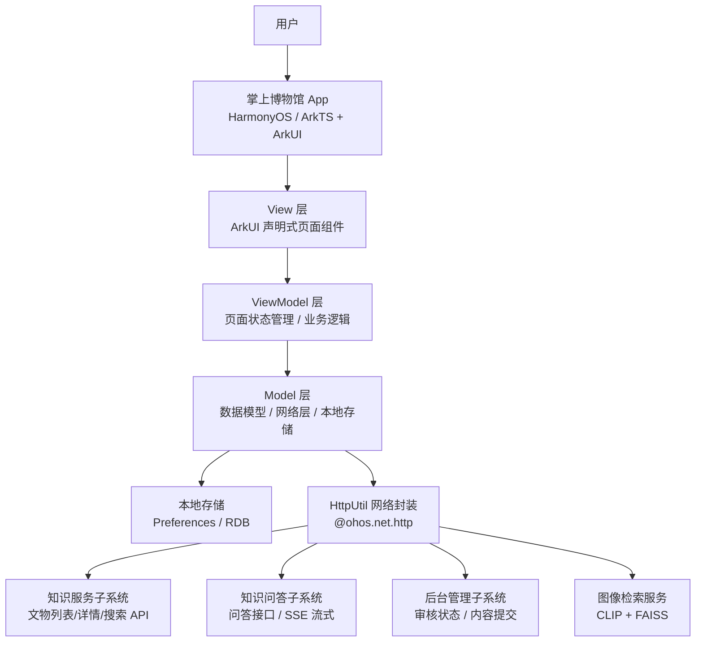

### 2.3 技术栈

| 类别 | 技术选型 | 说明 |
|---|---|---|
| 开发平台 | HarmonyOS | 鸿蒙操作系统，课程指定 |
| 开发语言 | ArkTS | 鸿蒙推荐编程语言，基于 TypeScript 扩展 |
| UI 框架 | ArkUI | 声明式 UI 开发框架 |
| 开发工具 | DevEco Studio 6.1.0 (Release) | 统一开发环境 |
| 路由管理 | @ohos.router | 系统级路由能力 |
| 网络请求 | @ohos.net.http | HTTP 数据请求，封装为 HttpUtil |
| 图片加载 | Image 组件 + 图片缓存 | 网络图片加载与本地缓存 |
| 语音识别 | @ohos.speechRecognizer | 语音输入转文字 |
| 语音合成 | @ohos.textToSpeech | 文字转语音播报 |
| 相机调用 | @ohos.multimedia.camera | 拍照搜图功能 |
| 音视频播放 | AVPlayer / Video 组件 | 文物讲解音视频播放 |
| 本地存储 | Preferences / 关系型数据库 | 用户偏好、历史记录、收藏数据缓存 |
| 版本控制 | Git + GitHub | 协作开发 |
| 后端接口 | RESTful API | 与 Web 服务子系统、问答子系统通信 |

### 2.4 模块划分

| 模块编号 | 模块名称 | 负责人 | 功能描述 |
|---|---|---|---|
| M1 | 框架统筹与用户系统 | 潘晨晨 | App 初始化、路由配置、网络层封装；用户注册/登录、个人主页、隐私设置 |
| M2 | 文物浏览 | 郝婧 | 首页卡片/瀑布流展示、文物详情页、简单搜索、音视频播放 |
| M3 | 以图搜图 | 王珍 | 相册选择图片搜索、拍照搜索、相似度结果展示 |
| M4 | 语音导览 | 范力烨 | 文物语音讲解播放、语音输入搜索、语音问答交互 |
| M5 | 用户交互（社交） | 刘清 | 点赞、收藏及分组管理、评论与回复、用户上传照片 |


## 3. 总体设计与公共部分

### 3.1 页面路由设计

#### 3.1.1 路由表

| 页面名称 | 路由路径 | 所属模块 | 说明 |
|---|---|---|---|
| 启动页 | pages/SplashPage | M1 框架 | App 启动加载页，检查登录状态 |
| 登录页 | pages/LoginPage | M1 用户系统 | 用户登录入口 |
| 注册页 | pages/RegisterPage | M1 用户系统 | 新用户注册 |
| 首页 | pages/HomePage | M2 文物浏览 | 文物列表展示（默认进入页） |
| 文物详情页 | pages/ArtifactDetailPage | M2 文物浏览 | 文物详细信息与关联展示 |
| 搜索页 | pages/SearchPage | M2 文物浏览 | 关键字全文搜索 |
| 视频播放页 | pages/VideoPlayPage | M2 文物浏览 | 全屏视频播放 |
| 以图搜图页 | pages/ImageSearchPage | M3 以图搜图 | 图片上传与拍照入口 |
| 相似结果页 | pages/SimilarResultPage | M3 以图搜图 | 相似文物结果列表 |
| 语音导览页 | pages/VoiceGuidePage | M4 语音导览 | 语音讲解播放控制 |
| 语音问答页 | pages/VoiceQAPage | M4 语音导览 | 语音问答对话界面 |
| 个人主页 | pages/ProfilePage | M1 用户系统 | 用户信息、收藏、动态入口 |
| 隐私设置页 | pages/PrivacySettingPage | M1 用户系统 | 隐私选项设置 |
| 收藏列表页 | pages/FavoriteListPage | M5 用户交互 | 收藏夹分组管理 |
| 评论页 | pages/CommentPage | M5 用户交互 | 评论查看、发表与回复 |
| 照片上传页 | pages/PhotoUploadPage | M5 用户交互 | 用户照片上传与说明填写 |

#### 3.1.2 页面跳转流程图

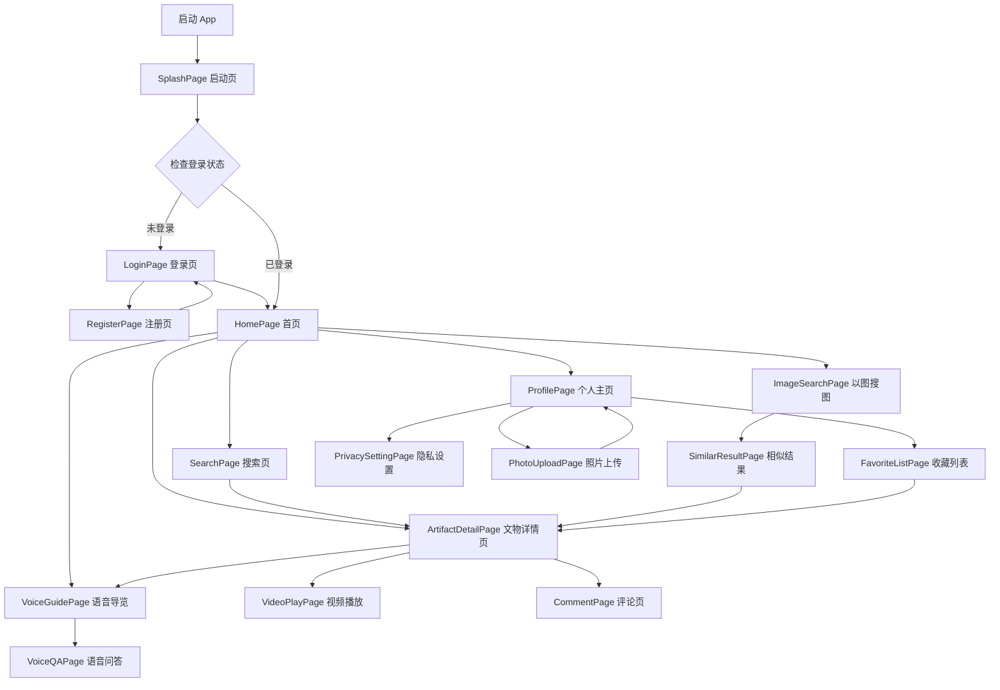

### 3.2 网络层封装设计

本子系统创建统一的 HTTP 工具类 `HttpUtil`，封装 `@ohos.net.http` 能力，全组统一调用。

```typescript
// HttpUtil.ets - 统一网络请求封装
import http from '@ohos.net.http';
import { Preferences } from '@kit.ArkData';

export class HttpUtil {
  private static BASE_URL: string = "https://your-api-server.com/api/v1";
  
  // 获取存储的 Token
  private static async getToken(): Promise<string> {
    // 从 Preferences 中读取 JWT Token
    return "";
  }
  
  // GET 请求
  static async get(endpoint: string, params?: Record<string, string>): Promise<ApiResponse> {
    const token = await this.getToken();
    // 构建 URL、添加请求头 Authorization: Bearer {token}
    // 统一处理超时（10秒）、异常捕获
    return { code: 0, message: "success", data: null };
  }
  
  // POST 请求
  static async post(endpoint: string, data: object): Promise<ApiResponse> {
    const token = await this.getToken();
    // 统一处理
    return { code: 0, message: "success", data: null };
  }
  
  // 文件上传
  static async upload(endpoint: string, filePath: string): Promise<ApiResponse> {
    // 图片等文件上传封装
    return { code: 0, message: "success", data: null };
  }
}

// 统一接口响应格式
export interface ApiResponse {
  code: number;
  message: string;
  data: object | null;
}
```

### 3.3 公共数据模型定义

以下数据模型全组统一使用，由组长提供。

```typescript
// Artifact.ets - 文物数据模型
export class Artifact {
  objectId: string;        // 文物唯一标识
  title: string;           // 名称
  period: string;          // 年代
  type: string;            // 类型
  material: string;        // 材质
  description: string;     // 描述
  dimensions: string;      // 尺寸
  museum: string;          // 所属博物馆
  location: string;        // 博物馆所在地
  imageUrl: string;        // 图片地址
  detailUrl: string;       // 详情页URL
  accessionNumber: string; // 藏品编号
}

// User.ets - 用户数据模型
export class User {
  userId: number;
  username: string;
  email: string;
  avatar: string;
  status: number;
  privacySetting: PrivacyConfig;
}

// PrivacyConfig.ets - 隐私配置
export class PrivacyConfig {
  showFavorites: boolean;
  showComments: boolean;
  showPhotos: boolean;
}

// FavoriteItem.ets - 收藏项
export class FavoriteItem {
  favoriteId: number;
  objectId: string;
  title: string;
  imageUrl: string;
  groupName: string;
  createdAt: string;
}

// Comment.ets - 评论数据模型
export class Comment {
  commentId: number;
  userId: number;
  username: string;
  avatar: string;
  objectId: string;
  content: string;
  parentId: number | null;
  auditStatus: number;     // 0:待审 1:通过 2:拒绝
  createdAt: string;
}
```


## 4. 接口设计

本子系统不直接操作知识图谱，所有数据通过后端 API 获取。以下为与各子系统的接口约定。

### 4.1 与海外文物知识服务子系统的接口

| 接口名称 | 请求方式 | 路径 | 说明 | 调用模块 |
|---|---|---|---|---|
| 获取文物列表 | GET | /artifacts | 分页获取文物数据，支持排序参数 | M2 文物浏览 |
| 获取文物详情 | GET | /artifacts/{id} | 获取单件文物完整信息含关联实体 | M2 文物浏览 |
| 文物搜索 | GET | /artifacts/search | 关键字全文检索，支持分页 | M2 文物浏览 |
| 获取博物馆列表 | GET | /museums | 获取博物馆基本信息 | M2 文物浏览 |
| 获取相关文物推荐 | GET | /artifacts/{id}/related | 获取与指定文物相似的推荐 | M2 文物浏览 |
| 图像特征检索 | POST | /search/image | 上传图片，返回相似文物列表 | M3 以图搜图 |

### 4.2 与知识问答子系统的接口

| 接口名称 | 请求方式 | 路径 | 说明 | 调用模块 |
|---|---|---|---|---|
| 问答对话 | POST | /qa/chat | 发送文字问题，获取回答（SSE流式） | M4 语音导览 |
| 获取历史列表 | GET | /qa/getHistoryList | 获取用户历史问答记录 | M4 语音导览 |

### 4.3 与后台管理子系统的接口

| 接口名称 | 请求方式 | 路径 | 说明 | 调用模块 |
|---|---|---|---|---|
| 提交评论 | POST | /comments | 提交评论（进入待审核队列） | M5 用户交互 |
| 获取评论列表 | GET | /comments | 获取指定文物的已审核评论 | M5 用户交互 |
| 上传照片 | POST | /photos/upload | 上传用户照片（进入待审核） | M5 用户交互 |
| 获取审核状态 | GET | /audit/status/{contentId} | 查询用户提交内容的审核结果 | M5 用户交互 |
| 点赞/收藏操作 | POST | /user/action | 提交点赞、收藏等行为 | M5 用户交互 |

> **注**：详细的请求参数与响应格式由各模块负责人在 `6.模块详细设计` 中具体定义，并需与其他子系统组长协商确认。


## 5. 数据库设计

### 5.1 本地存储设计

| 存储方式 | 用途 | 关键数据 |
|---|---|---|
| Preferences | 用户偏好与轻量缓存 | JWT Token、首页展示偏好、语音播报速度、隐私设置 |
| 关系型数据库 (RDB) | 本地数据缓存 | 缓存的文物列表、浏览历史、离线收藏数据 |

### 5.2 用户数据库表设计（与后端共用，需协商一致）

以下为建议设计，最终需与知识服务子系统、后台管理子系统协商统一。

```sql
-- 用户表
CREATE TABLE user (
  user_id      INT PRIMARY KEY AUTO_INCREMENT,
  username     VARCHAR(50) NOT NULL UNIQUE,
  password     VARCHAR(255) NOT NULL,        -- bcrypt 加密存储
  email        VARCHAR(100),
  phone        VARCHAR(20),
  avatar       VARCHAR(255),                 -- 头像URL
  status       TINYINT DEFAULT 1,            -- 1:正常 0:禁用
  privacy_setting JSON,                      -- 隐私设置（JSON格式）
  created_at   DATETIME DEFAULT CURRENT_TIMESTAMP,
  updated_at   DATETIME ON UPDATE CURRENT_TIMESTAMP
);

-- 收藏表
CREATE TABLE favorite (
  favorite_id  INT PRIMARY KEY AUTO_INCREMENT,
  user_id      INT NOT NULL,
  object_id    VARCHAR(50) NOT NULL,
  group_name   VARCHAR(50) DEFAULT '默认收藏夹',
  created_at   DATETIME DEFAULT CURRENT_TIMESTAMP,
  FOREIGN KEY (user_id) REFERENCES user(user_id)
);

-- 评论表
CREATE TABLE comment (
  comment_id   INT PRIMARY KEY AUTO_INCREMENT,
  user_id      INT NOT NULL,
  object_id    VARCHAR(50) NOT NULL,
  content      TEXT NOT NULL,
  parent_id    INT DEFAULT NULL,             -- 父评论ID，用于回复
  audit_status TINYINT DEFAULT 0,            -- 0:待审 1:通过 2:拒绝
  created_at   DATETIME DEFAULT CURRENT_TIMESTAMP,
  FOREIGN KEY (user_id) REFERENCES user(user_id),
  FOREIGN KEY (parent_id) REFERENCES comment(comment_id)
);

-- 用户上传照片表
CREATE TABLE user_photo (
  photo_id     INT PRIMARY KEY AUTO_INCREMENT,
  user_id      INT NOT NULL,
  object_id    VARCHAR(50),                  -- 关联的文物ID（可选）
  photo_url    VARCHAR(255) NOT NULL,
  description  VARCHAR(500),
  location     VARCHAR(200),                 -- 拍摄地点
  audit_status TINYINT DEFAULT 0,            -- 0:待审 1:通过 2:拒绝
  created_at   DATETIME DEFAULT CURRENT_TIMESTAMP,
  FOREIGN KEY (user_id) REFERENCES user(user_id)
);

-- 点赞表
CREATE TABLE user_like (
  like_id      INT PRIMARY KEY AUTO_INCREMENT,
  user_id      INT NOT NULL,
  object_id    VARCHAR(50) NOT NULL,
  created_at   DATETIME DEFAULT CURRENT_TIMESTAMP,
  UNIQUE KEY (user_id, object_id),
  FOREIGN KEY (user_id) REFERENCES user(user_id)
);
```


## 6. 模块详细设计

> **说明**：本节由各模块负责人分别编写，每人负责自己模块的详细设计内容。

### 6.1 文物浏览模块（郝婧 编写）

#### 6.1.1 模块概述
文物浏览模块（M2）是掌上博物馆子系统的核心展示模块。主要职责包括：
- 首页文物卡片/瀑布流列表的呈现与交互
- 文物详情页的完整数据展示、图片浏览、视频播放
- 全文关键字搜索
- 将用户的点赞、收藏、评论操作通过事件传递给 M5（用户交互模块），语音讲解跳转至 M4（语音导览模块）

模块依赖知识服务子系统接口获取文物数据，不直接操作本地数据库，仅通过 RDB 缓存部分列表数据以提升离线体验。

#### 6.1.2 UI 页面设计
文物浏览模块共包含 4 个页面，各页面组件树如下。

**首页组件树**

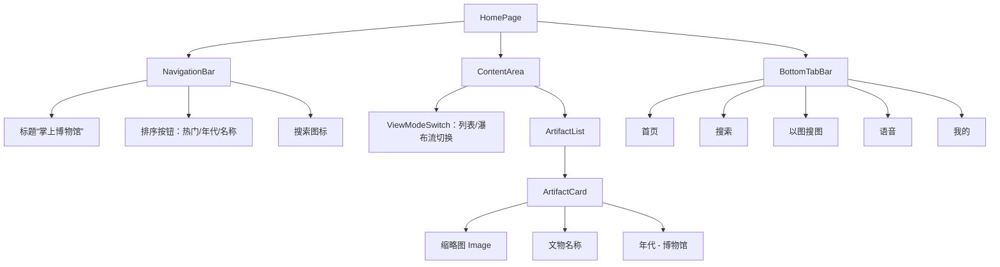
**文物详情页组件树**
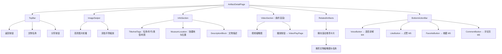
**搜索页组件树**
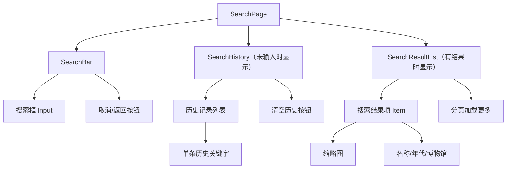
**视频播放页组件树**
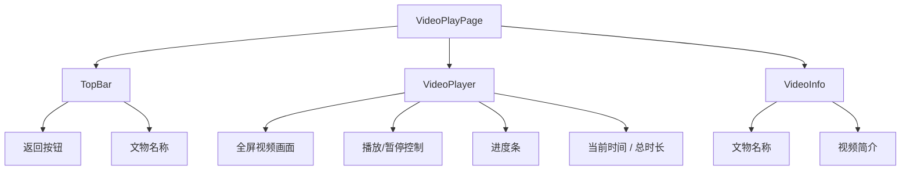
#### 6.1.3 组件交互流程
**首页加载与详情跳转时序**

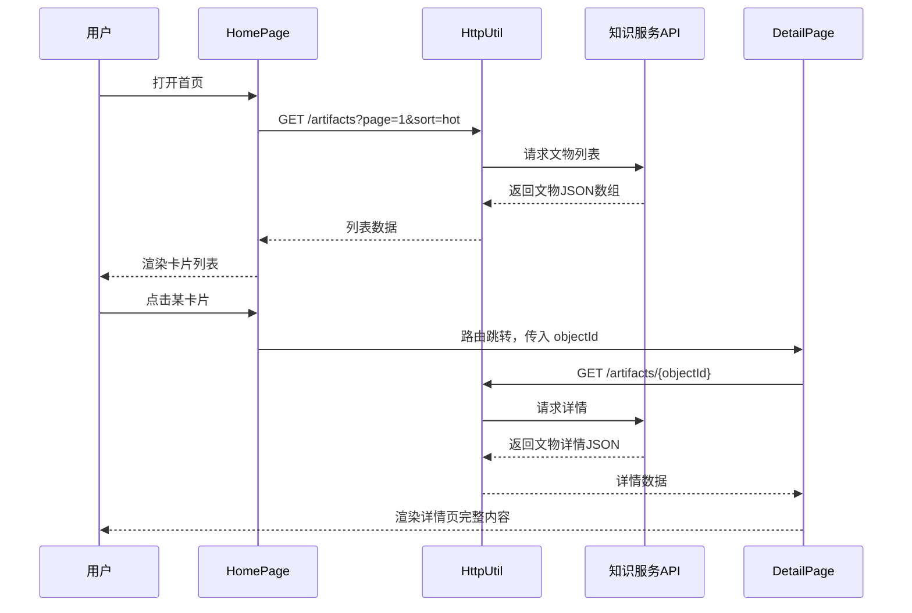

**搜索流程**
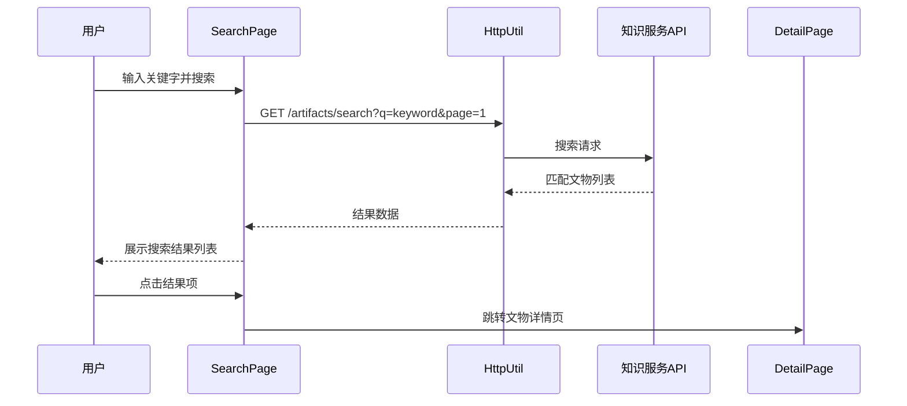
**视频播放流程**

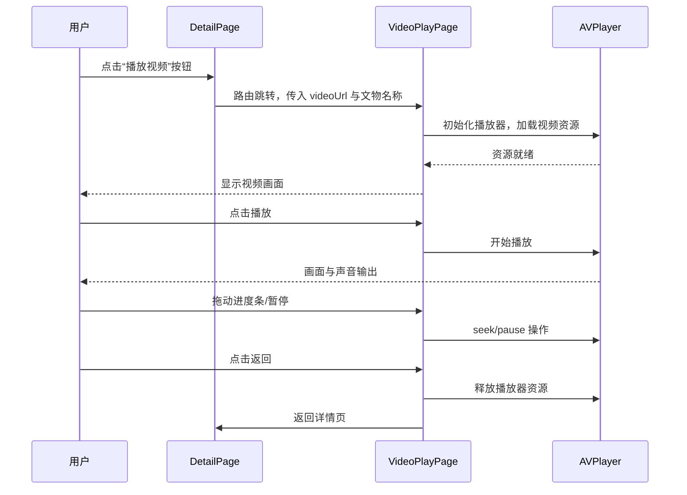
**首页排序与视图切换流程**

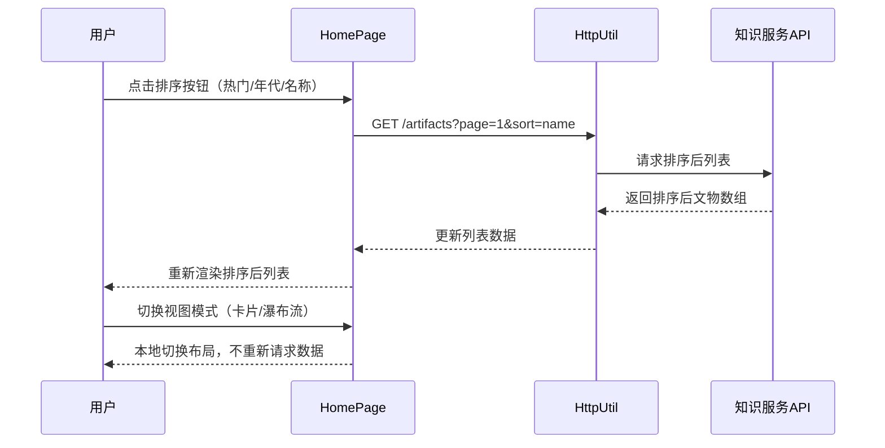
**首页分页加载流程**

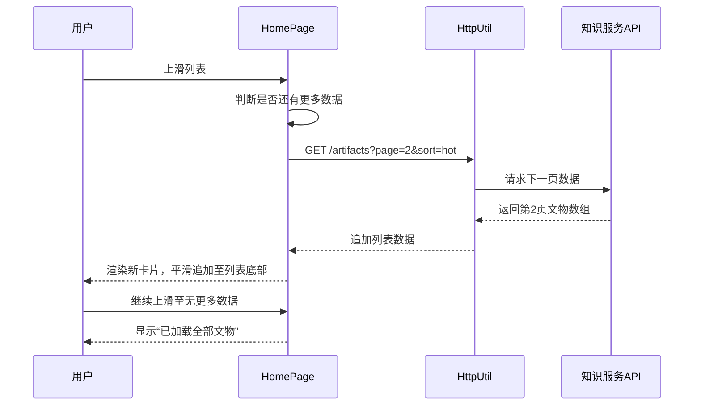

#### 6.1.4 接口调用设计

本模块所有接口由知识服务子系统提供，均通过 `HttpUtil` 统一调用，请求头自动携带 `Authorization: Bearer <token>`。

**接口列表**

| 序号 | 接口用途 | 请求方式 | 路径 | 调用页面 |
|------|----------|----------|------|----------|
| 1 | 获取文物列表 | GET | `/artifacts` | HomePage |
| 2 | 获取文物详情 | GET | `/artifacts/{objectId}` | ArtifactDetailPage |
| 3 | 文物搜索 | GET | `/artifacts/search` | SearchPage |
| 4 | 获取相关文物推荐 | GET | `/artifacts/{objectId}/related` | ArtifactDetailPage |

---

**接口 1：获取文物列表**

| 项目 | 内容 |
|------|------|
| 请求方式 | GET |
| 接口路径 | `/artifacts` |
| 调用场景 | 首页首次加载、下拉刷新、上拉分页加载、切换排序方式 |

请求参数：

| 参数名 | 类型 | 必填 | 说明 |
|--------|------|------|------|
| page | int | 否 | 页码，默认 1 |
| size | int | 否 | 每页条数，默认 20 |
| sort | string | 否 | 排序方式：`hot`（热门，默认）/ `name`（名称）/ `period`（年代） |

响应参数：

```json
{
  "code": 200,
  "message": "success",
  "data": {
    "total": 150,
    "page": 1,
    "size": 20,
    "items": [
      {
        "objectId": "artifact_001",
        "title": "青花云龙纹象耳瓶",
        "period": "元",
        "museum": "大英博物馆",
        "imageUrl": "https://xxx/thumbnail/artifact_001.jpg"
      }
    ]
  }
}
```
响应字段说明：

| 字段 | 类型 | 说明 |
|------|------|------|
| code | int | 状态码，200 表示成功 |
| message | string | 提示信息 |
| data.total | int | 文物总数 |
| data.page | int | 当前页码 |
| data.size | int | 每页条数 |
| data.items | array | 文物数组 |
| data.items[].objectId | string | 文物唯一标识 |
| data.items[].title | string | 文物名称 |
| data.items[].period | string | 年代 |
| data.items[].museum | string | 所属博物馆 |
| data.items[].imageUrl | string | 缩略图地址 |

---

**接口 2：获取文物详情**

| 项目 | 内容 |
|------|------|
| 请求方式 | GET |
| 接口路径 | `/artifacts/{objectId}` |
| 调用场景 | 从首页列表、搜索结果、相关推荐点击某文物时 |

请求参数：

| 参数名 | 类型 | 必填 | 说明 |
|--------|------|------|------|
| objectId | string | 是 | 文物唯一标识，拼接在 URL 路径中 |

响应示例：

```json
{
  "code": 200,
  "message": "success",
  "data": {
    "objectId": "artifact_001",
    "title": "青花云龙纹象耳瓶",
    "period": "元",
    "type": "瓷器",
    "material": "青花瓷",
    "description": "此瓶盘口，长颈，瘦腹，台足...",
    "dimensions": "高 63.6cm，口径 14.5cm",
    "museum": "大英博物馆",
    "location": "英国伦敦",
    "accessionNumber": "PDF.100",
    "imageUrls": [
      "https://xxx/hd/artifact_001_01.jpg",
      "https://xxx/hd/artifact_001_02.jpg"
    ],
    "videoUrl": "https://xxx/video/artifact_001.mp4",
    "relatedArtifacts": [
      {
        "objectId": "artifact_045",
        "title": "元青花鬼谷子下山图罐",
        "period": "元",
        "museum": "大英博物馆",
        "imageUrl": "https://xxx/thumbnail/artifact_045.jpg"
      }
    ]
  }
}
```
响应字段说明：

| 字段                    | 类型     | 说明     |
|-----------------------|--------|--------|
| data.objectId	        | string | 文物唯一标识 |
| data.title            | string	 | 文物名称   |
| data.period	          | string	 |年代|
| data.type	            | string	 |类型|
| data.material	        | string |材质|
| data.description	     | string	 |详细描述|
| data.dimensions	      | string	 |尺寸|
| data.museum	          | string	 |所属博物馆|
| data.location	        | string	 |博物馆所在地|
| data.accessionNumber	 | string	 |藏品编号|
| data.imageUrls	       | array	 |高清图片地址数组|
| data.videoUrl	        | string |介绍视频地址（可选）|
| data.relatedArtifacts	 | array  |相关推荐文物数组（结构同列表项）|

---
**接口 3：文物搜索**

| 项目 | 内容 |
|------|------|
| 请求方式 | GET |
| 接口路径 | `/artifacts/search` |
| 调用场景 | 用户在搜索页输入关键字后点击搜索或回车 |

请求参数：

| 参数名 | 类型 | 必填 | 说明 |
|--------|------|------|------|
| q | string | 是 | 搜索关键字，最短 2 个字符 |
| page | int | 否 | 页码，默认 1 |
| size | int | 否 | 每页条数，默认 20 |

响应示例：

```json
{
  "code": 200,
  "message": "success",
  "data": {
    "total": 8,
    "page": 1,
    "size": 20,
    "items": [
      {
        "objectId": "artifact_023",
        "title": "青花花鸟纹盘",
        "period": "明",
        "museum": "大都会艺术博物馆",
        "imageUrl": "https://xxx/thumbnail/artifact_023.jpg"
      }
    ]
  }
}
```
响应字段说明：

|字段|类型|说明|
|------|------|------|
|data.total	|int	|匹配结果总数|
|data.items	|array	|搜索结果文物数组（字段同列表项）|

---
**接口 4：获取相关文物推荐**

| 项目 | 内容 |
|------|------|
| 请求方式 | GET |
| 接口路径 | `/artifacts/{objectId}/related` |
| 调用场景 | 进入文物详情页后，加载相关文物推荐区域 |

请求参数：

| 参数名 | 类型 | 必填 | 说明 |
|--------|------|------|------|
| objectId | string | 是 | 当前文物唯一标识，拼接在 URL 路径中 |
| count | int | 否 | 推荐数量，默认 6 |

响应示例：

```json
{
  "code": 200,
  "message": "success",
  "data": {
    "items": [
      {
        "objectId": "artifact_045",
        "title": "元青花鬼谷子下山图罐",
        "period": "元",
        "museum": "大英博物馆",
        "imageUrl": "https://xxx/thumbnail/artifact_045.jpg"
      }
    ]
  }
}
```

响应字段说明：

|字段| 类型                  | 说明            |
|-----|---------------------|---------------|
|data.items|array|推荐文物数组（字段同列表项） |

---
**错误响应格式**

所有接口在异常情况下的统一响应格式：

```json
{
    "code": 400,
    "message": "参数错误：q 不能为空",
    "data": null
}
```

| 状态码  | 含义	          |前端处理|
|------|--------------|----|
| 400	 | 请求参数错误       |提示用户输入不合法|
| 401  | 	Token 无效或过期 | 	跳转登录页          |
| 404	 | 文物不存在	       | 提示“文物未找到”并返回上一页 |
| 500  | 	服务器内部错误	    | 提示“服务器繁忙，请稍后再试” |

#### 6.1.5 数据结构设计

本模块在公共数据模型 `Artifact` 的基础上，针对列表页、详情页、搜索页的不同展示需求，定义以下前端视图模型。

**列表项数据模型**

```typescript
// ArtifactListItem.ets
// 用于首页列表、搜索结果列表、相关推荐列表
export class ArtifactListItem {
      objectId: string;     // 文物唯一标识
      title: string;        // 文物名称
      period: string;       // 年代
      museum: string;       // 所属博物馆
      imageUrl: string;     // 缩略图地址
}
````

**详情数据模型**

```typescript
// ArtifactDetail.ets
// 用于文物详情页
export class ArtifactDetail {
    objectId: string;                  // 文物唯一标识
    title: string;                     // 文物名称
    period: string;                    // 年代
    type: string;                      // 类型
    material: string;                  // 材质
    description: string;               // 详细描述
    dimensions: string;                // 尺寸
    museum: string;                    // 所属博物馆
    location: string;                  // 博物馆所在地
    accessionNumber: string;           // 藏品编号
    imageUrls: string[];               // 高清图片地址数组
    videoUrl?: string;                 // 介绍视频地址（可选）
    relatedArtifacts: ArtifactListItem[];  // 相关推荐文物列表
}
````

**排序方式枚举**

```typescript
// SortType.ets
// 用于首页列表排序切换
export enum SortType {
    HOT = 'hot',         // 按热度排序（默认）
    NAME = 'name',       // 按名称排序
    PERIOD = 'period'    // 按年代排序
}
````

**视图模式枚举**

```typescript
// ViewMode.ets
// 用于首页视图切换
export enum ViewMode {
    GRID = 'grid',           // 卡片网格视图
    WATERFALL = 'waterfall'  // 瀑布流视图
}
````
**搜索状态模型**

```typescript
// SearchState.ets
// 用于搜索页状态管理
export class SearchState {
    keyword: string;                     // 当前搜索关键字
    historyList: string[];               // 搜索历史（最多5条）
    resultList: ArtifactListItem[];      // 搜索结果列表
    currentPage: number;                 // 当前页码
    totalCount: number;                  // 结果总数
    isLoading: boolean;                  // 加载状态
    hasMore: boolean;                    // 是否有更多数据
}
````
**首页状态模型**

```typescript
// HomePageState.ets
// 用于首页状态管理
export class HomePageState {
    artifactList: ArtifactListItem[];    // 文物列表
    currentPage: number;                 // 当前页码
    totalCount: number;                  // 文物总数
    sortType: SortType;                  // 当前排序方式
    viewMode: ViewMode;                  // 当前视图模式
    isLoading: boolean;                  // 首次加载状态
    isRefreshing: boolean;               // 下拉刷新状态
    isLoadingMore: boolean;              // 上拉加载更多状态
    hasMore: boolean;                    // 是否有更多数据
}
````
**本地缓存模型**

```typescript
// ArtifactCache.ets
// 用于 RDB 本地缓存
export class ArtifactCache {
    cacheData: ArtifactListItem[];       // 缓存的文物列表数据（最多40条）
    cacheTime: number;                   // 缓存时间戳
    expireDuration: number;              // 有效期，默认 2 小时 = 7200000 毫秒

// 判断缓存是否有效
isValid(): boolean {
  return Date.now() - this.cacheTime < this.expireDuration;
}
}
````
**模型关系说明**

| 模型 | 使用页面 | 数据来源 |
|------|----------|----------|
| ArtifactListItem | HomePage、SearchPage、DetailPage（推荐区） | 接口 1、3、4 |
| ArtifactDetail | ArtifactDetailPage | 接口 2 |
| SortType | HomePage | 前端枚举 |
| ViewMode | HomePage | 前端枚举 |
| SearchState | SearchPage | 前端状态 |
| HomePageState | HomePage | 前端状态 |
| ArtifactCache | HomePage（离线时） | RDB 本地存储 |

---

### 6.2 以图搜图模块（王珍 编写）

#### 6.2.1 模块概述
[请在此描述模块职责与功能范围]

#### 6.2.2 图像检索流程设计
[请在此插入时序图，展示：相册选择→上传→特征提取→检索→结果展示全流程]

#### 6.2.3 相机调用设计
[请在此描述调用 @ohos.multimedia.camera 的流程与权限处理]

#### 6.2.4 接口调用设计
[请在此列出图片上传接口与检索结果接口的参数]

#### 6.2.5 相似度结果展示设计
[请在此描述结果列表的排序方式与展示样式]

---

### 6.3 语音导览模块（范力烨 编写）

#### 6.3.1 模块概述
[请在此描述模块职责与功能范围]

#### 6.3.2 语音播讲设计
[请在此描述语音合成 (@ohos.textToSpeech) 调用流程、播放控制（倍速、进度）]

#### 6.3.3 语音搜索设计
[请在此描述语音识别 (@ohos.speechRecognizer) 调用流程、识别结果到搜索的衔接]

#### 6.3.4 语音问答设计
[请在此描述与知识问答子系统的对接流程、SSE 流式响应处理]

#### 6.3.5 接口调用设计
[请在此列出该模块调用的接口及其参数]

---

### 6.4 用户交互模块（刘清 编写）

#### 6.4.1 模块概述
用户交互模块负责承接用户在文物详情页和个人中心中的社交化行为，属于前端本地状态与持久化的核心模块。当前阶段采用 `Preferences` 作为本地存储载体，围绕以下四类能力展开：
- **点赞与收藏**：记录用户对文物的偏好状态，并在详情页、个人中心、收藏列表中联动展示。
- **评论与回复**：支持用户针对文物发表评论、查看审核状态，并为后续接入后端审核流预留数据结构。
- **照片上传**：支持从相册选择图片，保存文物关联、时间、地点和说明信息。
- **浏览记录与统计**：在进入详情页时自动记录浏览历史，并在个人中心汇总点赞、收藏、评论、照片数量。

模块遵循“当前先本地原型、后续再接后端接口”的设计原则，数据结构和页面入口均按正式产品形态组织。

#### 6.4.2 点赞收藏流程设计
点赞/收藏的交互流程如下：
1. 用户进入文物详情页，页面加载该文物的点赞/收藏状态与计数。
2. 未登录用户点击点赞或收藏时，系统提示“请先登录”，并跳转登录页。
3. 已登录用户点击点赞按钮时：
   - 若当前未点赞，则写入本地点赞映射，按钮切换为高亮状态，数量 `+1`。
   - 若当前已点赞，则删除本地记录，按钮恢复默认状态，数量 `-1`。
4. 已登录用户点击收藏按钮时：
   - 若当前未收藏，则将文物写入当前用户的收藏列表，默认归入“默认收藏夹”。
   - 若当前已收藏，则将文物从收藏列表中移除。
5. 收藏夹页面按当前用户维度读取收藏数据，并展示时间、分组等信息；分组管理在原型阶段采用轻量方式实现，可通过固定分组集合进行切换。

本模块将点赞与收藏分离存储，避免相互耦合；同时在个人中心汇总统计数量，提升反馈一致性。

模块遵循“当前先本地原型、后续再接后端接口”的设计原则，数据结构和页面入口均按正式产品形态组织。

#### 6.4.3 评论功能设计
评论功能采用“详情页快速输入 + 个人中心统一查看”的双入口设计：
- **详情页评论区**：展示若干条公开评论或本地种子评论，并提供单行输入框和“发表”按钮，方便用户快速参与。
- **我的评论页**：聚合当前用户提交过的评论，展示关联文物、评论内容、提交时间和审核状态。
- **回复能力**：数据模型中保留 `parentId` 与 `replyTo` 字段，为后续完整回复链路预留结构；当前原型阶段可先以“回复某人：内容”的形式展示。

审核状态流转设计：
1. 用户提交评论后，前端先执行非空、长度和敏感词预校验。
2. 通过校验的评论写入本地持久化存储，并标记为 `pending`。
3. 评论在“我的评论”中始终可见，但公开区默认只展示种子评论和已通过内容。
4. 后续接入后端审核接口时，可将本地状态映射为 `pending / approved / rejected` 三态。

#### 6.4.4 照片上传功能设计
照片上传采用“选择图片 -> 保存元数据 -> 标记审核中 -> 个人中心查看”的闭环设计：
1. 用户在详情页或“上传的照片”页面点击上传入口。
2. 系统调用图片选择器，获取单张图片 URI。
3. 前端收集与图片相关的文物编号、文物标题、地点、说明、上传时间等信息。
4. 系统将上传记录写入本地存储，并统一标记为 `pending`。
5. “上传的照片”页面按卡片形式展示缩略图、关联文物、描述、地点和审核状态。

原型阶段不发起真实网络请求，但整个数据结构、权限声明和状态设计都与后续真实接口保持一致。

#### 6.4.5 接口调用设计
当前阶段以前端本地持久化为主，不强制依赖后端接口；但为后续联调预留如下接口约定：

| 功能 | 方法 | 路径 | 关键参数 | 说明 |
|---|---|---|---|---|
| 点赞/收藏行为提交 | POST | `/user/action` | `userId`, `objectId`, `actionType`, `groupName?` | `actionType` 取值可为 `like` / `unlike` / `favorite` / `unfavorite` |
| 获取评论列表 | GET | `/comments` | `objectId`, `page`, `size` | 返回公开评论列表 |
| 提交评论 | POST | `/comments` | `userId`, `objectId`, `content`, `parentId?` | 新评论默认进入审核队列 |
| 上传照片 | POST | `/photos/upload` | `userId`, `objectId`, `file`, `location`, `description` | 上传成功后返回内容 ID |
| 查询审核状态 | GET | `/audit/status/{contentId}` | `contentId` | 查询评论或照片的审核结果 |

在当前实现中，上述接口以本地 `InteractionStore` 替代，页面层不直接依赖后端，实现了后续替换时的低耦合。

---

### 6.5 框架统筹与用户系统模块（潘晨晨 编写）

#### 6.5.1 模块概述
本模块负责 App 的全局框架搭建与用户个人信息管理，包括：应用初始化、页面路由注册、网络层封装、用户注册与登录、个人主页展示、隐私设置等功能。

#### 6.5.2 启动与初始化流程

**App 启动流程**：

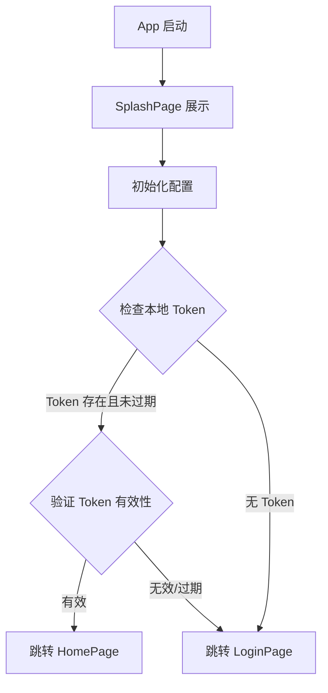

#### 6.5.3 用户注册与登录设计

**登录流程**：

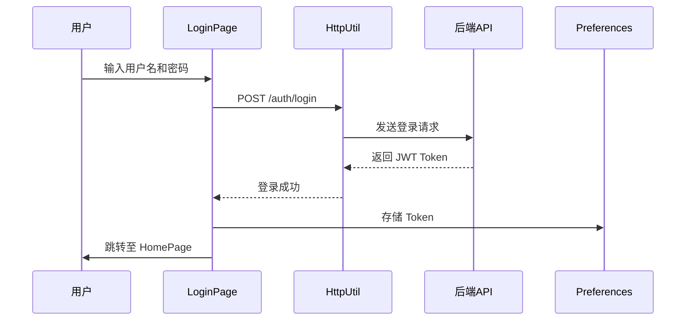

**注册流程**：

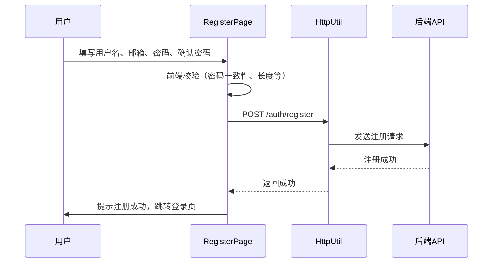

**Token 管理策略**：
- Token 存储在 Preferences 中
- 每次请求通过 HttpUtil 自动携带
- Token 过期后自动跳转登录页
- 支持手动退出登录，清除本地 Token

#### 6.5.4 个人主页设计

**个人主页功能结构**：
- 顶部：用户头像、用户名、个人简介
- 收藏入口：显示收藏数量，点击进入收藏列表
- 上传照片入口：显示已上传照片数量
- 评论入口：显示历史评论数量
- 隐私设置入口：跳转隐私设置页
- 退出登录按钮

#### 6.5.5 隐私设置设计

可配置项：
- **收藏夹可见性**：公开 / 仅自己可见
- **评论可见性**：公开 / 仅自己可见
- **上传照片可见性**：公开 / 仅自己可见
- 设置通过 POST 请求同步到后端


## 7. 非功能性设计

### 7.1 性能设计

#### 7.1.1 图片加载优化
- **策略**：列表页使用缩略图（?size=thumb 参数），详情页加载原图
- **缓存**：使用 Image 组件内置缓存机制，避免重复下载
- **占位图**：加载中显示骨架屏或默认占位图

#### 7.1.2 语音响应优化
- **语音识别超时**：设置为 10 秒，超时后提示用户重试
- **语音合成预加载**：进入文物详情页时预加载语音讲解
- **SSE 流式展示**：语音问答采用流式响应，逐字显示答案，减少等待感

#### 7.1.3 列表性能优化
- 首页文物列表使用 LazyForEach 实现懒加载
- 分页加载，每页 20 条

### 7.2 安全设计

#### 7.2.1 认证与授权
- 采用 JWT 无状态认证机制
- Token 设置过期时间（建议 2 小时）
- 请求在 HttpUtil 中统一携带 `Authorization: Bearer {token}`

#### 7.2.2 数据安全
- 用户密码使用 bcrypt 加密存储（后端）
- 密码等敏感信息不在本地明文存储
- 所有 API 通信采用 HTTPS 加密

#### 7.2.3 权限管理
- 调用系统敏感能力（相机、麦克风）前动态申请权限
- 用户可在设置中随时撤销权限
- 未授权时给出明确提示并引导用户授权

#### 7.2.4 输入校验
- 所有用户输入进行前端校验（长度、格式等）
- 防止 XSS 攻击，对用户生成内容进行转义处理

### 7.3 容错与异常处理

#### 7.3.1 网络异常处理

| 场景 | 处理策略 |
|---|---|
| 无网络连接 | 显示“网络不可用”提示，展示本地缓存数据 |
| 请求超时 | 自动重试 1 次，仍失败则提示用户稍后再试 |
| 服务器错误（5xx） | 提示“服务器繁忙，请稍后再试” |
| Token 过期 | 自动跳转登录页，提示重新登录 |

#### 7.3.2 功能降级
- **语音识别失败**：降级为手动输入搜索关键词
- **图片搜索超时**：提示用户“检索超时，请尝试重新上传”
- **音视频加载失败**：显示“加载失败，点击重试”按钮

### 7.4 可扩展性设计
- 模块间通过接口解耦，新增功能模块不影响已有代码
- 网络层封装支持后续更换后端地址或添加拦截器
- 数据模型独立定义，便于与后端协商调整字段


## 8. 附录

### 8.1 与其它子系统的集成约定
[预留接口文档链接或说明，待与其他子系统组长协商后补充]

### 8.2 Git 协作规范

1. **禁止直接推送到 `main` 分支**
2. 每位组员基于 `main` 创建自己的功能分支，命名格式：`feature/<模块名>`（如 `feature/browse-module`）
3. 每天工作结束前将分支推送至远端备份
4. 合并时发起 Pull Request，由组长审核后合并
5. 合并冲突由开发者本地解决后重新推送

### 8.3 GitHub 仓库信息
- 仓库地址：`https://github.com/BUCT-CS2301/PalmMuseum.git`
- 主分支：`main`

### 8.4 设计变更记录

| 日期 | 变更内容 | 变更原因 | 影响范围 | 记录人 |
|---|---|---|---|---|
|  |  |  |  |  |
