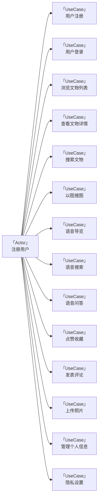
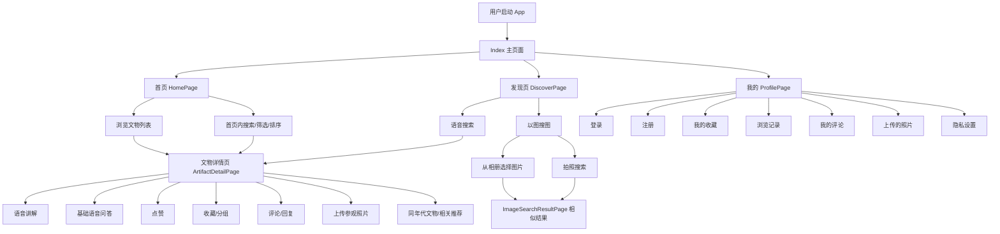
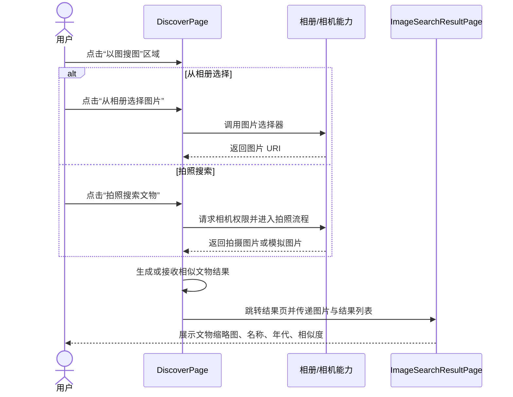
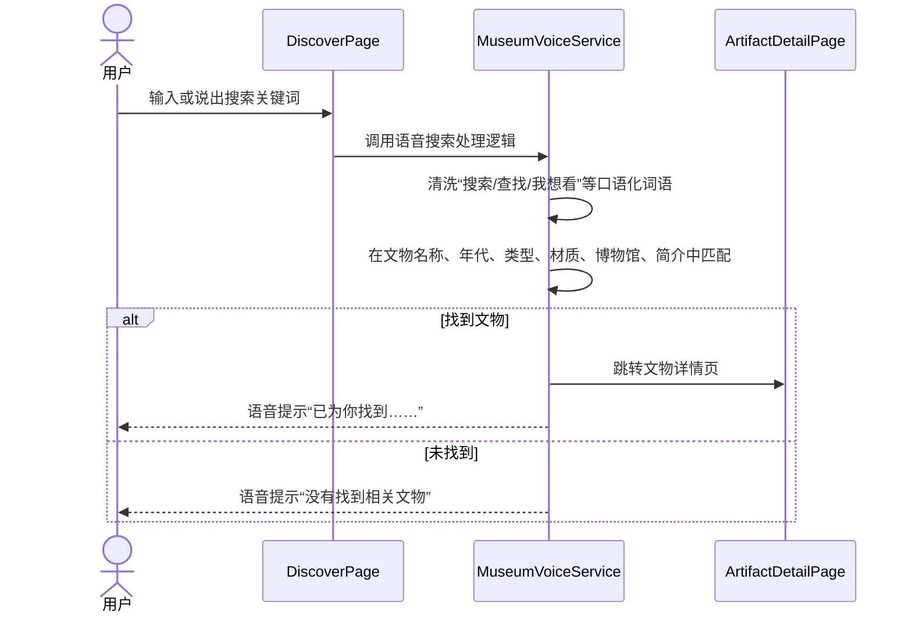
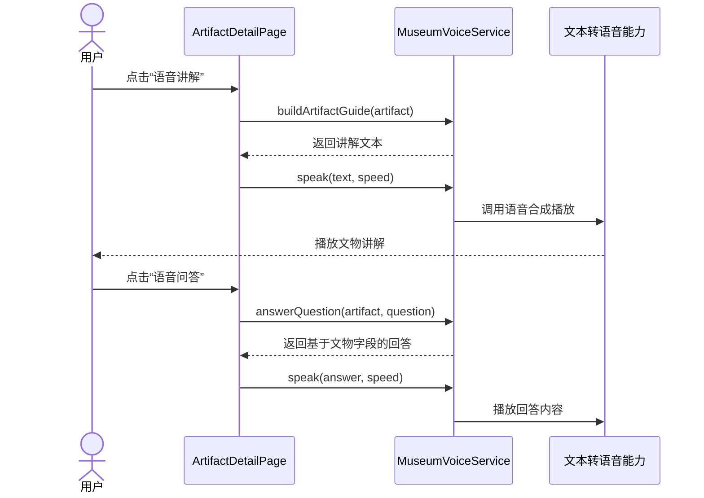
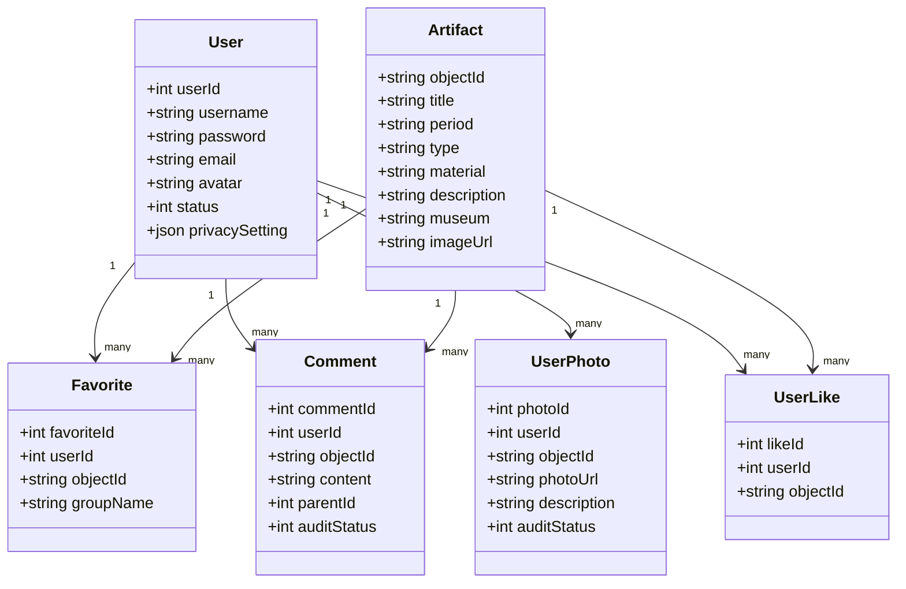

# 掌上博物馆子系统 - 需求规格说明书

## 1. 引言

### 1.1 编写目的

本文档旨在明确掌上博物馆子系统的功能需求与性能要求，为系统设计、开发、测试和验收提供统一的需求基线。

掌上博物馆是“海外藏中国文物知识管理与服务平台”的移动端子系统，以海外藏中国文物为主题，为用户提供随时随地浏览文物、语音导览、以图搜图、社交互动等沉浸式体验。本系统的开发，解决了传统博物馆 App 功能单一、互动性弱的问题，使用户能够便捷地探索海外流散中国文物，感受中华文化的博大精深。

通过本文档详尽说明该软件产品的需求规格，从而对产品进行准确的定义，作为后续设计、编码和测试的依据。

### 1.2 预期读者

- 项目负责人、产品经理
- 前端开发人员（本组全体成员）
- 后端开发人员（知识服务子系统、知识问答子系统、后台管理子系统成员）
- 测试人员
- 助教及评审教师

### 1.3 产品范围

#### 1.3.1 待开发软件系统

待开发软件系统：基于 HarmonyOS 的掌上博物馆移动端 App

#### 1.3.2 产品说明

掌上博物馆 App 作为“海外藏中国文物知识管理与服务平台”的移动端入口，是平台向普通用户提供文物知识服务的重要渠道。

本 App 的应用将使海外中国文物知识服务移动化、智能化、互动化，让用户不受时间和空间限制，通过手机即可浏览海外博物馆的中国文物、通过语音与图像等多种方式探索文物知识。系统主要功能包括文物浏览、以图搜图、语音导览、用户社交互动以及个人信息管理。

本子系统不直接操作知识图谱，所有文物数据通过调用知识服务子系统的 API 获取；以图搜图的特征提取与相似度检索由后端（CLIP + FAISS）完成，移动端负责图片采集与结果展示；语音问答功能通过调用知识问答子系统的接口实现。

### 1.4 参考文献

1. 课程设计题目 - 海外藏中国文物知识管理与服务平台.docx  
2. 华为 HarmonyOS 开发者文档：https://developer.harmonyos.com/

## 2. 综合描述

本项目是为文物爱好者与普通大众开发的掌上博物馆 App。随着移动互联网和人工智能技术的发展，博物馆知识服务需要向移动化、智能化、个性化方向发展。用户希望通过手机即可随时随地探索海外流散的中国文物，获得专业而深入的文物知识。

现有博物馆类 App 多为图文展示的简单模式，缺乏以图搜图、语音交互、社交互动等创新功能。本系统基于 HarmonyOS 开发，采用 ArkTS 语言与 ArkUI 框架，支持用户通过浏览、搜索、拍照、语音等多种方式探索文物，提供点赞、收藏、评论、上传照片等社交互动功能。

本系统通过调用平台后端 API 获取数据和智能服务，用户无需安装额外的服务端软件，所有数据均由服务器处理后返回移动端展示。

### 2.1 产品功能概览

根据当前 GitHub 仓库中的前端实现，本子系统采用 **首页 / 发现 / 我的** 三个底部 Tab 作为主导航入口。其中首页负责文物浏览，发现页集中承载语音搜索与以图搜图入口，我的页面负责登录注册、个人主页与用户个人数据管理。

本子系统共包含五大功能模块，分工保持不变：

1. **文物浏览**：首页文物卡片/列表展示、首页内搜索、多维筛选、排序、分页加载、文物详情页、同年代文物与相关推荐展示。
2. **以图搜图**：发现页中的拍照搜图、相册选择图片、相似文物结果展示。当前前端原型使用模拟检索结果，后续可替换为后端图像检索接口。
3. **语音导览**：发现页语音搜索入口、文物详情页语音讲解、语音播放控制、围绕当前文物的基础语音问答。
4. **用户交互**：文物点赞、收藏与收藏夹分组、评论与回复、用户照片上传、浏览记录、审核状态提示。
5. **用户个人信息管理**：注册登录、个人主页、我的收藏、我的评论、浏览记录、上传照片、隐私设置与退出登录。

### 2.2 用户类与特性

| 用户类型 | 主要特征                           | 主要权限                                                     |
| -------- | ---------------------------------- | ------------------------------------------------------------ |
| 普通游客 | 未登录或刚注册用户，以浏览文物为主 | 浏览文物列表与详情、查看公开评论、使用搜索功能               |
| 注册用户 | 已完成注册登录的用户               | 除游客权限外，可使用点赞收藏、发表评论、上传照片、语音导览、以图搜图等完整功能 |
| 禁用用户 | 因违规被限制的用户                 | 仅可浏览文物，无法使用评论、上传等互动功能                   |

> 注：后台管理员不直接使用本 App，管理功能由后台管理子系统（Web 端）提供。

### 2.3 运行环境

#### 2.3.1 硬件平台

本 App 运行于 HarmonyOS 设备：

- 操作系统：HarmonyOS 4.0 或以上版本
- CPU：ARM 架构处理器
- 内存：4GB 或以上
- 存储空间：200MB 以上可用空间
- 屏幕分辨率：2340×1080 或等效分辨率，适配主流手机屏幕

#### 2.3.2 软件环境

- 开发语言：ArkTS
- UI 框架：ArkUI
- 开发工具：DevEco Studio 6.1.0 (Release)
- 运行时依赖：HarmonyOS SDK

#### 2.3.3 后端依赖

本 App 设计上依赖平台后端服务，但当前前端仓库以课程原型实现为主，部分数据和交互状态仍采用本地 Mock 数据、`AppStorage` 与 `Preferences` 保存。后续联调时，应逐步将本地数据源替换为后端接口。

本 App 后续需要对接的平台服务包括：

- 知识服务子系统 RESTful API：提供文物列表、详情、搜索、相关推荐等数据。
- 知识问答子系统 API：提供复杂文物问答能力，支持 SSE 流式响应。
- 后台管理子系统 API：提供评论、照片等用户生成内容的审核状态查询与同步。
- 图像检索服务：提供以图搜图的特征比对与相似度检索。

当前原型中的说明：

- 文物浏览使用 `mockArtifacts` 作为本地模拟数据源。
- 点赞、收藏、评论、上传照片、浏览记录、隐私设置等交互数据使用本地存储模拟。
- 语音搜索、语音播报与基础问答已封装在 `MuseumVoiceService` 中。
- 网络层已预留 `HttpApi` 封装，统一使用 `/api/v1` 基础路径，后续可用于后端联调。

### 2.4 设计与实现限制

#### 2.4.1 必须使用的特定技术

- ArkTS 编程语言（HarmonyOS 课程指定）
- ArkUI 声明式 UI 框架
- DevEco Studio 开发环境
- @ohos 系列系统能力 API（路由、网络、语音、相机等）

#### 2.4.2 运行限制

- 需要 HarmonyOS 4.0 及以上版本设备
- 需稳定的互联网连接（部分功能可在无网络时浏览缓存数据）
- 相机和麦克风权限需用户授权
- 语音功能依赖设备硬件支持

#### 2.4.3 数据限制

- App 不直接操作知识图谱数据库
- 不直接存储用户密码明文
- 本地缓存数据仅用于提升加载速度，不作为权威数据源

## 3. 系统功能需求

> **说明**：本节第 3.1-3.5 小节由组长编写，第 3.6 节按模块划分，由各组员分别编写。

### 3.1 系统用例总览

#### 3.1.1 系统用例图

#### 3.1.2 用例概述

| 用例编号 | 用例名称     | 简要描述                       | 所属模块 |
| -------- | ------------ | ------------------------------ | -------- |
| UC01     | 用户注册     | 新用户创建账号                 | 用户系统 |
| UC02     | 用户登录     | 已有账号登录系统               | 用户系统 |
| UC03     | 浏览文物列表 | 首页浏览文物卡片/瀑布流        | 文物浏览 |
| UC04     | 查看文物详情 | 查看文物完整信息与图片         | 文物浏览 |
| UC05     | 搜索文物     | 按关键字搜索文物               | 文物浏览 |
| UC06     | 以图搜图     | 通过上传或拍摄图片搜索相似文物 | 以图搜图 |
| UC07     | 语音导览     | 收听文物语音讲解               | 语音导览 |
| UC08     | 语音搜索     | 通过语音输入搜索文物           | 语音导览 |
| UC09     | 语音问答     | 通过语音提问获取文物知识回答   | 语音导览 |
| UC10     | 点赞收藏     | 对文物点赞或加入收藏夹         | 用户交互 |
| UC11     | 发表评论     | 对文物发表文字评论或回复       | 用户交互 |
| UC12     | 上传照片     | 上传拍摄的文物相关照片         | 用户交互 |
| UC13     | 管理个人信息 | 查看和编辑个人主页             | 用户系统 |
| UC14     | 隐私设置     | 设置个人内容的可见范围         | 用户系统 |

---

### 3.2 系统核心流程分析

#### 3.2.1 典型用户使用流程

当前 App 主导航采用 `Index` 页面中的三栏 Tab：**首页、发现、我的**。用户进入 App 后，可在首页浏览文物，在发现页使用语音搜索与以图搜图，在我的页面完成登录注册和个人数据管理。

### 3.3 用例描述

#### 3.3.1 “浏览文物列表”用例描述

| 项目       | 内容                                                         |
| ---------- | ------------------------------------------------------------ |
| 用例名     | 浏览文物列表                                                 |
| 用例编号   | UC03                                                         |
| 简要描述   | 用户进入首页，查看文物卡片列表，支持排序和筛选               |
| 参与者     | 注册用户 / 普通游客                                          |
| 涉众       | 用户：浏览和发现感兴趣的文物。系统：展示文物数据。           |
| 相关用例   | 查看文物详情（UC04）、搜索文物（UC05）                       |
| 前置条件   | App 启动完成，网络连接正常                                   |
| 后置条件   | 文物列表成功展示                                             |
| 基本事件流 | 1. 用户打开 App 进入首页 2. 系统默认按热度排序展示文物卡片列表 3. 用户可切换视图（卡片/瀑布流） 4. 用户可选择排序方式（年代、名称） 5. 用户下滑加载更多文物 6. 用户点击某文物卡片进入详情页 |
| 备选事件流 | A-1 网络异常 1. 系统提示“网络不可用” 2. 显示本地缓存数据（如有） A-2 无更多数据 1. 系统提示“已加载全部文物” |
| 补充约束   | B-1 列表采用分页加载，每页 20 条 B-2 图片使用缩略图以提升加载速度 |
| 待解决问题 | 无                                                           |

#### 3.3.2 “用户登录”用例描述

| 项目       | 内容                                                         |
| ---------- | ------------------------------------------------------------ |
| 用例名     | 用户登录                                                     |
| 用例编号   | UC02                                                         |
| 简要描述   | 已有账号的用户输入用户名和密码登录系统                       |
| 参与者     | 已注册用户                                                   |
| 涉众       | 用户：获取完整功能权限。系统：认证用户身份。                 |
| 相关用例   | 用户注册（UC01）                                             |
| 前置条件   | 用户已有注册账号                                             |
| 后置条件   | 用户成功登录，获得 JWT Token，跳转首页                       |
| 基本事件流 | 1. 用户进入登录页 2. 用户输入用户名和密码 3. 用户点击“登录”按钮 4. 系统验证用户名和密码 5. 系统返回 JWT Token 6. App 存储 Token 到本地 7. 系统跳转至首页 |
| 备选事件流 | A-1 用户名或密码错误 1. 系统提示“用户名或密码错误” 2. 用户可重新输入 A-2 网络异常 1. 系统提示“网络连接失败，请稍后重试” |
| 补充约束   | B-1 密码长度 5-16 位 B-2 Token 有效期 2 小时 B-3 连续输入错误 5 次锁定 15 分钟 |
| 待解决问题 | 是否支持华为账号一键登录（选做）                             |

---

### 3.4 系统交互时序图（核心流程）

#### 3.4.1 发现页以图搜图流程

#### 3.4.2 语音搜索流程

#### 3.4.3 文物详情页语音讲解与问答流程

> 说明：当前前端实现以本地规则问答为主，支持回答年代、类型、材质、收藏机构、简介等问题；后续可接入知识问答子系统，通过 SSE 流式响应实现更复杂的智能问答。

### 3.5 用户界面原型说明

本 App 界面设计要求：

1. **主导航清晰**：底部主导航采用“首页、发现、我的”三栏结构。首页用于文物浏览，发现页用于语音搜索和以图搜图，我的页面用于用户登录与个人数据管理。
2. **风格统一**：整体采用偏传统文化的暖色调视觉风格，如米白背景、敦煌红强调色、棕色辅助文字，与文物展示主题保持一致。
3. **操作集中**：文物浏览、筛选、排序和搜索集中在首页；语音搜索和以图搜图集中在发现页；点赞、收藏、评论、上传照片和语音讲解集中在文物详情页。
4. **反馈明确**：搜索无结果、权限被拒绝、语音播放失败、图片选择失败、评论待审核等情况均应提供 Toast 或空状态提示。
5. **响应式适配**：页面组件应适配主流 HarmonyOS 手机和常规平板宽度，列表、卡片、按钮和图片区域应保持清晰可用。
6. **无障碍支持**：核心按钮应具有明确文字提示，例如“语音讲解”“开始语音搜索”“拍照搜索文物”“选择照片并上传”等。

### 3.6 模块功能需求

> **说明**：以下各小节仍按原分工编写，但内容已根据当前 GitHub 仓库中的三栏主导航、发现页入口、文物详情页集成交互等实现模式进行统一修订。

#### 3.6.1 文物浏览模块（郝婧 编写）

##### 3.6.1.1 功能描述

文物浏览模块是用户进入 App 后的核心内容展示入口，主要对应 `HomePage` 与 `ArtifactDetailPage`。当前实现以本地 `mockArtifacts` 数据为基础，支持文物列表展示、首页内搜索、多条件筛选、排序、分页加载和文物详情展示。

主要功能包括：

- **首页文物展示**：以网格卡片或列表形式展示文物图片、名称、年代、博物馆等基本信息。
- **首页内搜索**：在首页搜索框中输入文物名称、年代、类型、材质、博物馆等关键词，系统实时筛选文物列表。
- **多维筛选**：支持按年代、类型、材质、博物馆进行筛选，筛选项可展开或收起。
- **排序功能**：支持按热门、名称、年代排序。
- **分页加载**：每页展示固定数量文物，底部显示“加载更多”或“已经到底了”。
- **文物详情展示**：展示文物图片轮播、名称、年代、类型、材质、收藏机构、详细介绍、同年代文物和相关推荐。
- **跨模块入口**：详情页提供语音讲解、语音问答、点赞、收藏、评论、上传照片等入口，分别对接 M4 与 M5 模块。

##### 3.6.1.2 用例描述

| 用例编号 | 用例名称     | 简要描述                                                 |
| -------- | ------------ | -------------------------------------------------------- |
| UC03     | 浏览文物列表 | 用户进入首页查看文物卡片或列表，支持筛选、排序和分页加载 |
| UC04     | 查看文物详情 | 用户点击某件文物后查看完整图文信息、同年代文物和相关推荐 |
| UC05     | 搜索文物     | 用户在首页搜索框输入关键词，系统实时筛选匹配文物         |

##### 3.6.1.3 详细用例：浏览文物列表

| 项目       | 内容                                                         |
| ---------- | ------------------------------------------------------------ |
| 用例名     | 浏览文物列表                                                 |
| 用例编号   | UC03                                                         |
| 简要描述   | 用户进入首页后浏览文物列表，可切换视图、筛选、排序和加载更多 |
| 参与者     | 注册用户 / 普通游客                                          |
| 前置条件   | App 启动完成；本地文物数据或后端文物数据可用                 |
| 后置条件   | 首页正确展示符合条件的文物列表                               |
| 基本事件流 | 1. 用户进入 `HomePage`； 2. 系统加载文物数据并初始化筛选项； 3. 默认按热门排序展示文物； 4. 用户可输入关键词进行搜索； 5. 用户可按年代、类型、材质、博物馆筛选； 6. 用户可切换热门、名称、年代排序； 7. 用户点击“加载更多”继续浏览； 8. 用户点击文物卡片进入详情页。 |
| 备选事件流 | A-1 无匹配文物：显示“暂无匹配文物”； A-2 无更多数据：显示“已经到底了”； A-3 图片加载失败：显示默认占位图。 |
| 补充约束   | B-1 首页搜索采用输入防抖，避免频繁刷新； B-2 每页加载数量应固定，保证列表性能； B-3 筛选和搜索结果应保持与排序规则一致。 |

##### 3.6.1.4 详细用例：查看文物详情

| 项目       | 内容                                                         |
| ---------- | ------------------------------------------------------------ |
| 用例名     | 查看文物详情                                                 |
| 用例编号   | UC04                                                         |
| 简要描述   | 用户点击文物卡片后进入详情页，查看文物图片、属性、介绍、同年代文物和相关推荐 |
| 参与者     | 注册用户 / 普通游客                                          |
| 前置条件   | 用户处于首页、搜索结果或相关推荐区域；文物数据可用           |
| 后置条件   | 文物详情页正常渲染，相关操作入口可用                         |
| 基本事件流 | 1. 用户点击某件文物； 2. 系统根据文物 `id` 加载详情； 3. 页面展示图片轮播，支持左右滑动和双指缩放； 4. 页面展示名称、年代、类型、材质、收藏机构、简介； 5. 页面展示同年代文物和相关推荐； 6. 用户可继续进行语音讲解、点赞收藏、评论或上传照片等操作。 |
| 备选事件流 | A-1 文物不存在：显示“未找到该文物”； A-2 游客点击互动操作：提示“请先登录”； A-3 图片无多图数据：使用单张主图展示。 |
| 补充约束   | B-1 详情页需保持图片展示清晰； B-2 推荐文物应排除当前文物； B-3 详情页作为语音导览和用户交互模块的重要入口。 |

##### 3.6.1.5 详细用例：搜索文物

| 项目       | 内容                                                         |
| ---------- | ------------------------------------------------------------ |
| 用例名     | 搜索文物                                                     |
| 用例编号   | UC05                                                         |
| 简要描述   | 用户在首页搜索框输入关键词，系统在当前文物数据中实时匹配     |
| 参与者     | 注册用户 / 普通游客                                          |
| 前置条件   | 用户处于首页；文物数据已加载                                 |
| 后置条件   | 首页展示匹配关键词的文物列表                                 |
| 基本事件流 | 1. 用户在首页搜索框输入关键词； 2. 系统对输入进行防抖处理； 3. 系统在文物名称、年代、类型、材质、博物馆字段中匹配； 4. 列表更新为匹配结果； 5. 用户可清空关键词恢复全部列表。 |
| 备选事件流 | A-1 无匹配结果：显示“暂无匹配文物”； A-2 用户清空输入：恢复默认文物列表。 |
| 补充约束   | B-1 搜索不单独跳转页面； B-2 搜索结果应继续支持筛选、排序和分页。 |

##### 3.6.1.6 界面原型要求

- 首页顶部显示“掌上博物馆”标题和搜索框。
- 搜索框下方提供年代筛选，更多筛选项可展开显示类型、材质、博物馆。
- 排序区域提供“热门、名称、年代”选项。
- 列表支持网格卡片和单列列表两种显示方式。
- 文物详情页顶部为图片轮播区域，下方依次展示文物属性、介绍、同年代文物、相关推荐和操作区域。

---

#### 3.6.2 以图搜图模块（王珍 编写）

##### 3.6.2.1 功能描述

以图搜图模块对应当前 `DiscoverPage` 中的“以图搜图”卡片和 `ImageSearchResultPage` 结果页。该模块支持从相册选择图片或拍照搜索文物，当前前端原型通过模拟结果生成相似文物列表，后续可替换为后端图像检索接口。

主要功能包括：

- **功能入口**：在发现页中提供“以图搜图”区域。
- **相册选择**：调用系统图片选择器选择单张图片。
- **拍照搜索**：请求相机相关权限，进入拍照搜索流程；当前原型可使用模拟图片代替真实拍照结果。
- **结果展示**：跳转至 `ImageSearchResultPage`，展示文物图片、名称、年代和相似度。
- **异常提示**：权限拒绝、图片选择失败、打开相机失败时给出提示。

##### 3.6.2.2 用例描述

| 用例编号 | 用例名称 | 简要描述                                                 |
| -------- | -------- | -------------------------------------------------------- |
| UC06     | 以图搜图 | 用户在发现页通过拍照或相册选择图片，系统展示相似文物结果 |

##### 3.6.2.3 详细用例：以图搜图

| 项目       | 内容                                                         |
| ---------- | ------------------------------------------------------------ |
| 用例名     | 以图搜图                                                     |
| 用例编号   | UC06                                                         |
| 简要描述   | 用户选择图片或拍照后，系统生成相似文物结果并跳转结果页展示   |
| 参与者     | 注册用户 / 普通游客                                          |
| 前置条件   | 用户进入发现页；设备支持图片选择或拍照；必要权限已授权       |
| 后置条件   | 系统展示相似文物结果列表，用户可查看结果信息                 |
| 基本事件流 | 1. 用户进入发现页； 2. 用户点击“拍照搜索文物”或“从相册选择图片”； 3. 系统检查相机或图片读取权限； 4. 用户完成拍照或选择图片； 5. 系统生成相似文物结果； 6. 系统跳转至 `ImageSearchResultPage`； 7. 页面展示结果图片、名称、年代和相似度。 |
| 备选事件流 | A-1 权限被拒绝：提示“权限被拒绝”； A-2 图片选择失败：提示“选择图片失败”； A-3 打开相机失败：提示“打开相机失败”； A-4 无结果：显示空状态并提供重新搜索入口。 |
| 补充约束   | B-1 当前原型可使用本地模拟文物结果； B-2 后续联调时应将模拟检索替换为图像检索服务； B-3 结果列表应按相似度从高到低展示。 |

##### 3.6.2.4 界面原型要求

- 发现页中以独立卡片展示“以图搜图”功能。
- 卡片内提供“拍照搜索文物”和“从相册选择图片”两个按钮。
- 结果页标题为“以图搜图结果”。
- 结果列表采用卡片式布局，展示缩略图、名称、年代、相似度。
- 页面风格与首页一致，采用米白背景和敦煌红强调色。

---

#### 3.6.3 语音导览模块（范力烨 编写）

##### 3.6.3.1 功能描述

语音导览模块对应当前 `DiscoverPage` 中的语音搜索卡片，以及 `ArtifactDetailPage` 中的语音讲解、语音问答和播放控制区域。该模块基于 `MuseumVoiceService` 封装语音合成、语音识别、文物讲解文本生成、语音搜索匹配和基础规则问答。

主要功能包括：

- **语音搜索**：用户在发现页输入或说出文物名称、年代、类型、材质、博物馆等关键词，系统匹配本地文物并跳转详情页。
- **语音讲解**：在文物详情页根据当前文物信息生成讲解词并播放。
- **播放控制**：支持倍速切换、上一段、下一段、停止、重播和段落进度显示。
- **基础语音问答**：围绕当前文物回答收藏机构、年代、材质、类型、简介等问题。
- **后续扩展**：复杂问答可对接知识问答子系统，通过 SSE 流式返回回答。

##### 3.6.3.2 用例描述

| 用例编号 | 用例名称 | 简要描述                                 |
| -------- | -------- | ---------------------------------------- |
| UC07     | 语音导览 | 用户在文物详情页收听当前文物的语音讲解   |
| UC08     | 语音搜索 | 用户在发现页通过语音或文本关键词搜索文物 |
| UC09     | 语音问答 | 用户围绕当前文物进行基础问答并收听回答   |

##### 3.6.3.3 详细用例：语音导览

| 项目       | 内容                                                         |
| ---------- | ------------------------------------------------------------ |
| 用例名     | 语音导览                                                     |
| 用例编号   | UC07                                                         |
| 简要描述   | 用户在文物详情页点击语音讲解，系统播放当前文物介绍           |
| 参与者     | 注册用户 / 普通游客                                          |
| 前置条件   | 用户已进入文物详情页；当前文物数据已加载；设备支持语音播放   |
| 后置条件   | 系统完成文物讲解播放或停止播放                               |
| 基本事件流 | 1. 用户进入文物详情页； 2. 用户点击“语音讲解”； 3. 系统调用 `buildArtifactGuide(artifact)` 生成讲解文本； 4. 系统调用 `speak(text, speed)` 播放讲解； 5. 用户可切换 0.75x、1x、1.25x、1.5x 倍速； 6. 用户可点击上一段、下一段、停止或重播。 |
| 备选事件流 | A-1 设备不支持语音播报：提示“当前设备不支持语音播报”； A-2 文本为空：提示“没有可播报的内容”； A-3 语音播放失败：提示“语音播放失败”。 |
| 补充约束   | B-1 长文本应截断或分段处理； B-2 播放时避免多段语音重叠； B-3 进度显示格式为“当前段落 / 总段落”。 |

##### 3.6.3.4 详细用例：语音搜索

| 项目       | 内容                                                         |
| ---------- | ------------------------------------------------------------ |
| 用例名     | 语音搜索                                                     |
| 用例编号   | UC08                                                         |
| 简要描述   | 用户在发现页通过输入或语音方式搜索文物                       |
| 参与者     | 注册用户 / 普通游客                                          |
| 前置条件   | 用户进入发现页；设备支持语音识别或用户可手动输入关键词       |
| 后置条件   | 找到文物时跳转详情页；未找到时给出语音提示                   |
| 基本事件流 | 1. 用户进入发现页； 2. 用户在语音搜索区域输入或说出关键词； 3. 系统清洗“帮我找、搜索、查找”等口语词； 4. 系统在文物名称、年代、类型、材质、博物馆、简介中匹配； 5. 找到文物后语音提示并跳转详情页； 6. 未找到时提示“没有找到相关文物，请换一个关键词试试”。 |
| 备选事件流 | A-1 未输入搜索内容：提示“请输入或说出搜索内容”； A-2 语音识别失败：提示“语音识别失败”； A-3 设备不支持语音识别：提示“当前设备不支持语音识别”。 |
| 补充约束   | B-1 语音搜索应支持中文关键词； B-2 搜索逻辑应兼容“商/商代”等常见表达差异； B-3 语音搜索结果应与首页搜索匹配范围保持一致。 |

##### 3.6.3.5 详细用例：语音问答

| 项目       | 内容                                                         |
| ---------- | ------------------------------------------------------------ |
| 用例名     | 语音问答                                                     |
| 用例编号   | UC09                                                         |
| 简要描述   | 用户在文物详情页围绕当前文物提问，系统返回基础回答并播放     |
| 参与者     | 注册用户 / 普通游客                                          |
| 前置条件   | 用户已进入文物详情页；当前文物数据可用                       |
| 后置条件   | 系统展示或播报问题回答                                       |
| 基本事件流 | 1. 用户点击“语音问答”； 2. 系统获取当前文物对象和问题文本； 3. 系统根据问题关键词匹配年代、类型、材质、收藏机构、介绍等字段； 4. 系统返回回答文本； 5. 系统调用语音合成播放回答内容。 |
| 备选事件流 | A-1 问题超出支持范围：提示可询问年代、类型、材质、收藏博物馆和文物介绍； A-2 语音服务不可用：提示“语音问答暂不可用”； A-3 后续接入问答接口失败：保留本地规则问答作为降级方案。 |
| 补充约束   | B-1 当前基础问答必须围绕当前文物； B-2 不应影响详情页其他功能； B-3 后续可接入 SSE 流式问答并保留本地规则兜底。 |

##### 3.6.3.6 界面原型要求

- 发现页展示“语音搜索”卡片，包括语音提示按钮、文本输入框和开始语音搜索按钮。
- 文物详情页展示“语音讲解”和“语音问答”按钮。
- 文物详情页提供语音播放控制区，包括倍速、上一段、下一段、停止、重播和段落进度。
- 语音相关错误通过 Toast 提示。

---

#### 3.6.4 用户交互模块（刘清 编写）

##### 3.6.4.1 功能描述

用户交互模块主要对应 `ArtifactDetailPage`、`MyFavoritesPage`、`MyCommentsPage`、`MyHistoryPage`、`MyUploadsPage` 和 `PrivacySettingPage`。当前实现以前端本地存储为主，模拟点赞、收藏、评论审核、照片上传审核、浏览记录和隐私设置。

主要功能包括：

- **点赞**：登录用户可对文物点赞或取消点赞。
- **收藏与分组**：用户可收藏文物、新建收藏夹、切换分组、移动收藏项、删除自定义收藏夹。
- **评论与回复**：用户可发表评论和回复评论，新评论先显示为待审核状态，审核通过后公开显示。
- **评论点赞**：用户可对已通过审核的评论点赞。
- **上传照片**：用户可选择图片并填写拍摄地点、说明，上传记录先进入待审核状态。
- **浏览记录**：进入详情页后记录浏览历史，在我的页面中查看。
- **隐私设置**：控制收藏、点赞、评论、上传照片是否对他人可见。

##### 3.6.4.2 用例描述

| 用例编号 | 用例名称 | 简要描述                                               |
| -------- | -------- | ------------------------------------------------------ |
| UC10     | 点赞收藏 | 用户对文物点赞或加入收藏夹，并可进行分组管理           |
| UC11     | 发表评论 | 用户对文物发表评论或回复评论，评论进入审核流程         |
| UC12     | 上传照片 | 用户上传文物相关照片并填写地点、说明，照片进入审核流程 |

##### 3.6.4.3 详细用例：点赞收藏

| 项目       | 内容                                                         |
| ---------- | ------------------------------------------------------------ |
| 用例名     | 点赞收藏                                                     |
| 用例编号   | UC10                                                         |
| 简要描述   | 登录用户在文物详情页点赞或收藏文物，并在我的收藏中管理分组   |
| 参与者     | 已登录用户                                                   |
| 前置条件   | 用户已登录；已进入文物详情页                                 |
| 后置条件   | 点赞或收藏状态被保存到本地存储；个人主页相关统计同步更新     |
| 基本事件流 | 1. 用户点击点赞按钮； 2. 系统切换点赞状态并更新数量； 3. 用户点击收藏按钮； 4. 系统将文物加入当前收藏分组； 5. 用户进入“我的收藏”查看收藏列表； 6. 用户可新建收藏夹、切换分组、移动收藏项或移出收藏。 |
| 备选事件流 | A-1 未登录用户点击：提示“请先登录”； A-2 收藏夹名称为空或重复：提示用户重新输入； A-3 删除收藏夹：内容迁移到默认分组。 |
| 补充约束   | B-1 默认收藏夹不可删除； B-2 收藏列表应支持按分组筛选； B-3 点赞收藏状态应与详情页按钮状态同步。 |

##### 3.6.4.4 详细用例：发表评论

| 项目       | 内容                                                         |
| ---------- | ------------------------------------------------------------ |
| 用例名     | 发表评论                                                     |
| 用例编号   | UC11                                                         |
| 简要描述   | 登录用户在详情页发表评论或回复他人评论，系统保存并显示审核状态 |
| 参与者     | 已登录用户                                                   |
| 前置条件   | 用户已登录；已进入文物详情页                                 |
| 后置条件   | 评论保存成功，状态为待审核或已通过                           |
| 基本事件流 | 1. 用户输入评论内容； 2. 用户点击“发表”； 3. 系统执行非空和敏感词校验； 4. 评论保存为待审核状态； 5. 页面提示“评论已提交”； 6. 审核通过后评论公开显示； 7. 用户可在“我的评论”查看评论状态。 |
| 备选事件流 | A-1 未登录：跳转登录页； A-2 输入为空：提示补充内容； A-3 命中敏感词：提示修改后重试。 |
| 补充约束   | B-1 待审核评论仅自己可见； B-2 公开评论支持回复和点赞； B-3 当前原型使用本地延时模拟审核通过。 |

##### 3.6.4.5 详细用例：上传照片

| 项目       | 内容                                                         |
| ---------- | ------------------------------------------------------------ |
| 用例名     | 上传照片                                                     |
| 用例编号   | UC12                                                         |
| 简要描述   | 登录用户选择图片并填写地点、说明后上传照片记录               |
| 参与者     | 已登录用户                                                   |
| 前置条件   | 用户已登录；系统可调用图片选择器                             |
| 后置条件   | 照片记录保存成功，进入待审核状态                             |
| 基本事件流 | 1. 用户在详情页或“上传的照片”页面点击上传； 2. 系统打开图片选择器； 3. 用户选择图片； 4. 用户填写拍摄地点和说明； 5. 系统保存图片 URI 和元数据； 6. 页面提示“照片已上传，等待审核”； 7. 用户可在“上传的照片”页面查看审核状态。 |
| 备选事件流 | A-1 未登录：提示登录； A-2 用户取消选择：不生成记录； A-3 图片选择失败：提示重新选择。 |
| 补充约束   | B-1 上传照片应保存关联文物、用户、地点、说明和审核状态； B-2 后续可接入后台审核接口替换本地模拟审核。 |

##### 3.6.4.6 界面原型要求

- 文物详情页展示点赞、收藏、评论区、照片上传区域。
- 收藏夹页面支持新建收藏夹、分组筛选、移出收藏和更换分组。
- 我的评论页面展示评论内容、所属文物、审核状态和评论点赞数。
- 上传照片页面提供地点、说明输入框和图片选择按钮。
- 隐私设置页面提供收藏、点赞、评论、上传照片可见性开关。

---

#### 3.6.5 用户个人信息管理模块（潘晨晨 编写）

##### 3.6.5.1 功能描述

用户个人信息管理模块负责登录注册、个人主页、退出登录、个人数据入口和隐私设置。当前实现使用 `AppStorage` 保存登录状态和用户名，使用本地存储保存用户互动数据。

主要功能包括：

- **登录**：用户输入用户名和密码，前端模拟登录成功并保存登录状态。
- **注册**：用户输入用户名、密码和确认密码，校验通过后自动登录。
- **个人主页**：根据登录状态展示“未登录”入口或用户名与功能菜单。
- **个人数据入口**：从我的页面进入收藏夹、浏览记录、我的评论、上传的照片等页面。
- **隐私设置**：设置收藏、点赞、评论、上传照片是否可见。
- **退出登录**：清除登录状态和用户名。

##### 3.6.5.2 用例描述

| 用例编号 | 用例名称     | 简要描述                                 |
| -------- | ------------ | ---------------------------------------- |
| UC01     | 用户注册     | 新用户填写用户名和密码完成注册并自动登录 |
| UC02     | 用户登录     | 已有用户输入用户名和密码登录系统         |
| UC13     | 管理个人信息 | 用户查看个人主页与个人数据入口           |
| UC14     | 隐私设置     | 用户设置个人互动内容的可见范围           |

##### 3.6.5.3 详细用例：用户登录

| 项目       | 内容                                                         |
| ---------- | ------------------------------------------------------------ |
| 用例名     | 用户登录                                                     |
| 用例编号   | UC02                                                         |
| 简要描述   | 用户输入用户名和密码后登录系统                               |
| 参与者     | 注册用户                                                     |
| 前置条件   | 用户进入登录页                                               |
| 后置条件   | 系统保存登录状态，返回上一页或个人主页                       |
| 基本事件流 | 1. 用户进入“我的”页面； 2. 用户点击“去登录”； 3. 用户输入用户名和密码； 4. 系统校验输入是否为空； 5. 系统保存 `isLogin` 和 `username`； 6. 页面提示“登录成功”。 |
| 备选事件流 | A-1 用户名或密码为空：提示“请输入用户名和密码”； A-2 后续接入后端登录失败：提示用户名或密码错误。 |
| 补充约束   | B-1 当前为前端模拟登录； B-2 后续联调时应改为调用认证接口并保存 Token。 |

##### 3.6.5.4 详细用例：用户注册

| 项目       | 内容                                                         |
| ---------- | ------------------------------------------------------------ |
| 用例名     | 用户注册                                                     |
| 用例编号   | UC01                                                         |
| 简要描述   | 新用户输入用户名、密码和确认密码完成注册                     |
| 参与者     | 未注册用户                                                   |
| 前置条件   | 用户进入注册页                                               |
| 后置条件   | 注册成功后自动登录                                           |
| 基本事件流 | 1. 用户点击“注册账号”； 2. 用户输入用户名、密码和确认密码； 3. 系统校验必填项； 4. 系统校验两次密码是否一致； 5. 校验通过后保存登录状态； 6. 页面提示“注册成功，已自动登录”。 |
| 备选事件流 | A-1 信息未填写完整：提示“请输入完整信息”； A-2 两次密码不一致：提示“两次密码不一致”。 |
| 补充约束   | B-1 当前不进行后端唯一性校验； B-2 后续应接入注册接口完成账号持久化。 |

##### 3.6.5.5 详细用例：隐私设置

| 项目       | 内容                                                         |
| ---------- | ------------------------------------------------------------ |
| 用例名     | 隐私设置                                                     |
| 用例编号   | UC14                                                         |
| 简要描述   | 用户设置收藏、点赞、评论、上传照片的可见范围                 |
| 参与者     | 已登录用户                                                   |
| 前置条件   | 用户已登录并进入隐私设置页                                   |
| 后置条件   | 隐私设置保存到本地存储                                       |
| 基本事件流 | 1. 用户进入我的页面； 2. 用户进入隐私设置； 3. 系统展示收藏夹可见、点赞可见、评论可见、上传照片可见开关； 4. 用户切换开关； 5. 系统实时保存并提示“设置已更新”。 |
| 备选事件流 | A-1 未登录：使用默认隐私设置； A-2 保存失败：提示用户稍后重试。 |
| 补充约束   | B-1 当前设置保存到本地； B-2 后续可映射到用户配置接口。  |

##### 3.6.5.6 界面原型要求

- 我的页面未登录时显示“未登录”“去登录”“注册账号”。
- 登录页包含用户名/手机号输入框、密码输入框和登录按钮。
- 注册页包含用户名/手机号、密码、确认密码输入框和注册按钮。
- 已登录个人主页显示头像占位、用户名、收藏夹、浏览记录、我的评论、上传照片、退出登录等入口。
- 隐私设置页以开关形式控制用户内容可见性。

## 4. 其它非功能需求

### 4.1 界面需求

1. **主题风格**：融入中国传统文化元素，配色雅致（青瓷色调、水墨意境），营造沉浸式文化氛围。
2. **操作便捷**：核心功能入口突出，页面层级不超过 3 层，关键操作不超过 3 步到达。
3. **术语统一**：文物相关术语与知识服务子系统保持一致，行文格式统一、规范、明确。
4. **响应式设计**：适配主流手机屏幕尺寸，在折叠屏等大屏设备上优化布局（如详情页双栏展示）。
5. **流式展示**：语音问答当前支持本地规则回答，后续接入知识问答接口后支持 SSE 流式输出。

### 4.2 响应时间需求

| 操作             | 性能指标                                      |
| ---------------- | --------------------------------------------- |
| App 冷启动       | < 3 秒                                        |
| 首页文物列表加载 | < 2 秒（首屏）                                |
| 文物详情页加载   | < 3 秒                                        |
| 图片上传         | < 5 秒（2MB 图片）                            |
| 以图搜图检索     | < 5 秒返回首屏结果                            |
| 语音问答响应     | 本地规则问答 < 1 秒；后端 SSE 首字响应 < 3 秒 |
| 语音识别         | < 3 秒返回结果                                |
| 页面切换         | < 500 毫秒                                    |

系统应能检测各种异常情况（网络中断、服务器无响应等），避免长时间等待甚至无响应，超时时间设置为 10 秒，超时后给出明确提示。

### 4.3 可靠性需求

1. **数据一致性**：收藏、点赞等用户操作状态需与后端保持同步，本地缓存作为临时副本。
2. **离线可用**：文物列表与详情支持本地缓存，无网络时可浏览缓存数据。
3. **操作确认**：不可逆操作（删除评论、退出登录）需二次确认。
4. **崩溃恢复**：App 异常退出后重新启动，应恢复至退出前页面。

### 4.4 开放性需求

1. 系统应具备良好的灵活性，支持未来新增文物类别或博物馆数据源的扩展。
2. 功能模块间低耦合，新增功能不影响已有模块运行。
3. 后端接口变更时，仅需更新对应数据模型，不需大范围修改 UI 代码。

### 4.5 可扩展性需求

本系统采用模块化设计，支持以下扩展：

1. **新功能模块**：如用户动态、消息推送等选做功能可独立开发后接入
2. **新交互方式**：如 AR 文物展示、手势控制等可后续集成
3. **新数据类别**：新增文物类别时仅需更新数据模型和配置
4. **多语言支持**：预留国际化能力，支持后续增加英文等多语言界面

### 4.6 系统安全需求

1. **认证安全**：采用 JWT Token 认证，Token 过期自动跳转登录；密码使用 bcrypt 加密（后端），前端不存储明文密码。
2. **通信安全**：所有 API 通信采用 HTTPS 加密传输。
3. **权限管理**：调用相机、麦克风等敏感能力时动态申请权限，用户可随时在系统设置中撤销。
4. **输入校验**：所有用户输入进行前端校验（长度、格式、特殊字符过滤），防止 XSS 攻击。
5. **内容安全**：用户生成内容（评论、照片）需经后台审核后方可公开展示；本 App 维护本地敏感词预检，命中敏感词时拦截并提示用户修改。
6. **数据保护**：不同用户之间数据隔离，普通用户无法访问其他用户的收藏、评论等私密数据（除非对方设为公开）。

## 5. 数据需求

### 5.1 数据实体关系

### 5.2 主要数据结构

（详细定义见设计报告-公共数据模型）

## 6. 附录

### 6.1 与其它子系统的需求依赖

| 依赖项       | 依赖方                         | 需求说明                                      |
| ------------ | ------------------------------ | --------------------------------------------- |
| 文物数据 API | 知识服务子系统                 | 提供文物列表、详情、搜索、相关推荐等接口      |
| 图像检索 API | 知识服务子系统                 | 提供以图搜图的特征提取与向量检索服务          |
| 问答 API     | 知识问答子系统                 | 提供语音问答的文字问答接口，支持 SSE 流式响应 |
| 用户认证 API | 知识服务子系统或后台管理子系统 | 提供注册、登录、Token 验证接口                |
| 审核接口     | 后台管理子系统                 | 提供评论、照片的审核状态查询接口              |

### 6.2 需求评审记录

| 评审项   | 结论                 | 说明                                                         |
| -------- | -------------------- | ------------------------------------------------------------ |
| 页面结构 | 已按当前仓库实现修订 | 当前实现采用 Index 三 Tab：首页、发现、我的；发现页承载语音搜索与以图搜图入口。 |
| 模块分工 | 保持原负责人不变     | 仅根据当前代码调整各模块需求表述，不改变成员分工。           |
| 语音导览 | 已对齐当前实现       | 语音讲解和语音问答位于文物详情页，语音搜索位于发现页。       |

### 6.3 需求变更记录

| 日期 | 变更内容 | 变更原因 | 影响范围 | 记录人 |
| ---- | -------- | -------- | -------- | ------ |
|      |          |          |          |        |
