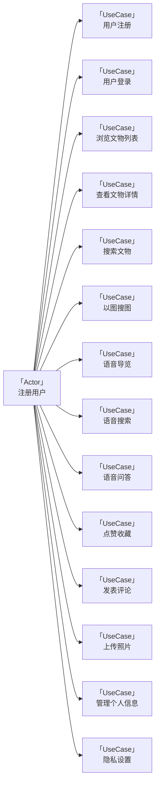
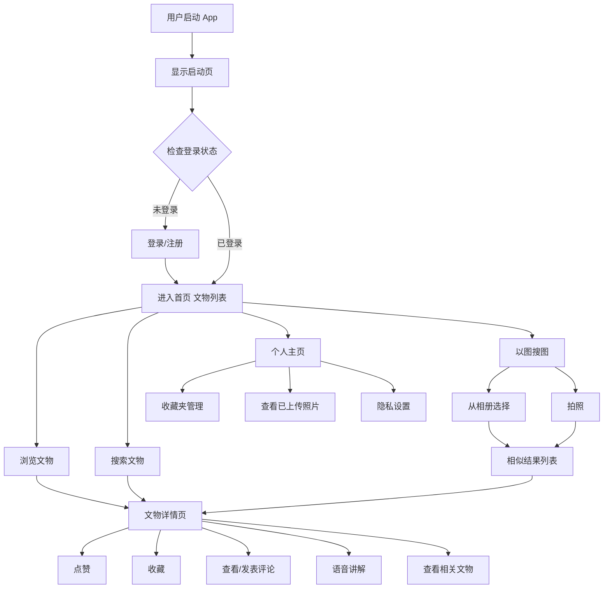
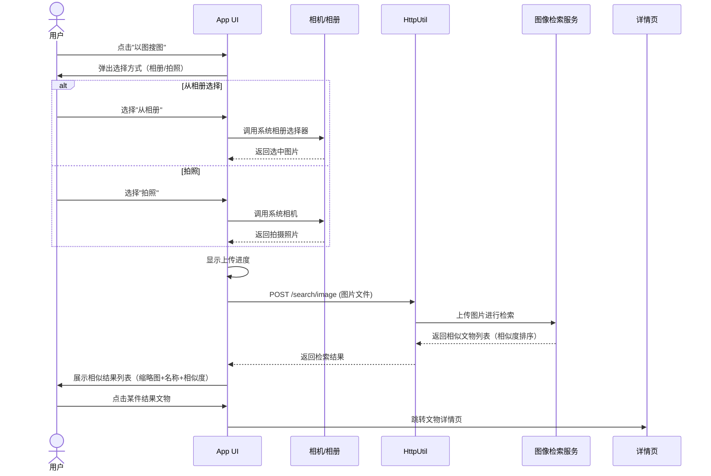
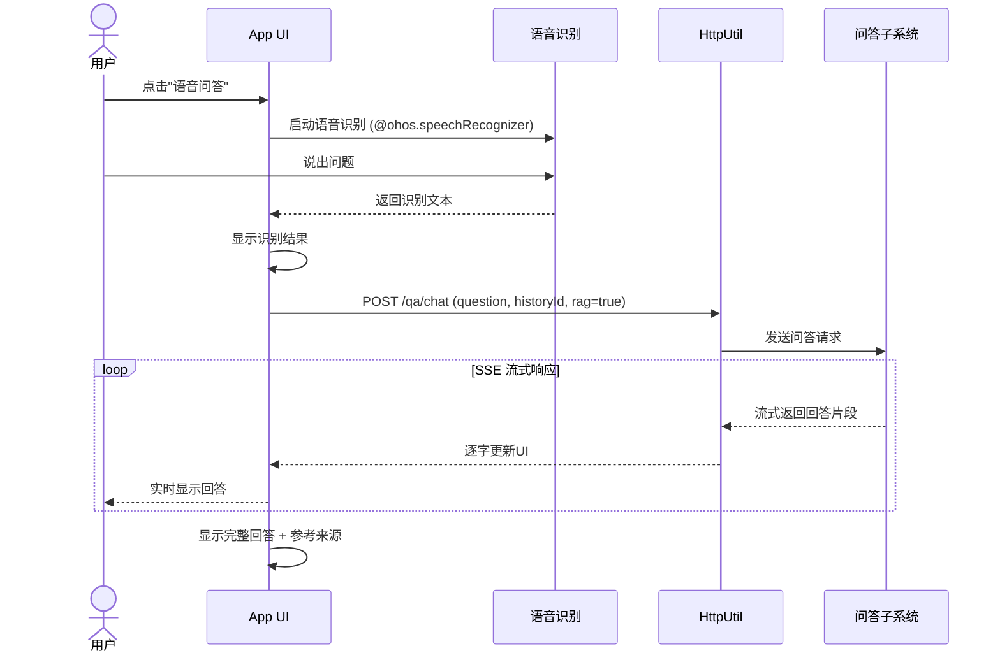
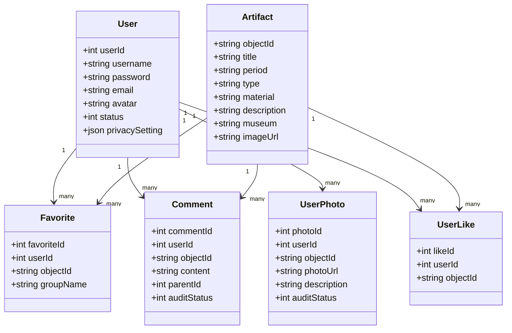

# 掌上博物馆子系统 - 需求规格说明书

## 1. 引言

### 1.1 编写目的

本文档旨在明确掌上博物馆子系统的功能需求与性能要求，为系统设计、开发、测试和验收提供统一的需求基线。

掌上博物馆是“海外藏中国文物知识管理与服务平台”的移动端子系统，以海外藏中国文物为主题，为用户提供随时随地浏览文物、语音导览、以图搜图、社交互动等沉浸式体验。本系统的开发，解决了传统博物馆 App 功能单一、互动性弱的问题，使用户能够便捷地探索海外流散中国文物，感受中华文化的博大精深。

通过本文档详尽说明该软件产品的需求规格，从而对产品进行准确的定义，作为后续设计、编码和测试的依据。

### 1.2 预期读者

- 项目负责人、产品经理
- 前端开发人员（本组全体成员）
- 后端开发人员（知识服务子系统、知识问答子系统、后台管理子系统成员）
- 测试人员
- 助教及评审教师

### 1.3 产品范围

#### 1.3.1 待开发软件系统

待开发软件系统：基于 HarmonyOS 的掌上博物馆移动端 App

#### 1.3.2 产品说明

掌上博物馆 App 作为“海外藏中国文物知识管理与服务平台”的移动端入口，是平台向普通用户提供文物知识服务的重要渠道。

本 App 的应用将使海外中国文物知识服务移动化、智能化、互动化，让用户不受时间和空间限制，通过手机即可浏览海外博物馆的中国文物、通过语音与图像等多种方式探索文物知识。系统主要功能包括文物浏览、以图搜图、语音导览、用户社交互动以及个人信息管理。

本子系统不直接操作知识图谱，所有文物数据通过调用知识服务子系统的 API 获取；以图搜图的特征提取与相似度检索由后端（CLIP + FAISS）完成，移动端负责图片采集与结果展示；语音问答功能通过调用知识问答子系统的接口实现。

### 1.4 参考文献

1. 课程设计题目 - 海外藏中国文物知识管理与服务平台.docx  
2. 华为 HarmonyOS 开发者文档：https://developer.harmonyos.com/

## 2. 综合描述

本项目是为文物爱好者与普通大众开发的掌上博物馆 App。随着移动互联网和人工智能技术的发展，博物馆知识服务需要向移动化、智能化、个性化方向发展。用户希望通过手机即可随时随地探索海外流散的中国文物，获得专业而深入的文物知识。

现有博物馆类 App 多为图文展示的简单模式，缺乏以图搜图、语音交互、社交互动等创新功能。本系统基于 HarmonyOS 开发，采用 ArkTS 语言与 ArkUI 框架，支持用户通过浏览、搜索、拍照、语音等多种方式探索文物，提供点赞、收藏、评论、上传照片等社交互动功能。

本系统通过调用平台后端 API 获取数据和智能服务，用户无需安装额外的服务端软件，所有数据均由服务器处理后返回移动端展示。

### 2.1 产品功能概览

本子系统共包含五大功能模块：

1. **文物浏览**：首页展示（卡片/瀑布流）、文物详情页、简单搜索、音视频播放
2. **以图搜图**：相册选择图片搜索、拍照搜索、相似度结果展示
3. **语音导览**：文物语音讲解播放、语音输入搜索、语音问答交互
4. **用户交互**：点赞、收藏及分组管理、评论与回复、用户上传照片
5. **用户个人信息管理**：注册登录、个人主页、隐私设置

### 2.2 用户类与特性

| 用户类型 | 主要特征 | 主要权限 |
|---|---|---|
| 普通游客 | 未登录或刚注册用户，以浏览文物为主 | 浏览文物列表与详情、查看公开评论、使用搜索功能 |
| 注册用户 | 已完成注册登录的用户 | 除游客权限外，可使用点赞收藏、发表评论、上传照片、语音导览、以图搜图等完整功能 |
| 禁用用户 | 因违规被限制的用户 | 仅可浏览文物，无法使用评论、上传等互动功能 |

> 注：后台管理员不直接使用本 App，管理功能由后台管理子系统（Web 端）提供。

### 2.3 运行环境

#### 2.3.1 硬件平台

本 App 运行于 HarmonyOS 设备：

- 操作系统：HarmonyOS 4.0 或以上版本
- CPU：ARM 架构处理器
- 内存：4GB 或以上
- 存储空间：200MB 以上可用空间
- 屏幕分辨率：2340×1080 或等效分辨率，适配主流手机屏幕

#### 2.3.2 软件环境

- 开发语言：ArkTS
- UI 框架：ArkUI
- 开发工具：DevEco Studio 6.1.0 (Release)
- 运行时依赖：HarmonyOS SDK

#### 2.3.3 后端依赖

本 App 依赖平台以下后端服务：

- 知识服务子系统 RESTful API：提供文物列表、详情、搜索等数据
- 知识问答子系统 API：提供语音问答能力（SSE 流式响应）
- 后台管理子系统 API：提供审核状态查询、内容提交接口
- 图像检索服务：提供以图搜图的特征比对与相似度检索

### 2.4 设计与实现限制

#### 2.4.1 必须使用的特定技术

- ArkTS 编程语言（HarmonyOS 课程指定）
- ArkUI 声明式 UI 框架
- DevEco Studio 开发环境
- @ohos 系列系统能力 API（路由、网络、语音、相机等）

#### 2.4.2 运行限制

- 需要 HarmonyOS 4.0 及以上版本设备
- 需稳定的互联网连接（部分功能可在无网络时浏览缓存数据）
- 相机和麦克风权限需用户授权
- 语音功能依赖设备硬件支持

#### 2.4.3 数据限制

- App 不直接操作知识图谱数据库
- 不直接存储用户密码明文
- 本地缓存数据仅用于提升加载速度，不作为权威数据源

## 3. 系统功能需求

> **说明**：本节第 3.1-3.5 小节由组长编写，第 3.6 节按模块划分，由各组员分别编写。

### 3.1 系统用例总览

#### 3.1.1 系统用例图

#### 3.1.2 用例概述

| 用例编号 | 用例名称 | 简要描述 | 所属模块 |
|---|---|---|---|
| UC01 | 用户注册 | 新用户创建账号 | 用户系统 |
| UC02 | 用户登录 | 已有账号登录系统 | 用户系统 |
| UC03 | 浏览文物列表 | 首页浏览文物卡片/瀑布流 | 文物浏览 |
| UC04 | 查看文物详情 | 查看文物完整信息与图片 | 文物浏览 |
| UC05 | 搜索文物 | 按关键字搜索文物 | 文物浏览 |
| UC06 | 以图搜图 | 通过上传或拍摄图片搜索相似文物 | 以图搜图 |
| UC07 | 语音导览 | 收听文物语音讲解 | 语音导览 |
| UC08 | 语音搜索 | 通过语音输入搜索文物 | 语音导览 |
| UC09 | 语音问答 | 通过语音提问获取文物知识回答 | 语音导览 |
| UC10 | 点赞收藏 | 对文物点赞或加入收藏夹 | 用户交互 |
| UC11 | 发表评论 | 对文物发表文字评论或回复 | 用户交互 |
| UC12 | 上传照片 | 上传拍摄的文物相关照片 | 用户交互 |
| UC13 | 管理个人信息 | 查看和编辑个人主页 | 用户系统 |
| UC14 | 隐私设置 | 设置个人内容的可见范围 | 用户系统 |

---

### 3.2 系统核心流程分析

#### 3.2.1 典型用户使用流程

---

### 3.3 用例描述

#### 3.3.1 “浏览文物列表”用例描述

| 项目 | 内容 |
|---|---|
| 用例名 | 浏览文物列表 |
| 用例编号 | UC03 |
| 简要描述 | 用户进入首页，查看文物卡片列表，支持排序和筛选 |
| 参与者 | 注册用户 / 普通游客 |
| 涉众 | 用户：浏览和发现感兴趣的文物。系统：展示文物数据。 |
| 相关用例 | 查看文物详情（UC04）、搜索文物（UC05） |
| 前置条件 | App 启动完成，网络连接正常 |
| 后置条件 | 文物列表成功展示 |
| 基本事件流 | 1. 用户打开 App 进入首页 2. 系统默认按热度排序展示文物卡片列表 3. 用户可切换视图（卡片/瀑布流） 4. 用户可选择排序方式（年代、名称） 5. 用户下滑加载更多文物 6. 用户点击某文物卡片进入详情页 |
| 备选事件流 | A-1 网络异常 1. 系统提示“网络不可用” 2. 显示本地缓存数据（如有） A-2 无更多数据 1. 系统提示“已加载全部文物” |
| 补充约束 | B-1 列表采用分页加载，每页 20 条 B-2 图片使用缩略图以提升加载速度 |
| 待解决问题 | 无 |

#### 3.3.2 “用户登录”用例描述

| 项目 | 内容 |
|---|---|
| 用例名 | 用户登录 |
| 用例编号 | UC02 |
| 简要描述 | 已有账号的用户输入用户名和密码登录系统 |
| 参与者 | 已注册用户 |
| 涉众 | 用户：获取完整功能权限。系统：认证用户身份。 |
| 相关用例 | 用户注册（UC01） |
| 前置条件 | 用户已有注册账号 |
| 后置条件 | 用户成功登录，获得 JWT Token，跳转首页 |
| 基本事件流 | 1. 用户进入登录页 2. 用户输入用户名和密码 3. 用户点击“登录”按钮 4. 系统验证用户名和密码 5. 系统返回 JWT Token 6. App 存储 Token 到本地 7. 系统跳转至首页 |
| 备选事件流 | A-1 用户名或密码错误 1. 系统提示“用户名或密码错误” 2. 用户可重新输入 A-2 网络异常 1. 系统提示“网络连接失败，请稍后重试” |
| 补充约束 | B-1 密码长度 5-16 位 B-2 Token 有效期 2 小时 B-3 连续输入错误 5 次锁定 15 分钟 |
| 待解决问题 | 是否支持华为账号一键登录（选做） |

---

### 3.4 系统交互时序图（核心流程）

#### 3.4.1 以图搜图流程

#### 3.4.2 语音问答流程

---

### 3.5 用户界面原型说明

本 App 界面设计要求：

1. **风格统一**：整体采用中国传统文化美学风格，配色雅致（如青瓷色、水墨灰），体现文物主题特色。
2. **操作便捷**：页面结构层次清晰，核心功能入口明显（首页底栏：首页、搜索、以图搜图、语音、我的）。
3. **响应式适配**：适配主流手机屏幕尺寸，在折叠屏等大屏设备上提供更优布局。
4. **加载反馈**：所有网络请求提供加载状态提示；图片加载使用占位图或骨架屏；操作结果给出明确反馈。
5. **无障碍支持**：按钮和重要元素提供文字标签，支持系统字体缩放。

---

### 3.6 模块功能需求

> **说明**：以下各小节由对应模块负责人编写，每小节需包含：功能描述、用例图（可选）、用例表、界面原型说明。

#### 3.6.1 文物浏览模块（郝婧 编写）

##### 3.6.1.1 功能描述
文物浏览模块是用户进入 App 后的核心内容消费入口，主要提供以下功能：
- **首页展示**：以卡片列表或瀑布流形式展示文物缩略图、名称、年代等基本信息；支持按热度、年代、名称排序；支持下拉刷新、上拉分页加载。
- **文物详情页**：展示文物的高清图片（可手势缩放）、详细元数据（时期、类型、材质、尺寸、馆藏地等）、关联文物推荐，并提供语音讲解入口、点赞/收藏/评论入口、视频播放（如有）等功能。
- **简单搜索**：提供顶部搜索框，支持按关键字全文搜索文物，展示搜索结果列表，点击可跳转详情页。
- **音视频播放**：在详情页内嵌音频播放器或全屏视频播放器，用于播放文物介绍音频/视频。

##### 3.6.1.2 用例描述

| 用例编号 | 用例名称 | 简要描述 |
|----------|----------|----------|
| UC03 | 浏览文物列表 | 进入首页查看文物卡片/瀑布流，支持排序和分页加载 |
| UC04 | 查看文物详情 | 从列表或搜索结果点击某文物，查看完整图文信息及多媒体内容 |
| UC05 | 搜索文物 | 通过关键字搜索文物，查看匹配结果列表并导航至详情页 |
##### 3.6.1.3 详细用例：查看文物详情

| 项目 | 内容 |
|------|------|
| 用例名 | 查看文物详情 |
| 用例编号 | UC04 |
| 简要描述 | 用户点击某件文物后，进入详情页查看高清图片、属性信息、视频、相关推荐，并可进行点赞、收藏、评论或听取语音讲解 |
| 参与者 | 注册用户 / 普通游客 |
| 前置条件 | 网络连接正常；用户处于文物列表页、搜索结果页或相关推荐列表 |
| 后置条件 | 详情页面完整渲染，交互控件可用 |
| 基本事件流 | 1. 用户点击文物卡片 2. 系统请求文物详情接口 3. 详情页展示：主图轮播区、文物基本信息（名称、年代、类型、材质、尺寸、博物馆等）、详细描述文本 4. 如有视频资源，显示“播放视频”按钮 5. 下方展示相关文物推荐列表 6. 悬浮或底部固定栏提供语音讲解、点赞、收藏、评论入口 |
| 备选事件流 | A-1 详情加载失败：提示“加载失败，点击重试”按钮 A-2 视频播放失败：提示“视频暂不可用”并隐藏播放按钮 A-3 游客操作受限：点击点赞/收藏/评论时，提示“请先登录”并跳转登录页 |
| 补充约束 | B-1 图片区域支持双指缩放与左右滑动切换 B-2 相关文物推荐展示 4~8 件，可横滑浏览 B-3 所有多媒体资源使用懒加载 |

##### 3.6.1.4 详细用例：搜索文物

| 项目 | 内容 |
|------|------|
| 用例名 | 搜索文物 |
| 用例编号 | UC05 |
| 简要描述 | 用户在搜索页输入关键字，系统返回匹配的文物列表 |
| 参与者 | 注册用户 / 普通游客 |
| 前置条件 | 用户进入搜索页；网络正常 |
| 后置条件 | 展示搜索结果列表或“未找到”提示 |
| 基本事件流 | 1. 用户点击首页搜索栏或底部导航“搜索” 2. 进入搜索页，顶部搜索框自动获取焦点 3. 用户输入关键字（支持中英文） 4. 系统实时或点击搜索后发送请求 5. 返回结果列表，每项显示缩略图、名称、年代、博物馆 6. 用户点击某项进入详情页 |
| 备选事件流 | A-1 无匹配结果：显示“未找到相关文物，请尝试其他关键词” A-2 搜索超时：提示“搜索超时，请重试” A-3 搜索历史：用户未输入时展示最近的 5 条搜索历史，点击可快速搜索；提供一键清空 |
| 补充约束 | B-1 关键字最短 2 个字符，前端拦截空搜索 B-2 搜索结果分页，每页 20 条 |

##### 3.6.1.5 界面原型要求
- **首页**：
    - 文物卡片列表（默认网格/瀑布流可切换），每张卡片展示缩略图、文物名、年代、博物馆简称。
    - 顶部右侧有排序按钮（热门/年代/名称），左侧显示当前文物数量或“全部文物”。
    - 底部导航栏固定（首页、搜索、以图搜图、语音、我的）。
- **详情页**：
    - 顶部为高清图片区（横向滑动，支持双指缩放）。
    - 图片下方依次为：文物名称（大标题）、年代/类型/材质标签、博物馆与地理位置、描述文本。
    - 若有视频，展示视频缩略图及播放按钮，点击进入全屏视频页。
    - 相关文物推荐横滑卡片区。
    - 底部操作栏：语音讲解（耳机图标）、点赞（心形）、收藏（书签）、评论（气泡），各带数量显示。
- **搜索页**：
    - 顶部搜索框，右侧“取消”按钮返回上一页。
    - 搜索历史区域（若未输入）。
    - 结果列表与首页卡片样式一致，支持上拉加载更多。

---

#### 3.6.2 以图搜图模块（王珍 编写）

##### 3.6.2.1 功能描述
[请描述该模块的整体功能定位：相册上传、拍照搜索、结果展示]

##### 3.6.2.2 用例描述

| 用例编号 | 用例名称 | 简要描述 |
|---|---|---|
| UC06 | 以图搜图 | 通过上传或拍摄图片搜索相似文物 |

##### 3.6.2.3 详细用例：以图搜图

| 项目 | 内容 |
|---|---|
| 用例名 | 以图搜图 |
| 用例编号 | UC06 |
| 简要描述 | [请填写] |
| 参与者 | [请填写] |
| 前置条件 | [请填写] |
| 后置条件 | [请填写] |
| 基本事件流 | [请填写步骤，包含相册选择和拍照两种方式] |
| 备选事件流 | [请填写：无相似结果、上传失败、权限未授权等] |
| 补充约束 | [请填写：支持图片格式、大小限制、相似度阈值等] |

##### 3.6.2.4 界面原型要求
- 以图搜图入口页：两个大按钮（从相册选择 / 拍照）
- 上传进度指示
- 相似结果列表：缩略图 + 文物名称 + 相似度百分比

---

#### 3.6.3 语音导览模块（范力烨 编写）

##### 3.6.3.1 功能描述
[请描述该模块的整体功能定位：语音讲解、语音搜索、语音问答]

##### 3.6.3.2 用例描述

| 用例编号 | 用例名称 | 简要描述 |
|---|---|---|
| UC07 | 语音导览 | 收听文物语音讲解 |
| UC08 | 语音搜索 | 通过语音输入搜索文物 |
| UC09 | 语音问答 | 通过语音提问获取文物知识回答 |

##### 3.6.3.3 详细用例：语音导览

| 项目 | 内容 |
|---|---|
| 用例名 | 语音导览 |
| 用例编号 | UC07 |
| 简要描述 | [请填写] |
| 参与者 | [请填写] |
| 前置条件 | [请填写] |
| 后置条件 | [请填写] |
| 基本事件流 | [请填写步骤] |
| 备选事件流 | [请填写] |
| 补充约束 | [请填写] |

##### 3.6.3.4 详细用例：语音问答

| 项目 | 内容 |
|---|---|
| 用例名 | 语音问答 |
| 用例编号 | UC09 |
| 简要描述 | [请填写] |
| 参与者 | [请填写] |
| 前置条件 | [请填写] |
| 后置条件 | [请填写] |
| 基本事件流 | [请填写步骤，参考上文时序图] |
| 备选事件流 | [请填写：识别失败、问答超时等] |
| 补充约束 | [请填写] |

##### 3.6.3.5 界面原型要求
- 语音讲解页：播放/暂停按钮、进度条、倍速控制
- 语音问答页：对话气泡界面、底部语音输入按钮、流式回答展示

---

#### 3.6.4 用户交互模块（刘清 编写）

##### 3.6.4.1 功能描述
[请描述该模块的整体功能定位：点赞、收藏、评论、上传照片]

##### 3.6.4.2 用例描述

| 用例编号 | 用例名称 | 简要描述 |
|---|---|---|
| UC10 | 点赞收藏 | 对文物点赞或加入收藏夹 |
| UC11 | 发表评论 | 对文物发表文字评论或回复他人 |
| UC12 | 上传照片 | 上传拍摄的文物相关照片 |

##### 3.6.4.3 详细用例：发表评论

| 项目 | 内容 |
|---|---|
| 用例名 | 发表评论 |
| 用例编号 | UC11 |
| 简要描述 | [请填写] |
| 参与者 | [请填写] |
| 前置条件 | [请填写] |
| 后置条件 | [请填写] |
| 基本事件流 | [请填写步骤，包含审核流程说明] |
| 备选事件流 | [请填写：含敏感词被拦截、审核不通过等] |
| 补充约束 | [请填写] |

##### 3.6.4.4 详细用例：上传照片

| 项目 | 内容 |
|---|---|
| 用例名 | 上传照片 |
| 用例编号 | UC12 |
| 简要描述 | [请填写] |
| 参与者 | [请填写] |
| 前置条件 | [请填写] |
| 后置条件 | [请填写] |
| 基本事件流 | [请填写步骤] |
| 备选事件流 | [请填写] |
| 补充约束 | [请填写] |

##### 3.6.4.5 界面原型要求
- 详情页点赞/收藏按钮
- 收藏夹列表页：分组管理
- 评论区：评论列表、发表评论输入框、回复功能
- 照片上传页：拍照/相册选择、添加拍摄地点和说明

---

#### 3.6.5 用户个人信息管理模块（潘晨晨 编写）

##### 3.6.5.1 功能描述
本模块负责用户账号管理及个人信息维护，包括：用户注册、用户登录、个人主页展示、隐私设置等功能。

##### 3.6.5.2 用例描述

| 用例编号 | 用例名称 | 简要描述 |
|---|---|---|
| UC01 | 用户注册 | 新用户创建账号 |
| UC02 | 用户登录 | 已有账号登录系统 |
| UC13 | 管理个人信息 | 查看和编辑个人主页 |
| UC14 | 隐私设置 | 设置个人内容的可见范围 |

##### 3.6.5.3 详细用例：用户注册

| 项目 | 内容 |
|---|---|
| 用例名 | 用户注册 |
| 用例编号 | UC01 |
| 简要描述 | 新用户通过填写基本信息创建账号 |
| 参与者 | 未注册用户 |
| 涉众 | 用户：创建个人账号。系统：持久化用户信息。 |
| 相关用例 | 用户登录（UC02） |
| 前置条件 | 用户未登录，且已有账号不存在 |
| 后置条件 | 用户账号创建成功，跳转登录页 |
| 基本事件流 | 1. 用户进入注册页 2. 用户填写用户名、邮箱、密码、确认密码 3. 系统前端校验输入合法性 4. 用户提交注册 5. 系统后端验证用户名和邮箱唯一性 6. 系统创建用户账号 7. 系统提示“注册成功” 8. 页面跳转至登录页 |
| 备选事件流 | A-1 用户名已存在 1. 系统提示“用户名已被注册” 2. 用户修改用户名后重新提交 A-2 密码不一致 1. 前端校验拦截，提示“两次密码不一致” A-3 网络异常 1. 系统提示“网络连接失败，请稍后重试” |
| 补充约束 | B-1 用户名长度 3-16 位，支持中英文和数字 B-2 密码长度 5-16 位 B-3 邮箱格式需符合规范 |
| 待解决问题 | 无 |

##### 3.6.5.4 详细用例：隐私设置

| 项目 | 内容 |
|---|---|
| 用例名 | 隐私设置 |
| 用例编号 | UC14 |
| 简要描述 | 用户设置个人内容的公开可见范围 |
| 参与者 | 已登录用户 |
| 前置条件 | 用户已登录 |
| 后置条件 | 隐私设置更新成功，即时生效 |
| 基本事件流 | 1. 用户进入个人主页 2. 用户点击“隐私设置” 3. 系统展示三个开关选项：收藏夹可见性、评论可见性、上传照片可见性 4. 用户调整开关状态 5. 系统实时保存设置到后端 6. 系统提示“设置已更新” |
| 备选事件流 | A-1 保存失败 1. 系统提示“保存失败，请重试” 2. 开关恢复原状态 |
| 补充约束 | B-1 默认全部“公开” B-2 设置为“仅自己可见”后，其他用户在前端看不到对应内容 |

##### 3.6.5.5 界面原型要求
- 登录页：用户名输入框、密码输入框、登录按钮、注册链接
- 注册页：用户名、邮箱、密码、确认密码输入框、注册按钮
- 个人主页：头像区、用户名、收藏数/照片数/评论数统计入口、隐私设置入口、退出登录按钮
- 隐私设置页：三项开关（收藏可见、评论可见、照片可见）

## 4. 其它非功能需求

### 4.1 界面需求

1. **主题风格**：融入中国传统文化元素，配色雅致（青瓷色调、水墨意境），营造沉浸式文化氛围。
2. **操作便捷**：核心功能入口突出，页面层级不超过 3 层，关键操作不超过 3 步到达。
3. **术语统一**：文物相关术语与知识服务子系统保持一致，行文格式统一、规范、明确。
4. **响应式设计**：适配主流手机屏幕尺寸，在折叠屏等大屏设备上优化布局（如详情页双栏展示）。
5. **流式展示**：语音问答支持流式输出回答，逐字显示，提供类似聊天的自然体验。

### 4.2 响应时间需求

| 操作 | 性能指标 |
|---|---|
| App 冷启动 | < 3 秒 |
| 首页文物列表加载 | < 2 秒（首屏） |
| 文物详情页加载 | < 3 秒 |
| 图片上传 | < 5 秒（2MB 图片） |
| 以图搜图检索 | < 5 秒返回首屏结果 |
| 语音问答首字响应 | < 3 秒 |
| 语音识别 | < 3 秒返回结果 |
| 页面切换 | < 500 毫秒 |

系统应能检测各种异常情况（网络中断、服务器无响应等），避免长时间等待甚至无响应，超时时间设置为 10 秒，超时后给出明确提示。

### 4.3 可靠性需求

1. **数据一致性**：收藏、点赞等用户操作状态需与后端保持同步，本地缓存作为临时副本。
2. **离线可用**：文物列表与详情支持本地缓存，无网络时可浏览缓存数据。
3. **操作确认**：不可逆操作（删除评论、退出登录）需二次确认。
4. **崩溃恢复**：App 异常退出后重新启动，应恢复至退出前页面。

### 4.4 开放性需求

1. 系统应具备良好的灵活性，支持未来新增文物类别或博物馆数据源的扩展。
2. 功能模块间低耦合，新增功能不影响已有模块运行。
3. 后端接口变更时，仅需更新对应数据模型，不需大范围修改 UI 代码。

### 4.5 可扩展性需求

本系统采用模块化设计，支持以下扩展：

1. **新功能模块**：如用户动态、消息推送等选做功能可独立开发后接入
2. **新交互方式**：如 AR 文物展示、手势控制等可后续集成
3. **新数据类别**：新增文物类别时仅需更新数据模型和配置
4. **多语言支持**：预留国际化能力，支持后续增加英文等多语言界面

### 4.6 系统安全需求

1. **认证安全**：采用 JWT Token 认证，Token 过期自动跳转登录；密码使用 bcrypt 加密（后端），前端不存储明文密码。
2. **通信安全**：所有 API 通信采用 HTTPS 加密传输。
3. **权限管理**：调用相机、麦克风等敏感能力时动态申请权限，用户可随时在系统设置中撤销。
4. **输入校验**：所有用户输入进行前端校验（长度、格式、特殊字符过滤），防止 XSS 攻击。
5. **内容安全**：用户生成内容（评论、照片）需经后台审核后方可公开展示；本 App 维护本地敏感词预检，命中敏感词时拦截并提示用户修改。
6. **数据保护**：不同用户之间数据隔离，普通用户无法访问其他用户的收藏、评论等私密数据（除非对方设为公开）。

## 5. 数据需求

### 5.1 数据实体关系

### 5.2 主要数据结构

（详细定义见设计报告-公共数据模型）

## 6. 附录

### 6.1 与其它子系统的需求依赖

| 依赖项 | 依赖方 | 需求说明 |
|---|---|---|
| 文物数据 API | 知识服务子系统 | 提供文物列表、详情、搜索、相关推荐等接口 |
| 图像检索 API | 知识服务子系统 | 提供以图搜图的特征提取与向量检索服务 |
| 问答 API | 知识问答子系统 | 提供语音问答的文字问答接口，支持 SSE 流式响应 |
| 用户认证 API | 知识服务子系统或后台管理子系统 | 提供注册、登录、Token 验证接口 |
| 审核接口 | 后台管理子系统 | 提供评论、照片的审核状态查询接口 |

### 6.2 需求评审记录

[待补充]

### 6.3 需求变更记录

| 日期 | 变更内容 | 变更原因 | 影响范围 | 记录人 |
|---|---|---|---|---|
|  |  |  |  |  |