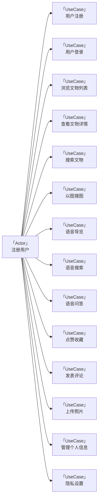
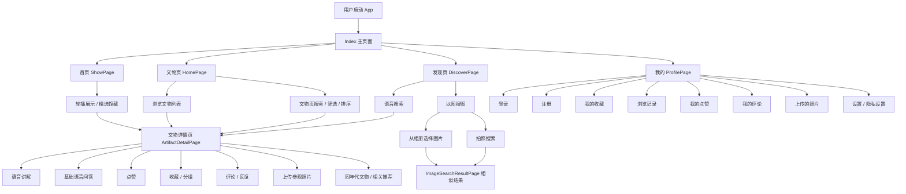
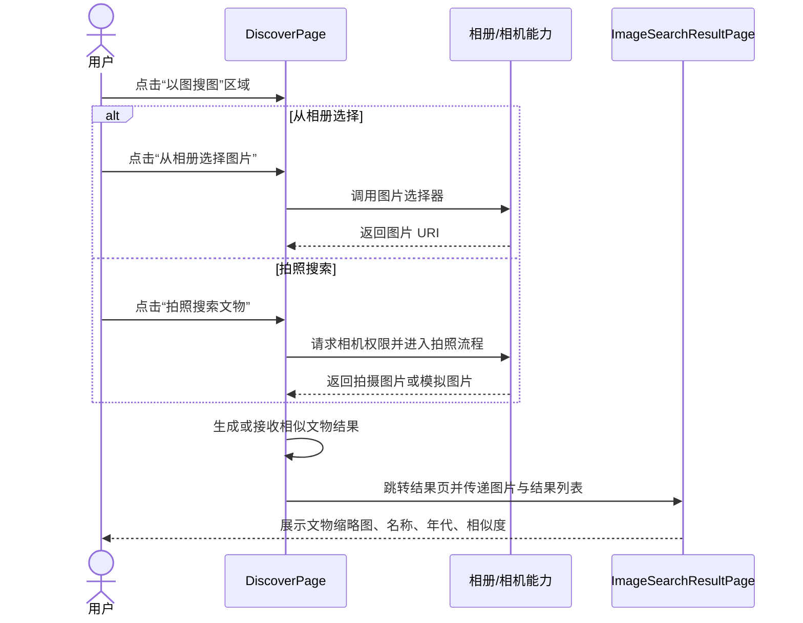
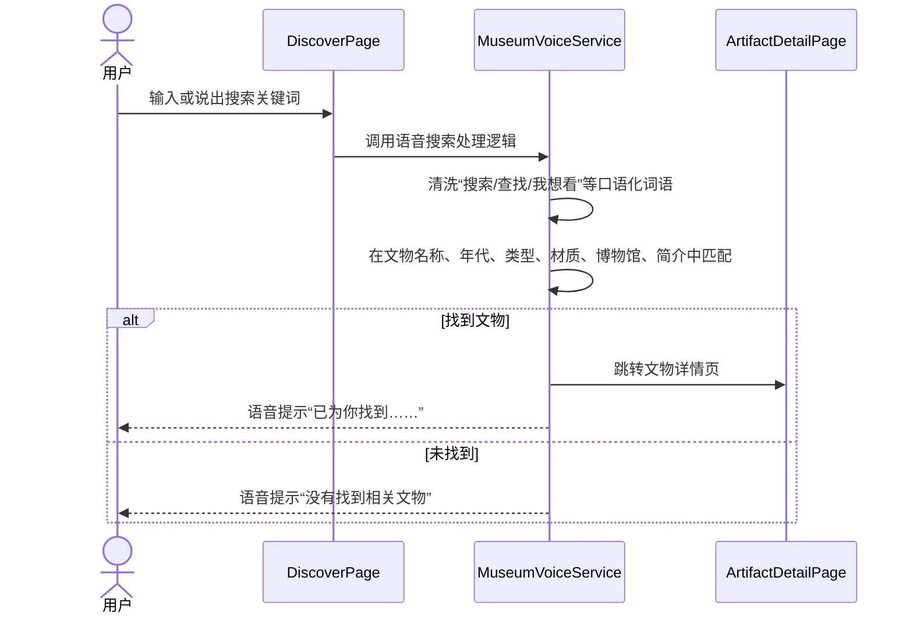
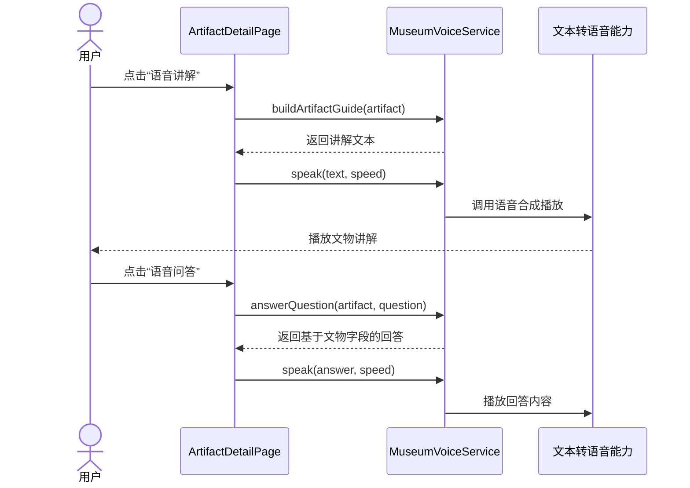
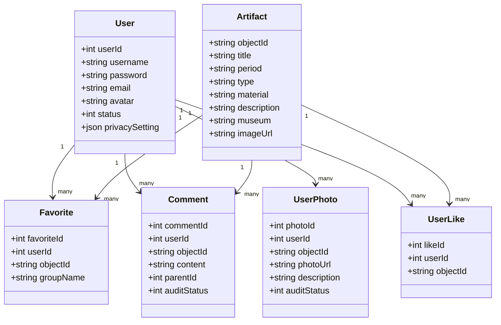

# 掌上博物馆子系统 - 需求规格说明书

## 1. 引言

### 1.1 编写目的

本文档旨在明确掌上博物馆子系统的功能需求与性能要求，为系统设计、开发、测试和验收提供统一的需求基线。

掌上博物馆是“海外藏中国文物知识管理与服务平台”的移动端子系统，以海外藏中国文物为主题，为用户提供随时随地浏览文物、语音导览、以图搜图、社交互动等沉浸式体验。本系统的开发，解决了传统博物馆 App 功能单一、互动性弱的问题，使用户能够便捷地探索海外流散中国文物，感受中华文化的博大精深。

通过本文档详尽说明该软件产品的需求规格，从而对产品进行准确的定义，作为后续设计、编码和测试的依据。

### 1.2 预期读者

- 项目负责人、产品经理
- 前端开发人员（本组全体成员）
- 后端开发人员（知识服务子系统、知识问答子系统、后台管理子系统成员）
- 测试人员
- 助教及评审教师

### 1.3 产品范围

#### 1.3.1 待开发软件系统

待开发软件系统：基于 HarmonyOS 的掌上博物馆移动端 App

#### 1.3.2 产品说明

掌上博物馆 App 作为“海外藏中国文物知识管理与服务平台”的移动端入口，是平台向普通用户提供文物知识服务的重要渠道。

本 App 的应用将使海外中国文物知识服务移动化、智能化、互动化，让用户不受时间和空间限制，通过手机即可浏览海外博物馆的中国文物、通过语音与图像等多种方式探索文物知识。系统主要功能包括文物浏览、以图搜图、语音导览、用户社交互动以及个人信息管理。

本子系统不直接操作知识图谱数据库，也不负责文物基础数据的维护。文物、博物馆等基础数据由后台管理子系统进行维护与管理，掌上博物馆移动端通过数据接口读取并展示；以图搜图的特征提取与相似度检索由图像检索服务完成，移动端负责图片采集与结果展示；复杂语音问答功能通过调用知识问答子系统接口实现。

### 1.4 参考文献

1. 课程设计题目 - 海外藏中国文物知识管理与服务平台.docx
2. 华为 HarmonyOS 开发者文档：https://developer.harmonyos.com/

## 2. 综合描述

本项目是为文物爱好者与普通大众开发的掌上博物馆 App。随着移动互联网和人工智能技术的发展，博物馆知识服务需要向移动化、智能化、个性化方向发展。用户希望通过手机即可随时随地探索海外流散的中国文物，获得专业而深入的文物知识。

现有博物馆类 App 多为图文展示的简单模式，缺乏以图搜图、语音交互、社交互动等创新功能。本系统基于 HarmonyOS 开发，采用 ArkTS 语言与 ArkUI 框架，支持用户通过浏览、搜索、拍照、语音等多种方式探索文物，提供点赞、收藏、评论、上传照片等社交互动功能。

本系统通过调用平台后端 API 获取数据和智能服务，用户无需安装额外的服务端软件，所有数据均由服务器处理后返回移动端展示。

### 2.1 产品功能概览

根据当前前端实现，本子系统采用 **首页 / 文物 / 发现 / 我的** 四个底部 Tab 作为主导航入口。其中：首页用于平台展示、精选馆藏与推荐入口；文物页负责文物列表、搜索、筛选、排序、分页加载和详情入口；发现页集中承载语音搜索与以图搜图入口；我的页面负责登录注册、个人主页与用户个人数据管理。

本子系统共包含五大功能模块，分工保持不变：

1. **文物浏览**：首页精选馆藏展示、文物页卡片/列表展示、搜索、筛选、排序、分页加载、文物详情页、同年代文物与相关推荐展示。
2. **以图搜图**：发现页中的拍照搜图、相册选择图片、相似文物结果展示。当前前端原型使用本地测试结果展示流程，正式联调时接入图像检索服务。
3. **语音导览**：发现页语音搜索入口、文物详情页语音讲解、语音播放控制、围绕当前文物的基础语音问答。
4. **用户交互**：文物点赞、收藏与收藏夹分组、评论与回复、用户照片上传、浏览记录、审核状态提示。
5. **用户个人信息管理**：注册登录、个人主页、我的收藏、我的评论、浏览记录、上传照片、隐私设置与退出登录。

### 2.2 用户类与特性

| 用户类型 | 主要特征                           | 主要权限                                                     |
| -------- | ---------------------------------- | ------------------------------------------------------------ |
| 普通游客 | 未登录或刚注册用户，以浏览文物为主 | 浏览文物列表与详情、查看公开评论、使用搜索功能               |
| 注册用户 | 已完成注册登录的用户               | 除游客权限外，可使用点赞收藏、发表评论、上传照片、语音导览、以图搜图等完整功能 |
| 禁用用户 | 因违规被限制的用户                 | 仅可浏览文物，无法使用评论、上传等互动功能                   |

> 注：后台管理员不直接使用本 App，管理功能由后台管理子系统（Web 端）提供。

### 2.3 运行环境

#### 2.3.1 硬件平台

本 App 运行于 HarmonyOS 设备：

- 操作系统：HarmonyOS 5.0 或以上版本
- CPU：ARM 架构处理器
- 内存：4GB 或以上
- 存储空间：200MB 以上可用空间
- 屏幕分辨率：2340×1080 或等效分辨率，适配主流手机屏幕

#### 2.3.2 软件环境

- 开发语言：ArkTS
- UI 框架：ArkUI
- 开发工具：DevEco Studio 6.1.0 (Release)
- 运行时依赖：HarmonyOS SDK

#### 2.3.3 后端依赖

本 App 设计上依赖平台后端服务。当前版本中，文物展示、用户认证、用户交互、隐私设置、图像检索和语音问答等能力均已按模块完成相应实现或接口对接。AppStorage 与 Preferences 主要用于前端状态共享、页面缓存和异常兜底，权威数据以后端接口返回结果为准。

本 App 需要对接的平台服务包括：

- **后台管理子系统数据接口**：文物数据、博物馆数据由后台管理子系统维护；移动端通过只读接口获取文物列表、详情、博物馆信息等数据。
- **图像检索服务**：提供以图搜图的图像特征提取与相似度检索。
- **知识问答子系统 API**：提供复杂文物问答能力，支持 SSE 流式响应。
- **用户认证与用户交互接口**：提供注册登录、Token 校验、点赞收藏、评论、照片上传及审核状态同步。

当前前端原型中的说明：

- 文物浏览通过后台管理维护的文物数据接口读取展示数据，并保留必要的本地兜底逻辑。
- 点赞、收藏、评论、上传照片、浏览记录、隐私设置等交互数据通过统一服务层与后端接口同步，并保留本地缓存能力用于异常场景兜底。
- 语音搜索、语音播报与基础问答已封装在 `MuseumVoiceService` 中。
- 网络层已封装 `HttpApi`，统一管理基础路径、Token 携带、请求超时与错误处理。

### 2.4 设计与实现限制

#### 2.4.1 必须使用的特定技术

- ArkTS 编程语言
- ArkUI 声明式 UI 框架
- DevEco Studio 开发环境
- @ohos 系列系统能力 API（路由、网络、语音、相机等）

#### 2.4.2 运行限制

- 需要 HarmonyOS 5.0 及以上版本设备
- 需稳定的互联网连接（部分功能可在无网络时浏览缓存数据）
- 相机和麦克风权限需用户授权
- 语音功能依赖设备硬件支持

#### 2.4.3 数据限制

- App 不直接操作知识图谱数据库
- 不直接存储用户密码明文
- 本地缓存数据仅用于提升加载速度，不作为权威数据源

## 3. 系统功能需求

### 3.1 系统用例总览

#### 3.1.1 系统用例图

#### 3.1.2 用例概述

| 用例编号 | 用例名称     | 简要描述                       | 所属模块 |
| -------- | ------------ | ------------------------------ | -------- |
| UC01     | 用户注册     | 新用户创建账号                 | 用户系统 |
| UC02     | 用户登录     | 已有账号登录系统               | 用户系统 |
| UC03     | 浏览文物列表 | 首页浏览文物卡片/瀑布流        | 文物浏览 |
| UC04     | 查看文物详情 | 查看文物完整信息与图片         | 文物浏览 |
| UC05     | 搜索文物     | 按关键字搜索文物               | 文物浏览 |
| UC06     | 以图搜图     | 通过上传或拍摄图片搜索相似文物 | 以图搜图 |
| UC07     | 语音导览     | 收听文物语音讲解               | 语音导览 |
| UC08     | 语音搜索     | 通过语音输入搜索文物           | 语音导览 |
| UC09     | 语音问答     | 通过语音提问获取文物知识回答   | 语音导览 |
| UC10     | 点赞收藏     | 对文物点赞或加入收藏夹         | 用户交互 |
| UC11     | 发表评论     | 对文物发表文字评论或回复       | 用户交互 |
| UC12     | 上传照片     | 上传拍摄的文物相关照片         | 用户交互 |
| UC13     | 管理个人信息 | 查看和编辑个人主页             | 用户系统 |
| UC14     | 隐私设置     | 设置个人内容的可见范围         | 用户系统 |

---

### 3.2 系统核心流程分析

当前 App 主导航采用 `Index` 页面中的四栏 Tab：**首页、文物、发现、我的**。用户进入 App 后，可在首页查看精选展示，在文物页浏览和检索文物，在发现页使用语音搜索与以图搜图，在我的页面完成登录注册和个人数据管理。

### 3.3 模块用例组织说明

| 模块 | 对应用例 | 详细描述位置 |
| --- | --- | --- |
| 文物浏览模块 | UC03 浏览文物列表；UC04 查看文物详情；UC05 搜索文物 | 3.6.1 文物浏览模块 |
| 以图搜图模块 | UC06 以图搜图 | 3.6.2 以图搜图模块 |
| 语音导览模块 | UC07 语音导览；UC08 语音搜索；UC09 语音问答 | 3.6.3 语音导览模块 |
| 用户交互模块 | UC10 点赞收藏；UC11 发表评论；UC12 上传照片 | 3.6.4 用户交互模块 |
| 用户个人信息管理模块 | UC01 用户注册；UC02 用户登录；UC13 管理个人信息；UC14 隐私设置；UC15 查看他人主页 | 3.6.5 用户个人信息管理模块 |

本节仅说明用例组织方式，具体前置条件、事件流、备选事件流和补充约束均在 3.6 各模块小节中展开。

### 3.4 系统核心交互流程

#### 3.4.1 发现页以图搜图流程

#### 3.4.2 语音搜索流程

#### 3.4.3 文物详情页语音讲解与问答流程

### 3.5 用户界面原型说明

本 App 界面设计要求：

1. **主导航清晰**：底部主导航采用“首页、文物、发现、我的”四栏结构。首页用于精选展示与推荐入口，文物页用于文物浏览、搜索、筛选和排序，发现页用于语音搜索和以图搜图，我的页面用于用户登录与个人数据管理。
2. **风格统一**：整体采用偏传统文化的暖色调视觉风格，如米白背景、敦煌红强调色、棕色辅助文字，与文物展示主题保持一致。
3. **操作集中**：文物列表、筛选、排序和搜索集中在文物页；语音搜索和以图搜图集中在发现页；点赞、收藏、评论、上传照片、语音讲解和基础问答集中在文物详情页。
4. **反馈明确**：搜索无结果、权限被拒绝、语音播放失败、图片选择失败、评论待审核等情况均应提供 Toast 或空状态提示。
5. **响应式适配**：页面组件应适配主流 HarmonyOS 手机和常规平板宽度，列表、卡片、按钮和图片区域应保持清晰可用。
6. **无障碍支持**：核心按钮应具有明确文字提示，例如“语音讲解”“开始语音搜索”“拍照搜索文物”“从相册选择图片”等。

### 3.6 模块功能需求

#### 3.6.1 文物浏览模块

##### 3.6.1.1 功能描述

文物浏览模块是用户浏览海外藏中国文物信息的核心模块，对应底部导航中的 **首页 `ShowPage`**、**文物页 `HomePage`** 和 **文物详情页 `ArtifactDetailPage`**。
- 首页：品牌氛围区、文物自动轮播（5件）、精选馆藏（4件）。
- 文物页：文物列表、实时搜索（防抖300ms）、多维筛选（年代/类型/材质，选项动态从后端获取）、排序（热门/名称/年代，年代按历史朝代映射）、网格/列表双视图、手动分页加载。
- 详情页：多图轮播（支持双指缩放/拖拽、双击还原）、文物完整信息、同年代标签云、横向相关推荐，并集成语音讲解、AI问答、点赞、收藏（支持分组）、评论（发表/回复/点赞，带审核状态）、上传照片等入口。

文物基础数据由后台管理子系统维护，移动端通过 `MuseumArtifactApi` 只读接口获取，不提供增删改查。

主要功能包括：

- **首页精选展示**：展示品牌标题、文化标语、文物轮播图和精选馆藏卡片。
- **文物列表展示**：支持网格卡片和单列列表两种视图，展示文物图片、名称、年代、类型、材质、博物馆等。
- **文物搜索**：支持按名称、年代、类型、材质、博物馆关键词实时搜索（防抖）。
- **多维筛选**：支持按年代、类型、材质筛选，筛选项可展开/收起，选项自动同步后端数据。
- **排序功能**：支持按热门（热度值）、名称（中文排序）、年代（历史朝代顺序）排序。
- **分页加载**：手动点击“加载更多”追加数据，每页10条，无更多时显示“已经到底了”。
- **文物详情展示**：多图轮播、图片缩放拖拽、基本信息、文物介绍、同年代文物（标签云）、相关推荐（横向滚动）。
- **跨模块入口**：详情页提供语音讲解、AI问答、点赞、收藏（分组管理）、评论（发表/回复/点赞）、上传照片（地点/说明/审核状态）等入口，分别对接 M4 与 M5 模块。

##### 3.6.1.2 用例描述

| 用例编号 | 用例名称     | 简要描述                                                   |
| -------- | ------------ | ---------------------------------------------------------- |
| UC03     | 浏览文物列表 | 用户进入文物页查看文物列表，支持搜索、筛选、排序、视图切换和分页加载 |
| UC04     | 查看文物详情 | 用户点击文物卡片后查看完整图文信息、同年代文物和相关推荐，可缩放图片 |
| UC05     | 搜索文物     | 用户在文物页搜索框输入关键词，系统防抖后实时筛选匹配文物         |

##### 3.6.1.3 详细用例：浏览文物列表

| 项目       | 内容                                                         |
| ---------- | ------------------------------------------------------------ |
| 用例名     | 浏览文物列表                                                 |
| 用例编号   | UC03                                                         |
| 简要描述   | 用户进入文物页后浏览文物列表，可切换视图、筛选、排序和加载更多 |
| 参与者     | 注册用户 / 普通游客                                          |
| 前置条件   | App 启动完成；后端文物数据接口可用                           |
| 后置条件   | 文物页正确展示符合条件的文物列表                             |
| 基本事件流 | 1. 用户点击底部导航“文物”进入 `HomePage`； 2. 系统请求筛选选项并动态补全； 3. 请求第一页文物数据，按热门排序展示； 4. 用户可输入关键词（防抖300ms）进行搜索； 5. 用户可按年代、类型、材质筛选； 6. 用户可切换热门、名称、年代排序（年代按朝代映射）； 7. 用户可切换网格/列表视图； 8. 用户点击“加载更多”请求下一页； 9. 用户点击文物卡片进入详情页。 |
| 备选事件流 | A-1 无匹配文物：显示“暂无匹配文物”； A-2 无更多数据：显示“已经到底了”； A-3 图片加载失败：显示默认占位图。 |
| 补充约束   | B-1 文物页搜索采用输入防抖（300ms），避免频繁请求； B-2 每页加载10条数据，支持手动加载更多； B-3 筛选和搜索结果应保持与排序规则一致； B-4 移动端不得提供文物基础数据的增删改查； B-5 年代排序需按历史朝代顺序（良渚→清）映射数字权重。 |

##### 3.6.1.4 详细用例：查看文物详情

| 项目       | 内容                                                         |
| ---------- | ------------------------------------------------------------ |
| 用例名     | 查看文物详情                                                 |
| 用例编号   | UC04                                                         |
| 简要描述   | 用户点击文物卡片后进入详情页，查看多图、基本信息、同年代文物和相关推荐 |
| 参与者     | 注册用户 / 普通游客                                          |
| 前置条件   | 用户处于首页、文物页、搜索结果或相关推荐区域；后端文物数据可用 |
| 后置条件   | 文物详情页正常渲染，交互入口可用                             |
| 基本事件流 | 1. 用户点击某件文物； 2. 系统根据 `objectId` 请求详情； 3. 页面展示图片轮播，支持左右滑动、双指缩放（0.5~3倍）、双指拖拽、双击还原； 4. 页面展示名称、年代、类型、材质、收藏机构、简介（支持展开/收起）； 5. 页面展示同年代文物（标签云）和相关推荐（横向滚动）； 6. 用户可进行语音讲解、AI问答、点赞、收藏（选择分组）、评论（发表/回复/点赞）、上传照片等操作。 |
| 备选事件流 | A-1 文物不存在：显示“未找到该文物”； A-2 游客点击互动操作：提示“请先登录”并跳转； A-3 图片无多图数据：仅显示单张主图。 |
| 补充约束   | B-1 详情页需保持图片缩放流畅，手势响应及时； B-2 推荐文物应排除当前文物； B-3 详情页作为语音导览和用户交互模块的统一入口。 |

##### 3.6.1.5 详细用例：搜索文物

| 项目       | 内容                                                         |
| ---------- | ------------------------------------------------------------ |
| 用例名     | 搜索文物                                                     |
| 用例编号   | UC05                                                         |
| 简要描述   | 用户在文物页搜索框输入关键词，系统防抖后实时匹配文物         |
| 参与者     | 注册用户 / 普通游客                                          |
| 前置条件   | 用户处于文物页；文物数据接口可用                             |
| 后置条件   | 文物页展示匹配关键词的文物列表                               |
| 基本事件流 | 1. 用户进入文物页； 2. 用户在搜索框输入关键词； 3. 系统延迟300ms后发起搜索请求； 4. 系统在文物名称、年代、类型、材质、博物馆字段中匹配； 5. 列表更新为匹配结果； 6. 用户可清空关键词恢复全部列表。 |
| 备选事件流 | A-1 无匹配结果：显示“暂无匹配文物”； A-2 用户清空输入：恢复默认文物列表并重置分页。 |
| 补充约束   | B-1 搜索不单独跳转页面，在同一页内刷新列表； B-2 搜索结果应继续支持筛选、排序和分页。 |

##### 3.6.1.6 界面原型要求

- 首页显示品牌晕染区、“掌上博物馆”标题、文化标语、文物自动轮播（5件）和精选馆藏卡片（4件）。
- 文物页顶部显示主题区、搜索框（带防抖效果）。
- 文物页搜索框下方提供筛选行（常显），更多筛选项（年代、类型、材质）通过“展开”按钮显示，支持横向滑动。
- 文物页排序区域提供“热门、名称、年代”选项，年代排序需符合历史朝代顺序。
- 文物列表支持网格卡片（两列）和单列列表两种显示方式，通过右上角按钮切换。
- 文物详情页顶部为图片轮播区（支持缩放和拖拽手势），下方依次展示文物标签、名称、收藏机构、介绍（可展开/收起）、同年代文物（标签云）、相关推荐（横向滚动）、操作区（语音、点赞收藏）、评论区、上传照片区。

#### 3.6.2 以图搜图模块

##### 3.6.2.1 功能描述
以图搜图模块对应前端`DiscoverPage`以图搜图卡片与`ImageSearchResultPage`结果页面，该模块支持从相册选择图片或拍照搜索文物，采用**前端+Python后端检索服务**完整实现真实图像检索，依托ResNet50特征提取+FAISS向量检索实现图片相似度匹配。
主要功能：
- **功能入口**：发现页独立卡片作为以图搜图入口；
- **相册选图**：申请存储权限，唤起系统相册单选图片；
- **拍照搜图**：申请相机权限，调用后置摄像头拍摄图片；
- **后端检索**：前端将图片二进制文件通过HTTP上传FastAPI检索接口，后端提取图像特征、向量相似度比对，按阈值过滤低匹配数据；
- **多样式结果展示**：结果页支持单列/双列布局切换，展示文物图、名称、年代、品类、材质、匹配相似度；
- **异常处理**：权限驳回、相机/相册拉起失败、接口异常、检索无匹配结果均弹窗提示。

##### 3.6.2.2 用例描述

| 用例编号 | 用例名称 | 简要描述 |
| -------- | -------- | -------------------------------------------------------- |
| UC06     | 以图搜图 | 用户拍照/相册选图，图片上传后端完成向量检索，页面返回排序后的相似文物 |

##### 3.6.2.3 详细用例：以图搜图

| 项目 | 内容 |
| ---------- | ------------------------------------------------------------ |
| 用例名 | 以图搜图 |
| 用例编号 | UC06 |
| 简要描述 | 用户拍照或选取本地图片，图片上传后端进行AI特征与向量检索，返回相似度文物并在结果页展示 |
| 参与者 | 注册用户 / 普通游客 |
| 前置条件 | 用户进入发现页；设备具备相机、存储权限；后端检索服务正常运行、已提前完成文物索引初始化 |
| 后置条件 | 结果页按相似度降序展示匹配文物，支持单列/双列视图切换，点击条目跳转文物详情 |
| 基本事件流 | 1.用户进入发现页； 2.点击【拍照搜索】/【相册选择】； 3.系统申请对应设备权限； 4.用户完成拍照或选中图片； 5.前端封装图片二进制，携带top_k、threshold参数调用后端检索接口； 6.后端完成特征提取、FAISS相似度检索、阈值过滤后返回结果； 7.跳转`ImageSearchResultPage`； 8.页面渲染文物信息，支持切换单列/双列布局。 |
| 备选事件流 | A-1 权限拒绝：Toast提示对应权限拒绝文案； A-2 相册/相机拉起异常：弹窗提示打开失败； A-3 后端接口异常：提示网络或服务异常； A-4 检索无达标数据：展示空页面，提供返回重新搜索按钮。 |
| 补充约束 | B-1 默认检索参数：TOP_K=20、相似度过滤阈值0.4； B-2 检索结果按照相似度由高至低排序； B-3 搜索请求期间按钮置灰，防止重复提交； B-4 后端由第三方文物接口批量拉取文物数据，提前构建特征索引。 |

##### 3.6.2.4 界面原型要求
- 发现页：独立圆角卡片承载以图搜图模块，内置**拍照搜索、相册选择**两个功能按钮，附带使用说明提示；
- 结果页：顶部包含返回按钮、原图预览、结果数量统计、单列/双列布局切换控件；
- 列表样式：单列横向卡片、双列网格卡片两种展示形式，卡片展示文物图片、基础属性、相似度百分比；
- 无数据时展示空态页面，配有提示文案与返回搜索按钮；
- 整体视觉风格统一，卡片圆角+阴影设计。

#### 3.6.3 语音导览模块

##### 3.6.3.1 功能描述

语音导览模块用于提升用户浏览文物时的智能交互体验，主要提供文物语音讲解、语音搜索和语音问答功能。用户可以在文物详情页收听当前文物的讲解内容，也可以在发现页或相关入口通过语音输入关键词搜索文物，还可以围绕文物内容提出问题并获得文字或语音形式的回答。

主要功能包括：

- **语音讲解**：根据当前文物名称、年代、类型、材质、收藏机构和简介生成讲解内容，并通过 TTS 播放。
- **播放控制**：支持开始播放、停止、重播、上一段、下一段和倍速调节。
- **语音搜索**：用户说出文物名称、年代、材质、类型或博物馆等关键词，系统识别后执行文物搜索。
- **语音问答**：用户围绕文物提出问题，系统返回对应回答，并支持语音播报。
- **权限与异常处理**：麦克风权限拒绝、识别失败、无匹配结果、网络异常等情况应给出明确提示。

##### 3.6.3.2 用例描述

| 用例编号 | 用例名称 | 简要描述 |
| --- | --- | --- |
| UC07 | 语音导览 | 用户在文物详情页播放当前文物的语音讲解，并可进行播放控制 |
| UC08 | 语音搜索 | 用户通过语音输入关键词，系统识别后搜索相关文物 |
| UC09 | 语音问答 | 用户通过语音或文字提出文物相关问题，系统返回知识回答并支持播报 |

##### 3.6.3.3 详细用例：语音导览

| 项目 | 内容 |
| --- | --- |
| 用例名 | 语音导览 |
| 用例编号 | UC07 |
| 简要描述 | 用户在文物详情页点击语音讲解按钮，系统播放当前文物的讲解内容 |
| 参与者 | 注册用户 / 普通游客 |
| 前置条件 | 用户已进入文物详情页；设备语音播放能力可用 |
| 后置条件 | 系统完成当前文物讲解播放，或根据用户操作停止/重播/切换段落 |
| 基本事件流 | 1. 用户进入某件文物详情页； 2. 用户点击“语音讲解”； 3. 系统根据当前文物信息生成讲解文本； 4. 系统调用语音合成能力播放讲解； 5. 用户可进行停止、重播、上一段、下一段和倍速调节； 6. 页面同步显示当前播放状态和段落进度。 |
| 备选事件流 | A-1 文物介绍为空：系统根据名称、年代、类型、材质等基础字段生成简短讲解； A-2 TTS 播放失败：系统提示语音播放失败； A-3 用户离开详情页：系统停止当前语音播放。 |
| 补充约束 | B-1 语音讲解不应阻塞详情页浏览； B-2 播放控制状态应与实际播放状态保持一致； B-3 长文本讲解应支持分段播放。 |

##### 3.6.3.4 详细用例：语音搜索

| 项目 | 内容 |
| --- | --- |
| 用例名 | 语音搜索 |
| 用例编号 | UC08 |
| 简要描述 | 用户通过语音输入关键词，系统识别后搜索相关文物 |
| 参与者 | 注册用户 / 普通游客 |
| 前置条件 | 用户进入发现页或支持语音搜索的页面；设备已授权麦克风权限 |
| 后置条件 | 系统根据识别出的关键词展示文物搜索结果或给出无结果提示 |
| 基本事件流 | 1. 用户点击语音搜索入口； 2. 系统申请或检查麦克风权限； 3. 用户说出搜索关键词； 4. 系统将语音转换为文本； 5. 系统根据识别文本执行文物搜索； 6. 页面展示相关文物列表； 7. 用户可点击任意文物进入详情页。 |
| 备选事件流 | A-1 用户拒绝麦克风权限：系统提示开启权限； A-2 未识别到有效内容：系统提示重新输入； A-3 搜索无结果：系统提示未找到相关文物； A-4 网络异常：系统提示网络异常并允许重试。 |
| 补充约束 | B-1 语音搜索关键词应支持文物名称、年代、材质、类型和博物馆等内容； B-2 识别失败时不应跳转空白页面； B-3 搜索结果应能继续进入文物详情页。 |

##### 3.6.3.5 详细用例：语音问答

| 项目 | 内容 |
| --- | --- |
| 用例名 | 语音问答 |
| 用例编号 | UC09 |
| 简要描述 | 用户围绕文物内容提出问题，系统返回知识回答并支持语音播报 |
| 参与者 | 注册用户 / 普通游客 |
| 前置条件 | 用户进入文物详情页或语音问答入口；问答服务可用 |
| 后置条件 | 页面展示问答结果，用户可阅读或播放语音答案 |
| 基本事件流 | 1. 用户点击语音问答入口； 2. 用户通过语音或文字输入问题； 3. 系统识别或接收问题文本； 4. 系统将问题和必要的文物上下文提交给问答服务； 5. 问答服务返回答案； 6. 页面展示文字答案； 7. 用户可点击播放按钮收听语音答案。 |
| 备选事件流 | A-1 问题为空：系统提示请输入问题； A-2 问答服务响应失败：系统提示稍后重试； A-3 答案较长：页面支持逐步展示或滚动查看； A-4 用户停止播放：系统停止当前答案播报。 |
| 补充约束 | B-1 问答内容应尽量围绕当前文物或文物知识主题； B-2 文字答案和语音播报应保持一致； B-3 问答过程中应提供加载状态或等待提示。 |

##### 3.6.3.6 界面原型要求

- 发现页或相关页面应提供清晰的语音搜索入口。
- 文物详情页应提供“语音讲解”入口，并在播放后展示必要的控制按钮。
- 播放控制应包括停止、重播、上一段、下一段和倍速调节等常用操作。
- 语音问答区域应支持问题输入、答案展示和答案播放。
- 麦克风权限被拒绝、识别失败、搜索无结果、问答失败等场景应提供明确提示。

#### 3.6.4 用户交互模块

##### 3.6.4.1 功能描述

用户交互模块主要对应 `ArtifactDetailPage`、`MyFavoritesPage`、`MyLikesPage`、`MyCommentsPage`、`MyHistoryPage`、`MyUploadsPage` 和 `PrivacySettingPage`。当前实现已完成前后端联动，用户在详情页和个人中心中的点赞、收藏、评论、上传照片、浏览记录与隐私设置等操作，均可通过统一服务层与后端接口进行同步。

主要功能包括：

- 点赞：登录用户可对文物点赞，详情页状态与“我的点赞”列表联动更新。
- 收藏与分组：用户可收藏文物，并在“我的收藏”中进行分组查看、新建收藏夹、切换分组、移动收藏项和删除自定义收藏夹。
- 评论与回复：用户可发表评论和回复评论，评论提交后显示审核状态，并可在“我的评论”中查看。
- 评论点赞：用户可对评论进行点赞，点赞结果与评论列表实时同步。
- 上传照片：用户可选择图片并填写拍摄地点、说明，提交后进入审核流程，并在“上传的照片”页面查看记录。
- 浏览记录：进入详情页后自动记录浏览历史，并在“浏览记录”页面展示。
- 隐私设置：控制收藏、点赞、评论、上传照片是否对他人可见，并与个人主页展示联动。

##### 3.6.4.2 用例描述

| 用例编号 | 用例名称 | 简要描述                        |
| ---- | ---- | --------------------------- |
| UC10 | 点赞收藏 | 用户对文物点赞或加入收藏夹，并可进行分组管理      |
| UC11 | 发表评论 | 用户对文物发表评论或回复评论，评论进入审核流程     |
| UC12 | 上传照片 | 用户上传文物相关照片并填写地点、说明，照片进入审核流程 |

##### 3.6.4.3 详细用例：点赞收藏

| 项目    | 内容                                       |
| ----- | ---------------------------------------- |
| 用例名   | 点赞收藏                                     |
| 用例编号  | UC10                                     |
| 简要描述  | 登录用户在文物详情页点赞或收藏文物，并在“我的收藏”与“我的点赞”中查看和管理相关内容 |
| 参与者   | 已登录用户                                    |
| 前置条件  | 用户已登录；已进入文物详情页                           |
| 后置条件  | 点赞或收藏结果同步到系统数据中，页面状态、数量展示及个人中心相关列表保持联动   |
| 基本事件流 | 1. 用户点击点赞按钮； 2. 系统提交点赞操作并更新按钮状态与数量； 3. 用户点击收藏按钮； 4. 系统将文物加入当前收藏分组； 5. 用户进入“我的收藏”查看收藏列表； 6. 用户可新建收藏夹、切换分组、移动收藏项或移出收藏； 7. 用户进入“我的点赞”可查看已点赞文物。 |
| 备选事件流 | A-1 未登录用户点击：提示“请先登录”并跳转登录页； A-2 收藏夹名称为空或重复：提示用户重新输入； A-3 删除收藏夹：内容迁移到默认分组。 |
| 补充约束  | B-1 默认收藏夹不可删除； B-2 收藏列表应支持按分组筛选； B-3 点赞收藏状态应与详情页按钮状态同步。 |

##### 3.6.4.4 详细用例：发表评论

| 项目    | 内容                                       |
| ----- | ---------------------------------------- |
| 用例名   | 发表评论                                     |
| 用例编号  | UC11                                     |
| 简要描述  | 登录用户在详情页发表评论或回复他人评论，系统提交评论并展示审核状态        |
| 参与者   | 已登录用户                                    |
| 前置条件  | 用户已登录；已进入文物详情页                           |
| 后置条件  | 评论提交成功，状态显示为待审核或已通过，并可在“我的评论”中查看         |
| 基本事件流 | 1. 用户输入评论内容； 2. 用户点击“发表”； 3. 系统执行非空、长度和敏感词校验； 4. 系统提交评论内容； 5. 页面提示“评论已提交”； 6. 评论区展示公开评论，并保留当前用户评论状态； 7. 用户可在“我的评论”中查看评论内容、审核状态和关联文物。 |
| 备选事件流 | A-1 未登录：跳转登录页； A-2 输入为空：提示补充内容； A-3 命中敏感词：提示修改后重试。 |
| 补充约束  | B-1 待审核评论仅当前用户可见； B-2 公开评论支持回复和点赞； B-3 评论区与“我的评论”页面数据需保持同步。 |

##### 3.6.4.5 详细用例：上传照片

| 项目    | 内容                                       |
| ----- | ---------------------------------------- |
| 用例名   | 上传照片                                     |
| 用例编号  | UC12                                     |
| 简要描述  | 登录用户选择图片并填写地点、说明后上传照片记录                  |
| 参与者   | 已登录用户                                    |
| 前置条件  | 用户已登录；系统可调用图片选择器                         |
| 后置条件  | 照片记录提交成功，进入审核状态，并可在“上传的照片”页面查看           |
| 基本事件流 | 1. 用户在详情页或“上传的照片”页面点击上传； 2. 系统打开图片选择器； 3. 用户选择图片； 4. 用户填写拍摄地点和说明； 5. 系统提交图片与相关元数据； 6. 页面提示“照片已上传，等待审核”； 7. 用户可在“上传的照片”页面查看上传记录和审核状态。 |
| 备选事件流 | A-1 未登录：提示登录并跳转登录页； A-2 用户取消选择：不生成记录； A-3 图片选择失败：提示重新选择。 |
| 补充约束  | B-1 上传照片应保存关联文物、用户、地点、说明和审核状态； B-2 详情页上传区域与“上传的照片”页面需保持数据联动。 |

##### 3.6.4.6 界面原型要求

- 文物详情页展示点赞、收藏、评论区、照片上传区域。
- 收藏夹页面支持新建收藏夹、分组筛选、移出收藏和更换分组。
- 我的点赞页面展示已点赞文物列表，并支持跳转查看详情。
- 我的评论页面展示评论内容、所属文物、审核状态和评论点赞数。
- 上传照片页面提供地点、说明输入框和图片选择按钮。
- 浏览记录页面展示用户浏览过的文物及浏览时间。
- 隐私设置页面提供收藏、点赞、评论、上传照片可见性开关。

---

#### 3.6.5 用户个人信息管理模块

##### 3.6.5.1 功能描述

用户个人信息管理模块负责掌上博物馆 App 中与用户身份、个人资料、账号安全和隐私控制相关的功能，是“我的”页面的核心模块。该模块面向普通用户和已注册用户，提供注册、登录、退出登录、个人主页展示、个人资料编辑、修改密码、头像上传、隐私设置、查看他人主页等能力。

当前实现已经从早期前端模拟登录升级为真实接口联调。登录成功后，系统会保存后端返回的 Token 和用户基础信息，并通过前端全局状态在多个页面间共享；用户资料和隐私配置以后端返回数据为准。个人主页、编辑资料页、隐私设置页、他人主页等页面之间需要保持状态同步，避免出现编辑后信息不一致的问题。

主要功能包括：

- **用户注册**：新用户填写用户名、手机号或邮箱、密码和确认密码完成注册。
- **用户登录**：已注册用户输入账号和密码登录系统，登录成功后保存 Token 和用户基础信息。
- **退出登录**：用户主动退出账号，系统清除登录态和用户基础信息。
- **个人主页**：根据登录状态展示登录入口或当前用户头像、昵称、用户名、简介和功能入口。
- **个人资料编辑**：支持修改昵称、个人简介、手机号和邮箱；用户名不可修改。
- **头像上传**：用户可点击头像从相册选择图片并上传，头像加载失败时降级显示昵称或用户名首字母。
- **修改密码**：用户输入旧密码、新密码和确认新密码完成密码修改。
- **隐私设置**：控制收藏夹、点赞记录、评论、上传照片四类内容是否对他人可见。
- **他人主页查看**：用户可输入用户名查看其他用户公开主页，系统根据对方隐私配置动态展示或隐藏内容。
- **个人数据入口**：从个人中心进入收藏夹、浏览记录、我的点赞、我的评论、上传的照片、设置等页面。

---

##### 3.6.5.2 用例描述

| 用例编号 | 用例名称 | 简要描述 |
| --- | --- | --- |
| UC01 | 用户注册 | 新用户填写账号信息并创建账号 |
| UC02 | 用户登录 | 已注册用户输入账号和密码登录系统 |
| UC13 | 管理个人信息 | 用户查看个人主页、编辑资料、上传头像、修改密码和退出登录 |
| UC14 | 隐私设置 | 用户设置个人互动内容的公开范围 |
| UC15 | 查看他人主页 | 用户输入用户名查看他人的公开主页，并受对方隐私设置限制 |

---

##### 3.6.5.3 详细用例：用户注册

| 项目 | 内容 |
| --- | --- |
| 用例名 | 用户注册 |
| 用例编号 | UC01 |
| 简要描述 | 新用户输入账号信息、密码和确认密码后完成注册 |
| 参与者 | 未注册用户 |
| 前置条件 | 用户进入注册页；设备网络正常 |
| 后置条件 | 后端创建用户账号；用户可使用该账号登录 |
| 基本事件流 | 1. 用户在登录页点击“注册账号”； 2. 系统进入注册页； 3. 用户输入用户名、手机号或邮箱、密码和确认密码； 4. 系统进行前端输入校验； 5. 校验通过后调用注册接口； 6. 后端返回注册成功； 7. 系统提示注册成功，并跳转登录页或自动进入登录流程。 |
| 备选事件流 | A-1 信息未填写完整：系统提示“请填写完整信息”； A-2 密码长度不符合要求：系统提示密码长度限制； A-3 两次密码不一致：系统提示“两次密码不一致”； A-4 用户名、手机号或邮箱已存在：系统提示后端返回的错误信息； A-5 网络异常：系统提示“网络连接失败，请稍后重试”。 |
| 补充约束 | B-1 注册时应校验密码长度； B-2 注册时必须校验两次密码一致； B-3 注册成功后不应出现“信息构建失败”等干扰提示； B-4 注册账号应以后端实际返回结果为准。 |

---

##### 3.6.5.4 详细用例：用户登录

| 项目 | 内容 |
| --- | --- |
| 用例名 | 用户登录 |
| 用例编号 | UC02 |
| 简要描述 | 已注册用户输入账号和密码完成登录 |
| 参与者 | 注册用户 |
| 前置条件 | 用户已拥有有效账号；设备网络正常 |
| 后置条件 | 用户成功登录，系统保存 Token 和用户基础信息 |
| 基本事件流 | 1. 用户进入“我的”页面； 2. 未登录时系统展示登录入口； 3. 用户进入登录页并输入账号和密码； 4. 系统校验账号和密码不能为空； 5. 系统调用登录接口； 6. 后端验证成功并返回 Token 和用户信息； 7. 系统将登录态、Token、用户名、昵称、头像、简介等基础信息写入前端全局状态； 8. 页面跳转或返回个人中心，展示已登录状态。 |
| 备选事件流 | A-1 账号或密码为空：系统提示“请填写账号和密码”； A-2 账号或密码错误：系统提示“用户名或密码错误”； A-3 Token 失效或认证失败：系统清除登录状态并引导重新登录； A-4 网络异常：系统提示“网络连接失败，请稍后重试”。 |
| 补充约束 | B-1 登录成功后，后续需要身份认证的请求应携带 Token； B-2 登录态应能被个人主页、编辑资料页、设置页等页面共享； B-3 用户资料展示应以后端 current-user 接口返回结果为准。 |

---

##### 3.6.5.5 详细用例：个人主页与个人资料编辑

| 项目 | 内容 |
| --- | --- |
| 用例名 | 管理个人信息 |
| 用例编号 | UC13 |
| 简要描述 | 用户查看个人主页，并编辑昵称、简介、手机号、邮箱和头像 |
| 参与者 | 已登录用户 |
| 前置条件 | 用户已成功登录 |
| 后置条件 | 用户资料更新成功；个人主页和编辑资料页展示一致 |
| 基本事件流 | 1. 用户进入“我的”页面； 2. 系统根据登录状态展示个人主页； 3. 页面展示头像、昵称、用户名和个人简介； 4. 用户点击“编辑资料”； 5. 系统进入编辑资料页，并自动填充原有昵称、简介、手机号和邮箱； 6. 用户修改资料后点击“保存修改”； 7. 系统进行前端校验，例如昵称不能为空； 8. 系统调用资料更新接口； 9. 后端返回更新后的用户信息； 10. 系统同步 current-user 数据并更新前端全局状态； 11. 返回个人主页后展示最新资料。 |
| 备选事件流 | A-1 未登录访问：系统显示登录引导； A-2 昵称为空：系统提示“昵称不能为空”； A-3 保存失败：系统提示“资料修改失败”，并保留用户已输入内容； A-4 获取用户信息失败：系统提示“用户信息加载失败”，可使用已有前端状态兜底。 |
| 补充约束 | B-1 用户名不可在编辑资料页修改； B-2 编辑资料页输入框应显示原有信息，允许用户在原有信息基础上修改； B-3 资料保存后个人主页应及时刷新； B-4 个人主页字体、卡片和功能入口需保持与 App 整体风格一致。 |

---

##### 3.6.5.6 详细用例：头像上传与显示兜底

| 项目 | 内容 |
| --- | --- |
| 用例名 | 头像上传 |
| 用例编号 | UC13-1 |
| 简要描述 | 用户在编辑资料页点击头像，选择图片并上传为个人头像 |
| 参与者 | 已登录用户 |
| 前置条件 | 用户已登录；系统具备相册读取能力；后端头像上传接口可用 |
| 后置条件 | 头像上传成功后，后端更新用户 avatar 字段；前端同步显示新头像 |
| 基本事件流 | 1. 用户进入编辑资料页； 2. 用户点击头像区域； 3. 系统打开相册选择器； 4. 用户选择一张图片； 5. 系统将图片复制到 App 缓存目录； 6. 系统读取图片并转换为 Base64； 7. 系统调用头像上传接口； 8. 后端返回头像 URL； 9. 系统更新前端头像状态并提示“头像上传成功”。 |
| 备选事件流 | A-1 用户取消选择图片：系统不执行上传； A-2 图片读取失败：系统提示“图片转码失败”或“头像上传失败”； A-3 上传接口失败：系统提示失败原因； A-4 头像 URL 存在但图片加载失败：系统自动显示昵称或用户名首字母作为兜底头像。 |
| 补充约束 | B-1 编辑资料页不强制显示“点击更换头像”文字，但头像本身应可点击上传； B-2 头像上传采用 Base64 JSON 方式，避免 HarmonyOS 真机文件 URI 上传限制； B-3 头像显示优先使用远程头像，加载失败时使用本地首字母头像兜底。 |

---

##### 3.6.5.7 详细用例：修改密码

| 项目 | 内容 |
| --- | --- |
| 用例名 | 修改密码 |
| 用例编号 | UC13-2 |
| 简要描述 | 用户输入旧密码和两次新密码完成密码修改 |
| 参与者 | 已登录用户 |
| 前置条件 | 用户已登录并进入修改密码页面 |
| 后置条件 | 用户密码修改成功，可使用新密码重新登录 |
| 基本事件流 | 1. 用户进入设置页； 2. 用户选择修改密码； 3. 用户输入旧密码、新密码和确认新密码； 4. 系统校验旧密码、新密码、确认新密码不能为空； 5. 系统校验新密码长度符合要求； 6. 系统校验两次新密码一致； 7. 系统调用修改密码接口； 8. 后端返回修改成功； 9. 系统提示“密码修改成功”。 |
| 备选事件流 | A-1 任一输入为空：系统提示补充完整； A-2 两次新密码不一致：系统提示“两次新密码不一致”； A-3 旧密码错误：系统提示后端返回的错误信息； A-4 修改失败：系统保留输入状态并提示失败原因。 |
| 补充约束 | B-1 修改密码必须要求旧密码； B-2 前端不保存明文密码； B-3 修改成功后用户应能使用新密码登录。 |

---

##### 3.6.5.8 详细用例：隐私设置

| 项目 | 内容 |
| --- | --- |
| 用例名 | 隐私设置 |
| 用例编号 | UC14 |
| 简要描述 | 用户设置收藏、点赞、评论和上传照片是否对他人可见 |
| 参与者 | 已登录用户 |
| 前置条件 | 用户已登录并进入隐私设置页 |
| 后置条件 | 隐私设置保存到后端，并影响他人主页展示 |
| 基本事件流 | 1. 用户进入个人中心； 2. 用户进入设置页并点击隐私设置； 3. 系统调用隐私设置读取接口； 4. 页面展示收藏夹可见、点赞可见、评论可见、上传照片可见四个开关； 5. 用户切换某项开关； 6. 系统判断是否为真实状态变化； 7. 系统调用隐私设置保存接口； 8. 后端返回保存后的隐私配置； 9. 页面更新开关状态并提示“设置已更新”。 |
| 备选事件流 | A-1 用户未登录：系统提示请先登录； A-2 读取失败：系统提示读取失败，并采用保护隐私的默认策略； A-3 保存失败：系统回滚到旧设置并提示“保存失败，请重试”； A-4 页面初始化触发开关变化：系统不应重复保存，也不应弹出“设置已更新”。 |
| 补充约束 | B-1 隐私设置不应仅保存在本地，应以后端配置为准； B-2 隐私设置应实时影响他人主页展示结果； B-3 为保护隐私，读取他人隐私失败时应默认不可见。 |

---

##### 3.6.5.9 详细用例：查看他人主页

| 项目 | 内容 |
| --- | --- |
| 用例名 | 查看他人主页 |
| 用例编号 | UC15 |
| 简要描述 | 用户输入目标用户名，查看该用户公开主页 |
| 参与者 | 已登录用户 |
| 前置条件 | 用户已登录；目标用户名存在或可查询 |
| 后置条件 | 系统展示目标用户公开主页，并根据隐私设置隐藏不可见内容 |
| 基本事件流 | 1. 用户进入个人主页； 2. 用户在“查看他人主页”输入框输入目标用户名； 3. 用户点击查看； 4. 系统校验用户名不能为空，且不能与当前用户名相同； 5. 系统进入他人主页； 6. 系统读取目标用户隐私配置； 7. 系统根据隐私配置展示或隐藏收藏、点赞、评论和上传照片； 8. 页面展示目标用户头像、昵称、用户名、简介和公开内容。 |
| 备选事件流 | A-1 用户名为空：系统提示“请输入用户名”； A-2 输入的是自己：系统提示“这是你自己的主页”； A-3 读取隐私设置失败：系统按不可见策略处理； A-4 对方某项内容不可见：系统显示“对方设置了xxx不可见”。 |
| 补充约束 | B-1 他人主页头像显示逻辑应与个人主页保持一致； B-2 他人主页不得展示对方设置为不可见的内容； B-3 该功能应作为直接查看他人主页的入口，不依赖评论区跳转。 |

---

##### 3.6.5.10 界面原型要求

1. **我的页面未登录状态**
    - 显示未登录提示。
    - 提供“去登录”按钮。
    - 页面风格与 App 整体米白、敦煌红、棕色辅助文字风格一致。

2. **我的页面已登录状态**
    - 顶部展示头像或昵称首字母头像、昵称、用户名和个人简介。
    - 提供“编辑资料”入口。
    - 提供输入用户名查看他人主页入口。
    - 提供收藏夹、浏览记录、我的点赞、我的评论、上传的照片、设置、退出登录等菜单入口。

3. **编辑资料页**
    - 顶部展示头像，头像可点击上传新头像。
    - 头像下方不强制显示“点击更换头像”文字，保持页面简洁。
    - 用户名输入框置灰且不可修改。
    - 昵称、个人简介、手机号、邮箱输入框应显示原有信息。
    - 页面底部提供“保存修改”按钮。

4. **隐私设置页**
    - 提供收藏夹可见、点赞可见、评论可见、上传照片可见四个开关。
    - 页面进入时应显示后端保存的真实开关状态。
    - 只有用户真实切换开关时才提示“设置已更新”。

5. **他人主页**
    - 展示目标用户头像或首字母头像、昵称、用户名和简介。
    - 收藏、点赞、评论、上传照片四类区域按隐私设置展示内容或不可见提示。
    - 页面布局应与个人主页风格统一。

---

## 4. 其它非功能需求

### 4.1 界面需求

1. **主题风格**：融入中国传统文化元素，配色雅致（青瓷色调、水墨意境），营造沉浸式文化氛围。
2. **操作便捷**：核心功能入口突出，页面层级不超过 3 层，关键操作不超过 3 步到达。
3. **术语统一**：文物相关术语与知识服务子系统保持一致，行文格式统一、规范、明确。
4. **响应式设计**：适配主流手机屏幕尺寸，在折叠屏等大屏设备上优化布局（如详情页双栏展示）。
5. **流式展示**：语音问答当前支持本地规则回答，后续接入知识问答接口后支持 SSE 流式输出。

### 4.2 响应时间需求

| 操作           | 性能指标                                      |
| -------------- | --------------------------------------------- |
| App 冷启动     | < 3 秒                                        |
| 文物页列表加载 | < 2 秒（首屏）                                |
| 文物详情页加载 | < 3 秒                                        |
| 图片上传       | < 5 秒（2MB 图片）                            |
| 以图搜图检索   | < 5 秒返回首屏结果                            |
| 语音问答响应   | 本地规则问答 < 1 秒；后端 SSE 首字响应 < 3 秒 |
| 语音识别       | < 3 秒返回结果                                |
| 页面切换       | < 500 毫秒                                    |

系统应能检测各种异常情况（网络中断、服务器无响应等），避免长时间等待甚至无响应，超时时间设置为 10 秒，超时后给出明确提示。

### 4.3 可靠性需求

1. **数据一致性**：收藏、点赞等用户操作状态需与后端保持同步，本地缓存作为临时副本。
2. **离线可用**：文物列表与详情支持本地缓存，无网络时可浏览缓存数据。
3. **操作确认**：不可逆操作（删除评论、退出登录）需二次确认。
4. **崩溃恢复**：App 异常退出后重新启动，应恢复至退出前页面。

### 4.4 开放性需求

1. 系统应具备良好的灵活性，支持未来新增文物类别或博物馆数据源的扩展。
2. 功能模块间低耦合，新增功能不影响已有模块运行。
3. 后端接口变更时，仅需更新对应数据模型，不需大范围修改 UI 代码。

### 4.5 可扩展性需求

本系统采用模块化设计，支持以下扩展：

1. **新功能模块**：如用户动态、消息推送等选做功能可独立开发后接入
2. **新交互方式**：如 AR 文物展示、手势控制等可后续集成
3. **新数据类别**：新增文物类别时仅需更新数据模型和配置
4. **多语言支持**：预留国际化能力，支持后续增加英文等多语言界面

### 4.6 系统安全需求

1. **认证安全**：采用 JWT Token 认证，Token 过期自动跳转登录；密码使用 bcrypt 加密（后端），前端不存储明文密码。
2. **通信安全**：所有 API 通信采用 HTTPS 加密传输。
3. **权限管理**：调用相机、麦克风等敏感能力时动态申请权限，用户可随时在系统设置中撤销。
4. **输入校验**：所有用户输入进行前端校验（长度、格式、特殊字符过滤），防止 XSS 攻击。
5. **内容安全**：用户生成内容（评论、照片）需经后台审核后方可公开展示；本 App 维护本地敏感词预检，命中敏感词时拦截并提示用户修改。
6. **数据保护**：不同用户之间数据隔离，普通用户无法访问其他用户的收藏、评论等私密数据（除非对方设为公开）。

### 4.7 账号与隐私相关非功能需求

#### 4.7.1 安全需求

1. 用户登录后，系统应通过 Token 识别用户身份。
2. 需要身份认证的接口请求应统一携带 `Authorization: Bearer <token>`。
3. 前端不得保存明文密码。
4. 注册和修改密码流程必须进行密码长度和两次密码一致性校验。
5. 隐私设置必须影响他人主页展示，防止用户私密互动内容被误公开。
6. 退出登录后，应清除前端保存的 Token 和用户基础信息。
7. 他人主页展示应遵守对方隐私配置，不得绕过隐私开关。

#### 4.7.2 可靠性需求

1. 个人主页、编辑资料页、他人主页之间的用户信息展示应保持一致。
2. 资料修改成功后，应重新同步当前用户信息。
3. 隐私设置保存失败时，应回滚到修改前状态。
4. 头像图片加载失败时，应自动显示昵称或用户名首字母。
5. 获取用户信息失败时，应给出明确提示，不应导致页面崩溃。
6. 网络异常时，应通过 Toast 或空状态提示用户稍后重试。

#### 4.7.3 易用性需求

1. 注册、登录、编辑资料、修改密码等页面应提供明确的输入提示。
2. 错误提示应具体，例如“两次密码不一致”“昵称不能为空”“请输入用户名”等。
3. 他人主页查看入口应简单直接，用户只需输入目标用户名即可访问。
4. 头像上传入口应自然集成在头像区域，不额外增加复杂操作步骤。
5. 隐私设置开关文案应清晰说明关闭后的影响。

---

## 5. 数据需求

### 5.1 数据实体关系

### 5.2 用户与隐私数据说明

| 数据项 | 类型 | 说明 |
| --- | --- | --- |
| `isLogin` | boolean | 当前是否已登录 |
| `token` | string | 访问令牌 |
| `refreshToken` | string | 刷新令牌 |
| `userId` / `objectId` | string | 用户唯一标识 |
| `username` | string | 用户名 |
| `nickname` | string | 昵称 |
| `avatar` | string | 头像 URL |
| `bio` | string | 个人简介 |
| `phone` | string | 手机号 |
| `email` | string | 邮箱 |
| `favoritesVisible` | boolean | 收藏夹是否对外可见 |
| `likesVisible` | boolean | 点赞记录是否对外可见 |
| `commentsVisible` | boolean | 评论是否对外可见 |
| `uploadsVisible` | boolean | 上传照片是否对外可见 |

### 数据状态说明

- 用户基础资料以后端 `current-user` 接口返回结果为准。
- `AppStorage` 仅用于前端运行期间的全局状态共享。
- 隐私设置以后端隐私接口保存结果为准。
- 头像 URL 由头像上传接口返回，并同步到当前用户信息中。
- 他人主页展示数据应根据目标用户隐私配置动态过滤。

## 6. 附录

### 6.1 与其它子系统的需求依赖

| 依赖项                    | 依赖方                        | 需求说明                                                     |
| ------------------------- | ----------------------------- | ------------------------------------------------------------ |
| 文物 / 博物馆数据管理 API | 后台管理子系统                | 负责文物与博物馆基础数据的维护；掌上博物馆移动端通过只读接口获取文物列表、详情、博物馆信息等数据 |
| 图像检索 API              | 图像检索服务 / 知识服务子系统 | 提供以图搜图的特征提取与向量检索服务，返回相似文物及相似度   |
| 问答 API                  | 知识问答子系统                | 提供语音问答的文字问答接口，复杂问答支持 SSE 流式响应        |
| 用户认证 API              | 用户系统 / 后台管理子系统     | 提供注册、登录、Token 验证接口                               |
| 审核接口                  | 后台管理子系统                | 提供评论、照片等用户生成内容的审核状态查询接口               |
